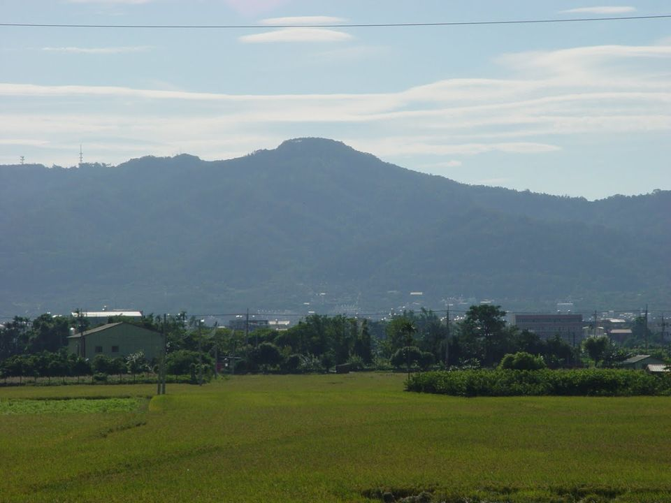
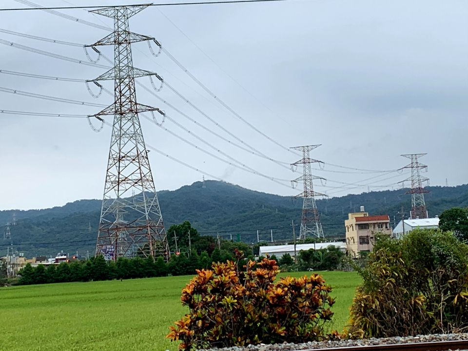
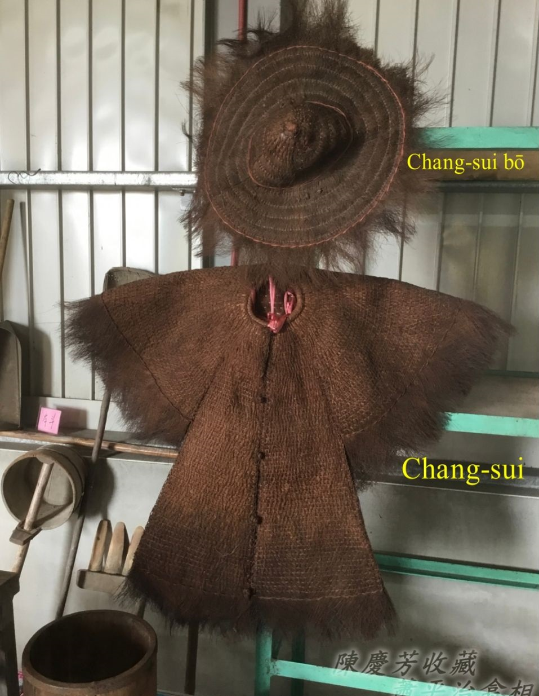
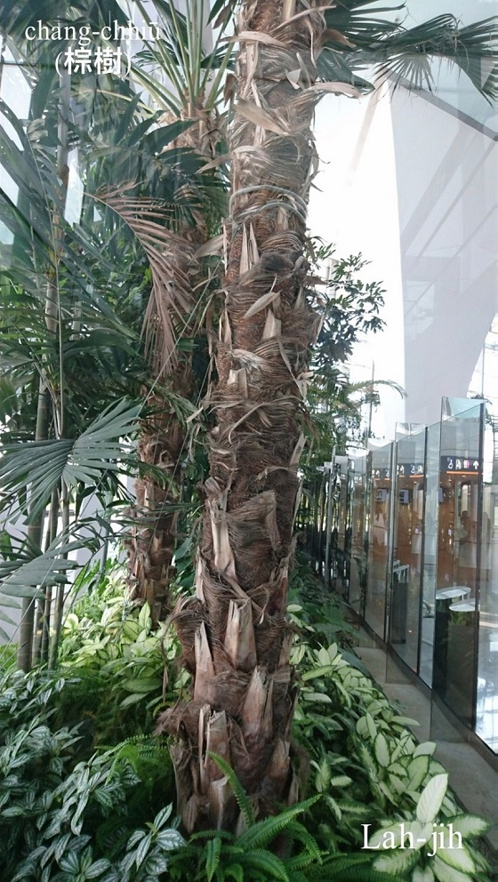

# 話頭──家鄉ê景致
> **Ōe-thâu──Ka-hiong ê Kéng-tì**

# 1. 牛角嶺 
> **Gû-kak-niah**

Niā是稜線ê形，Gû-kak-niā阮講Gû-kak-niah，漢字寫做牛港嶺。

這2張Gû-kak-niah ê相片，翕相位置tī八堡一圳社頭地界南pêng。

八卦山脈siāng koân所在有443公尺，名叫做Hoâiⁿ-soaⁿ（橫山），在地人講橫山á，古早叫做牛káng嶺，牛káng to̍h是大隻牛公，牛káng mā叫牛kak。因為伊ê山形tī山腳社頭、田中央看ǹg東pêng，kài-sêng牛頭āu-khok連ām-kún ê所在，所以有牛kak嶺ê稱號。Gû-kak-niah tī hit-lō交通不便，步步tio̍h步lián，看ē-tio̍h m̄-bat踏腳到ê古早時代，有可能ē ka看做是聖山，庇佑八卦山腳ê子民。

1991年，載大兄二兄三兄來到牛kak嶺，落車欣賞山腳景致，65歲ê二兄讚嘆一聲：「自做gín-á到taⁿ，tī咱崁頂庄看60幾冬ê Gû-kak-niah，今á日總算來到chia！」歡喜寫tī面--裡，心情清爽無tè比。

# 2. 水牛kap烏鶖
> **Chúi-gû kap O͘-chhiu**

Tī 1970年代進前ê田庄所在，烏鶖khiā tī水牛kha-chiah-phiaⁿ是chiâⁿ-chia̍p看tio̍h ê景象，大phiāng水牛行過草埔、田園，蚊á胡蠅iāⁿ-iāⁿ飛，iáu有水牛身軀頂ê牛蜂、牛蜱，lóng是烏鶖ê好食物。

水牛kap烏鶖互利共生，水牛徙振動，to̍h有蚊á胡蠅iāⁿ-iāⁿ飛，烏鶖mā-ē食牛ê寄生蟲thōa。牛是慢鈍好性地，載伊烏鶖四界se̍h，烏鶖mā無失伊禮，替牛趕蚊lia̍h蚊蟲，互相幫贊tàu-saⁿ-kāng，chit款景致真迷人。

水牛比赤牛khah有力，Chhân-tiong-ng（田中央）地區水田khah chē，駛田、拖牛車載貨，lóng需要水牛，khah少看tio̍h赤牛á。

# 3. 瓜笠á kap棕簑
> **Koe-loe̍h kap Chang-sui**

瓜笠á kap棕簑，是khah早做穡人標準ê穿插，日頭赤iāⁿ-iāⁿ，瓜笠á tì--leh，cha̍h鑿目日頭光koh兼bē曝kah皮疼。Nā tn̄g tio̍h落雨天，棕簑穿--leh，chiah bē kui身軀ak kah tâm-kô͘-kô͘。Tì瓜笠穿棕簑，到taⁿ猶原是chiâⁿ chē人懷念ê農村景致。

## 3-1. 瓜笠á／竹笠á
> **Koe-le̍h-á/Tek-le̍h-á**

笠á是作田人cha̍h日jia雨ê帽á，竹篾á pīⁿ ê笠á胚，外面thīⁿ桂竹ha̍h-á，形體sió-khóa sêng圓圓瓜形，瓜笠á、竹笠á、甲笠á lóng有人講，nā寫做kôe-le̍h-á（葵笠á）to̍h無合。

## 3-2. 棕簑
> **Chang-sui**

棕簑是古早作田人ê雨moa，頭戴瓜笠，身穿棕簑，適合落雨天巡田水、犁田、踏割耙穿。棕簑是用棕簑毛編織雨衫，穿--起來chiâⁿ刺鑿koh重，古早無雨moa，穿久to̍h慣勢，nā無，tn̄g-tio̍h落雨天，田--裡boeh án-chóaⁿ作穡？

## 3-3. 棕簑毛
> **Chang-sui Mo͘**

棕簑毛是ùi山棕（俗名虎尾棕）ê葉柄頭hit têng纖維採取--ê。

## 【Lah-jih台灣俗語】
- 有毛--ê食到棕簑，無毛--ê食到秤錘。

## 【Lah-jih七字仔唸歌】武東堡崁頂庄濁水米白米飯
> **【Lah-jih Chhit-jī-á Liām-koa】Bú-Tang-Pó Khàm-Téng-Chng Lô-Chúi-Bí Pe̍h-Bí-Pn̄g**

Pak-kòa soaⁿ-kha Khàm-téng-chng, Ko-thih tang-pêng bô gōa-hn̄g,
hia ū tōa-phiàn chúi-chhân hn̂g, choh-chhân hiaⁿ só tòa kui-chng.

（八卦山腳崁頂庄，高鐵東爿無外遠，遐有大遍水田園，作田兄嫂蹛規庄。）

Khàm-téng khiā-ke nn̄g-pah tang, choân sī Siau--sèⁿ chò-sit-lâng,
khîn-khiām chèng-choh gû lê pē, tiū-á pá-sūi thâu lê-lê.

（崁頂徛家兩百冬，全是蕭姓做穡人，勤儉種作牛犁耙，稻仔飽穗頭犁犁。）

Pò͘-chhân kà lán chin kang-hu, tò-thè-lu to̍h sī hiàng-chiân,
Jia̍t-chêng khiam-hi láu-si̍t lâng, kha ta̍h si̍t-tē jîn-chêng tāng.

（播田教咱真功夫，倒退攄就是向前，熱情謙虛老實人，腳踏實地人情重。）

Chó͘-thoân hong-sio̍k chin thoân-kiat, hiaⁿ-tī chek-sun tō-lí thiat,
tōa sè tāi-chì chiàu-khí-kang, chhut-chîⁿ chhut-la̍t m̄ su lâng.

（祖傳風俗真團結，兄弟叔孫道理徹，大細代誌照起工，出力出錢毋輸人。）

Pat-pó chùn-chúi tùi chia kòe, Lô-chuí-khe chúi sī pûi-té,
chhut-sán tiū-kok ū-kàu chē, Lô-chuí-khe bí khiū-teh-teh.

（八堡圳水對遮過，濁水溪水是肥底，出產稻穀有夠濟，濁水溪米糗嗲嗲。）

Lô-chuí-khe bí nńg koh khiū, chut-bí chāi-lâi lóng-chóng ū,
chhài-pó͘ kiâm-chhài chò kóe-āⁿ, Khàm-téng kóe-lō͘ chin káng-kiù.

（濁水溪米軟閣糗，秫米在來攏總有，菜脯鹹菜做粿餡，崁頂粿路真講究。）

Lâng-sn̂g chhoe-kóe chiok kāu-kang, pau-á-kóe hām chhài-thâu-kóe,
óaⁿ-kóe bí-chàng ō͘-hoâiⁿ-kóe, seⁿ-oe sa̍h chàng tek-hio̍h phang.

（籠床炊粿足厚工，包仔粿和菜頭粿，碗粿米粽芋莖粿，生鍋煠粽竹葉芳。）

Kiⁿ-chàng môa-íⁿ tōa-mī-kiⁿ, Khàm-téng te̍k-iú hó chu-bī,
pat-ūi boeh chia̍h ū khah chió, lán sī tiám-sim chia̍h sim-sek.

（鹼粽麻穎大麵鹼，崁頂特有好滋味，別位欲食有較少，咱是點心食心適。）

Siáu-liân chhut-gōa khì thàn-chia̍h, sī-tōa tiàm chhù chiú chhân-hn̂g,
lê-chhân koah-tiū iōng ke-khì, sî-tāi bô-kāng tio̍h kái-pìⁿ.

（少年出外去趁錢，序大踮厝守田園，犁田割稻用機器，時代無仝著改變。）

Siā-khu keng-êng ū kè-ōe, kiān-khong ōe-seng siāng iàu-kín,
lāu-lâng chiàu-kò͘ tio̍h chin-sim, chó͘-sian bûn-hòa tio̍h thoân-sêng.

（社區經營有計畫，健康衛生上要緊，老人照顧著真心，祖先文化著傳承。）

Kó͘-chá Khàm-téng bô͘-hoān chng, hiān-tāi lán boeh chò bô͘-hoān,
siā-khu piàⁿ-sàu chò-hóe lâi, chhù-lāi chheng-kiat ta̍k-kang ài.

（古早崁頂模範庄，現代咱欲做模範，社區拚掃做伙來，厝內清潔逐工愛。）

Kó͘-chá siú-bāng bāng-ko-liâu, àm-sî sûn-keⁿ hó͘-bóe-liâu,
chhù-lāi khǹg chhek iōng ka-tî, mn̂g-tiâⁿ chiah khí kó͘-teng-pūn.

（古早守望望高瞭，暗時巡更虎尾寮，厝內囥粟有茭櫥，門埕才起鼓燈笨。）

Hiaⁿ-tī chek-sun ū tōa-sè, chhù-piⁿ keh-piah chin hô-hâi,
kau-pôe pêng-iú ū sêng-ì, kóng-ōe chio-ho͘ chiok sêng-ì.

（兄弟叔孫有大細，厝邊隔壁真和諧，交陪朋友有誠意，講話招呼足誠意。）

Tiū-á pá-sūi thâu kau-kau, pò͘-chhân ǹg-chêng tò-thè-lu,
lâi o̍h choh-chhân hó kui-kí, sī lán chò-lâng chin tō-lí.

（稻仔飽穗頭鉤鉤，播田向前倒退攄，來學作田好規矩，是咱做人真道理。）

Hoaⁿ-hí sio-chio lâi kiâⁿ-ta̍h, chhân-hōaⁿ sàn-pō͘ khòaⁿ kî-khá,
Pak-kòa soaⁿ-me̍h tī gán-chiân, ū soaⁿ ū chhân ū hûn-ang.

（歡喜相招來行踏，田岸散步看奇巧，八卦山脈佇眼前，有山有田有雲尪。）

Ng-á tōa-châng chhēⁿ-lèng-lèng, tiū-kok sêng-se̍k chhiūⁿ n̂g-kim,
chi̍t-nî sù-kùi súi-tang-tang, nî-nî hong-siu ū bí-bāng.

（秧仔大叢青蘢蘢，稻穀成熟像黃金，一年四季媠噹噹，年年豐收有美望。）
> 20220525 Lahjih（蕭平治）

# 4. 註解
> **Chù-kái**

|**詞**|**解說**|
|Lia̍h貓lia̍h niah|古早有「Lia̍h貓lia̍h niah」ê lia̍h貓á方法，niah（岭）to̍h是貓á ām-kún頂面位置，親像山嶺ê稜線。|
|Niah|Niah是田中央崁頂庄在地ê腔口，別位有人講「niā」，親像《台日》收錄「岭／niā」，《教典》收錄「陵／niā」。
|Pān-tōaⁿ／pîn-tōaⁿ／pūn-tōaⁿ|『懶惰』。|
|Bē／bōe|『不會』。|
|Boeh／beh|『要』。|
|Iûⁿ-môa|『黃麻』。|
|Hit têng纖維|『指那層葉鞘』。|