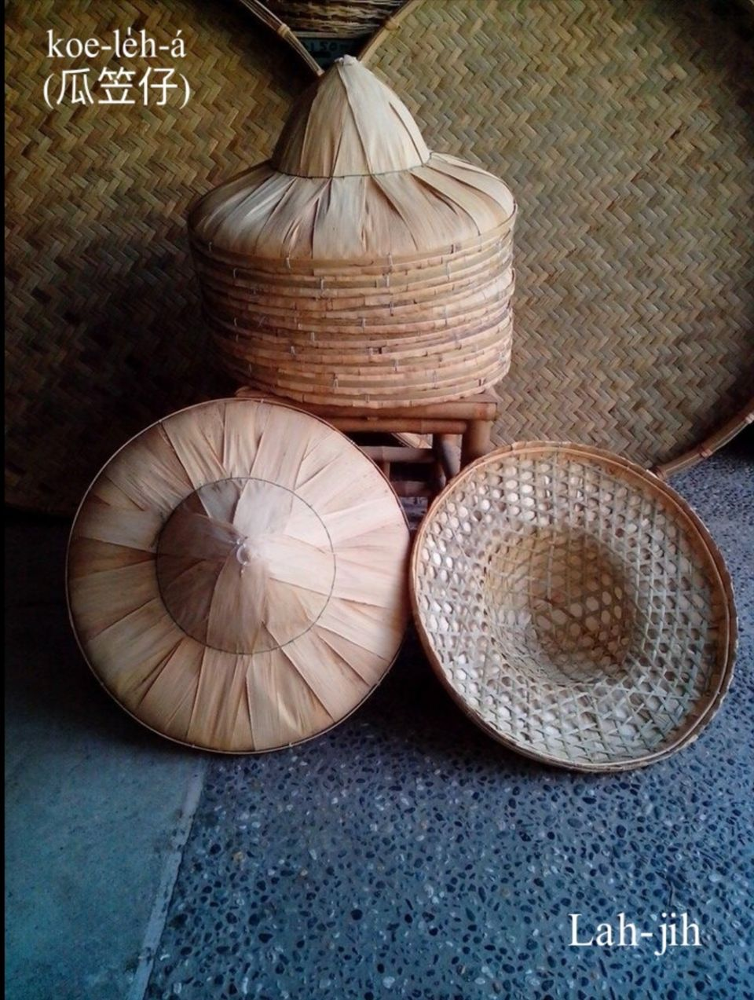
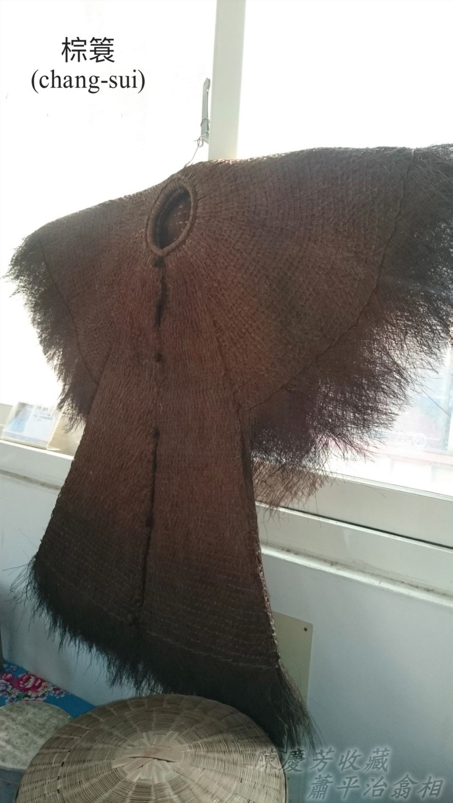
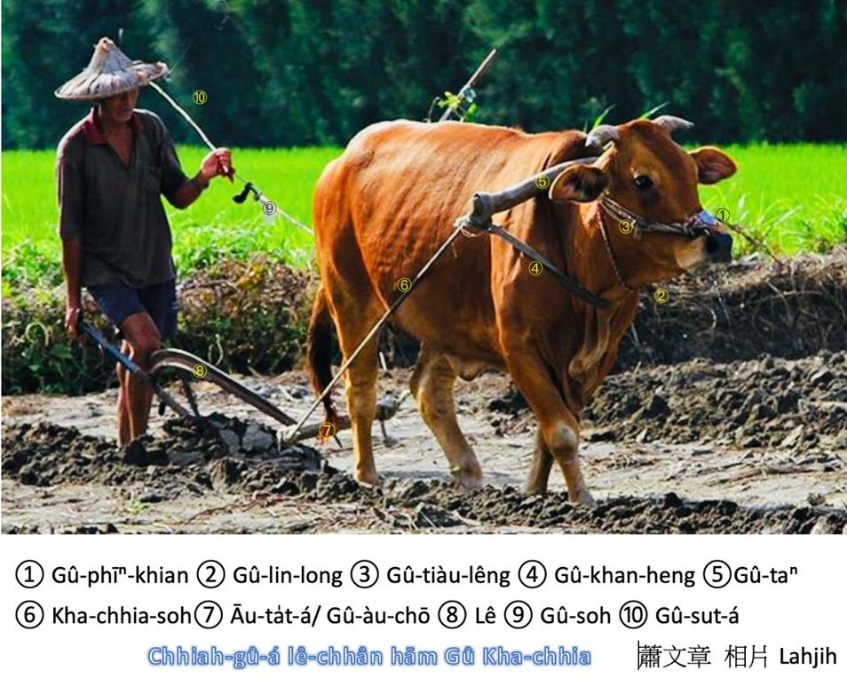
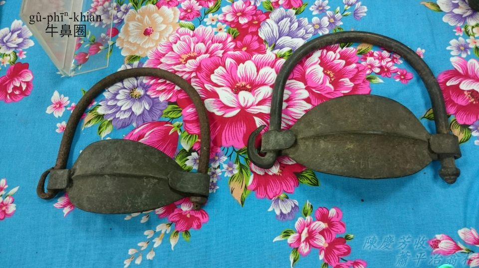
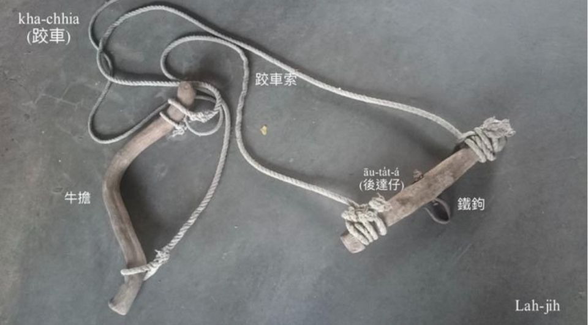
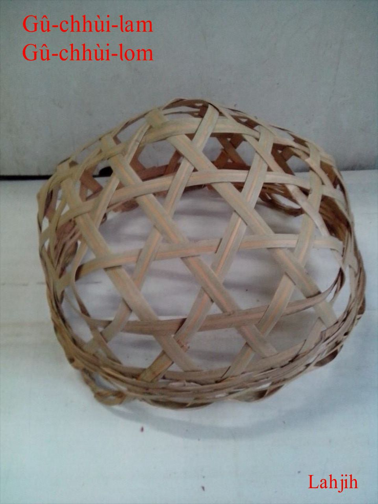
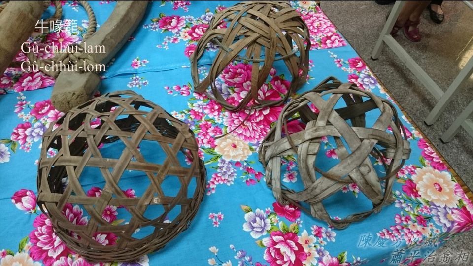

# 駛田篇—農村印象hām駛田簡介
> **Sái-chhân-phiⁿ — Lông-chhoan Ìn-siōng hām Sái-chhân Kán-kài**

駛田是播田進前牛犁pē ê khang-khòe，tāi-seng用犁犁田土，kā田土犁ho͘深深péng-pêng suh空氣，然後淹水，chiah koh用手pē／鐵pē ，割pē pháng田，pháng ho͘幼幼，最後chiah koh用loa̍h筒loa̍h-pêⁿ，to̍h ē-sái-tit準備播田插秧á。

# 1. 牛角嶺 — 故鄉ê景致
> **Gû-kak-niah — Kò͘-hiong ê kéng-tì**

Niā是稜線ê形，Gû-kak-niā阮講Gû-kak-niah，漢字寫做牛港嶺。

這2張Gû-kak-niah ê相片，翕相位置tī八堡一圳社頭地界南pêng。

八卦山脈siāng koân所在有443公尺，名叫做Hoâiⁿ-soaⁿ（橫山），在地人講橫山á，古早叫做牛káng嶺，牛káng to̍h是大隻牛公，牛káng mā叫牛kak。因為伊ê山形tī山腳社頭、田中央看ǹg東pêng，kài-sêng牛頭āu-khok連ām-kún ê所在，所以有牛kak嶺ê稱號。Gû-kak-niah tī hit-lō交通不便，步步tio̍h步lián，看ē-tio̍h m̄-bat踏腳到ê古早時代，有可能ē ka看做是聖山，庇佑八卦山腳ê子民。

1991年，載大兄二兄三兄來到牛kak嶺，落車欣賞山腳景致，65歲ê二兄讚嘆一聲：「自做gín-á到taⁿ，tī咱崁頂庄看60幾冬ê Gû-kak-niah，今á日總算來到chia！」歡喜寫tī面--裡，心情清爽無tè比。

# 2. 作田人kap牛 — 相依相倚ê關係
> **Choh-chhân-lâng kap Gû — Saⁿ I Saⁿ Óa Ê Koan-hē**

牛是作田人ê性命好朋友，牛ē犁田作穡，拖車做工，刻苦耐勞m̄-bat喝艱苦，透早到暗陪伴主人，罕得pān-tōaⁿ罷工，食，kài簡單，稻草、牛埔草phí，nā有蔗íⁿ、番薯葉、番薯是上等料理，做，是一牛贏過十ê人工，m̄-chiah駛牛兄惜命命。

## 2-1. 水牛kap烏鶖
> **Chúi-gû kap O͘-chhiu**

Tī 1970年代進前ê田庄所在，烏鶖khiā tī水牛kha-chiah-phiaⁿ是chiâⁿ-chia̍p看tio̍h ê景象，大phiāng水牛行過草埔、田園，蚊á胡蠅iāⁿ-iāⁿ飛，iáu有水牛身軀頂ê牛蜂、牛蜱，lóng是烏鶖ê好食物。

水牛kap烏鶖互利共生，水牛徙振動，to̍h有蚊á胡蠅iāⁿ-iāⁿ飛，烏鶖mā-ē食牛ê寄生蟲thōa。牛是慢鈍好性地，載伊烏鶖四界se̍h，烏鶖mā無失伊禮，替牛趕蚊lia̍h蚊蟲，互相幫贊tàu-saⁿ-kāng，chit款景致真迷人。

水牛比赤牛khah有力，Chhân-tiong-ng（田中央）地區水田khah chē，駛田、拖牛車載貨，lóng需要水牛，khah少看tio̍h赤牛á。

## 2-2. 水牛á-kiáⁿ
> **Chúi-gû-á-kiáⁿ**

## 2-3. 赤牛
> **Chhiah-gû**

赤牛á mā是ē-hiáu駛田、拖牛車。

## 3. 瓜笠á kap棕簑
> **Koe-loe̍h kap Chang-sui**

瓜笠á kap棕簑，是khah早做穡人標準ê穿插，日頭赤iāⁿ-iāⁿ，瓜笠á tì--leh，cha̍h鑿目日頭光koh兼bē曝kah皮疼。Nā tn̄g tio̍h落雨天，棕簑穿--leh，chiah bē kui身軀ak kah tâm-kô͘-kô͘。Tì瓜笠穿棕簑，到taⁿ猶原是chiâⁿ chē人懷念ê農村景致。

## 3-1. 瓜笠á／竹笠á
> **Koe-le̍h-á/Tek-le̍h-á**

笠á是作田人cha̍h日jia雨ê帽á，竹篾á pīⁿ ê笠á胚，外面thīⁿ桂竹ha̍h-á，形體sió-khóa sêng圓圓瓜形，瓜笠á、竹笠á、甲笠á lóng有人講，nā寫做kôe-le̍h-á（葵笠á）to̍h無合。

## 3-2. 棕簑
> **Chang-sui**

棕簑是古早作田人ê雨moa，頭戴瓜笠，身穿棕簑，適合落雨天巡田水、犁田、踏割耙穿。棕簑是用棕簑毛編織雨衫，穿--起來chiâⁿ刺鑿koh重，古早無雨moa，穿久to̍h慣勢，nā無，tn̄g-tio̍h落雨天，田--裡boeh án-chóaⁿ作穡？

## 3-3. 棕簑毛
> **Chang-sui Mo͘**

棕簑毛是ùi山棕（俗名虎尾棕）ê葉柄頭hit têng纖維採取--ê。

## 【Lah-jih台灣俗語】
- 有毛--ê食到棕簑，無毛--ê食到秤錘。
 
# 4. 牛做工ê配備簡介
> **Gû Chò-kang ê Phòe-pī**

田--裡真chē khang-khòe需要牛來tàu-saⁿ-kāng，咱用下面這張圖片來簡單紹介牛身軀頂ê配備。

## 4-1. 牛鼻Khian
> **Gû-phīⁿ-khian**

Kǹg入牛鼻ê khian-á，材料是bē seⁿ-sian ê金屬。Koh叫做牛鼻khoân。

## 4-2. Gû-Lin-long

Lin-long-á是赤牛ê配備，掛tī牛ām，行路ē lin-lin-long-long響。

## 4-3. 牛吊龍
> **Gû-tiàu-lêng**

Kā牛鼻khian固定tī鼻龍ê索á。

## 4-4. 牛牽胸
> **Gû-khan-heng**

固定牛擔ê索á。

## 4-5. 牛擔
> **Gû-taⁿ**

Khòe tī牛肩胛ām-kún頂，木造、竹造ê彎彎曲擔。Koh叫做gû-ka-taⁿ（牛加擔）。

## 4-6. 腳車索
> **Kha-chhia-soh**

一般用iûⁿ-môa phah ê三股索。

## 4-7. 後達á
> **Āu-ta̍t-á**

Mā講gû-āu-chō（牛後座），柴造，有安1-ê鐵kho͘-á kap犁鉤相連。

## 4-8. 犁
> **Lê**

重犁深掘chiah有好收成，駛牛兄tò手牽牛索，指揮牛拖犁，正手hōaⁿ犁柄，角度分深淺，力頭節輕重，深犁土胚chiah-ē大塊，nà日suh空氣chiah-ē chiâu-ûn，土肉營養份有夠，稻á chiah大ē súi。

## 4-9. 牛索
> **Gû-soh**

Pa̍k tī牛鼻khian ê黃麻索，是人kap牛互動ê媒人（媒介），教--過訓練--過ê牛，透過牛索tiuh振動to̍h ē了解牽牛兄ê意思行、停、正斡、tò斡。

## 4-10. 牛Sut-á
> **Gû-sut-á**

Ē使得用掃梳gím-á、樹á枝、a̍h是tîn-tiâu（籐條），是指揮牛哥行動第二媒介。

# 5. 牛做工ê配備詳細紹介

## 5-1. 牛鼻Khian
> **Gû-phīⁿ-khian**

俗語「牛鼻m̄牽，boeh牽牛耳。」意思是講boeh約束牛ê行動，重點tī牛鼻，m̄是牛耳。Kǹg鼻ê牛隻，牛鼻khian to̍h是控制牛行動ê家私。

## 5-2. Lin-long-á
Lin-long-á是赤牛ê配備，掛tī牛ām，行路ē lin-lin-long-long響。

## 5-3. 牛擔
> **Gû-taⁿ**

Khòe tī牛肩胛ām-kún頂，木造、竹造ê彎彎曲擔。Koh叫做gû-ka-taⁿ（牛加擔）。

## 5-4. 後達á
> **Āu-ta̍t-á**

Mā講gû-āu-chō（牛後座），柴造，有安1-ê鐵kho͘-á kap犁鉤相連。

## 5-5. 牛Sut-á
> **Gû-sut-á**

牛索、牛sut-á是指揮牛哥行路、作穡ê家私，牛索一下giú，牛哥隨時知影án-chóaⁿ做，tn̄g-tio̍h牛哥戇神無聽話，牛sut-á sió-khóa kiuh--一-下，隨時見效。牛mā是有脾氣，牛性地nā起，a̍h是siuⁿ-thiám m̄振動，to̍h-ài看hit-ê牽牛ê作穡人án-chóaⁿ對待，大部份ê作田人lóng是疼牛ná性命。

## 5-6. 腳車
> **Kha-chhia**

牛擔＋牛牽胸＋腳車索＋後達á＝腳車。

駛田犁田ê配備。Kha-chhia mā有人講gû-ka-chhia（牛枷車），a̍h是ka-chhia（枷車）。按照《台日大辭典》ê記載：Ka-chhia（枷車）指hō͘牛拖牛車、拖犁ê kui套設備，包括「枷擔」kap「後躂á」kap連接犁ê索。《教典》寫做ka-chhia（加車）。

## 5-7. 牛嘴籠
> **Gû-chhùi-lom/Gû-chhùi-lam**

駛田時，nā tn̄g-tio̍h犁糊á番薯a̍h是田園有牛kah意食ê菜蔬，tio̍h-ài掛牛嘴lom，防止牛顧食m̄拖犁。Khah早國民學校早起tio̍h『晨間檢查』，阮kā嘴am『口罩』叫做牛嘴lom，mā有人講牛嘴am。

## 【Lah-jih生活寫真】二兄
> **【Lah-jih Seng-oa̍h Siá-chin】Jī-hiaⁿ**

二兄giâ犁kap腳車boeh落田作穡。

# 6. 相關語詞
> **Siang-koan Gí-sû**

## 6-1. 翻腳車
> **Hoan-kha-chhia**

牛mā有性地，有時ē tiùⁿ-ku m̄拖犁、m̄拖車，to̍h-ē翻腳車。人有時mā-ē翻腳車，講話無算話。

## 6-2. Lêng牛鼻
> **Lêng Gû-phīⁿ**

牛鼻是siāng脆弱bē堪得giú ê所在，nā是牛鼻hông kǹg--落-去，to̍h隨在人指使。俗語有「牛鼻m̄牽，beh牽牛耳。」

## 6-3. 蠻牛厚屎尿
> **Bân-gû Kāu Sái-jiō**

牛nā使性地to̍h ē pān-tōaⁿ，行路慢鈍m̄聽話，m̄是放屎to̍h是放尿，無心拖車，無心犁田，kan-nā想boeh食。

# 7. 註解
> **Chù-kái**

|**詞**|**解說**|
|Lia̍h貓lia̍h niah|古早有「Lia̍h貓lia̍h niah」ê lia̍h貓á方法，niah（岭）to̍h是貓á ām-kún頂面位置，親像山嶺ê稜線。|
|Niah|Niah是田中央崁頂庄在地ê腔口，別位有人講「niā」，親像《台日》收錄「岭／niā」，《教典》收錄「陵／niā」。
|Pān-tōaⁿ／pîn-tōaⁿ／pūn-tōaⁿ|『懶惰』。|
|Bē／bōe|『不會』。|
|鼻龍|Phīⁿ-lêng／phīⁿ-liông，『鼻樑』。|
|Boeh／beh|『要』。|
|Iûⁿ-môa|『黃麻』。|
|Hit têng纖維|『指那層葉鞘』。|
