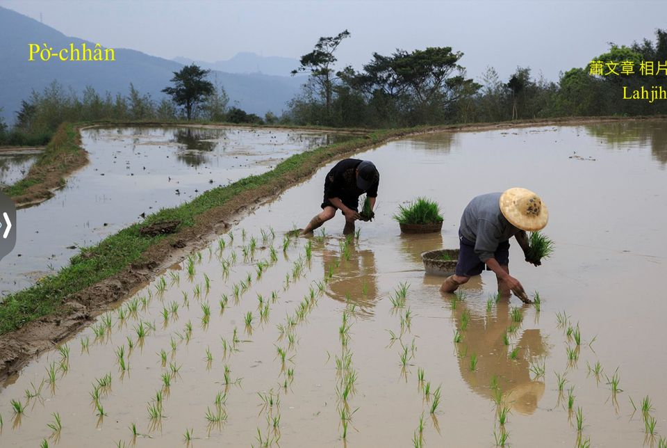

# 作田人Kui年冬ê Khang-khòe
> **Choh-chhân-lâng Kui Nî-tang ê Khang-khòe**


<!-- ```mermaid!
graph LR
    A["駛田"] --> B("播田")
    B --> C("收成（割稻á）")
    C --> D("曝粟")
    D --> E("收藏")
    E --> A
``` -->


Án-ne一冬koh一冬；透早是田水冷ki-ki，boeh晝是日頭赤iāⁿ-iāⁿ，kui冬ê無閒，kan-nā ǹg望年年好收成。

# 1. Kui年冬種作ê穡頭
> **Kui Nî-tang Chèng-choh ê Sit-thâu**

台灣一年四季如春，一年ē-tàng收成3冬，兩冬粟á一冬雜糧，無hit-lō春耕、夏種、秋收、冬藏ê觀念。

第一期稻作tī太陽曆一、二月掖秧á，三、四月播田，到七月份收成割稻，大約140工，成長期khah慢，收成khah chē，可惜七--月厚風颱做大水，早冬粟boeh豐收to̍h ē phah折，pháiⁿ按算。

第二期稻作tī太陽曆七月份to̍h-ài掖種，因為早冬粟收割了後，隨時tio̍h犁田pháng田，八月初to̍h-ài插秧á，是作田人siāng無閒ê季節，m̄ chiah有「六月六，頭家落田phah la̍k-ta̍k」 ê俗語，tī chia六月六是太陰曆。秧á插好，經過飽kūi、抽穗、芒花、入漿、飽穗到鉤頭、熟黃、割稻大約120工，成長比早冬稻khah快速，mā是因為快速，收成比早冬減真chē，不過chit段期間，無風颱水災來sńg-tn̄g，少bóng少，卻是穩tak-tak在穩--ê，第二冬to̍h是慢冬、望冬、穩冬。

第二期稻作收割tī十一月kha-tau，寒天已經到，田--裡工課暫時ē-tàng歇喘，俗語講：「入冬，田頭空。」To̍h是講chit段時間，田頭已經khah少穡頭，田頭少穡頭並m̄是田--裡無作物，tī慢冬稻á iáu未割進前，早to̍h tī稻á縫糊番薯藤、tiām番麥á種，a̍h是犁田掖楊麻，mā有thiau-kang放ho͘拋荒hō͘田土小歇睏。

Tī chit-chām khah閒ê làng縫，厝邊隔壁ê cha-bó͘人to̍h-ē相招會齊，炊碗粿、thoah米篩目、舂麻糍慰勞ka-tī 1年ê辛苦，大人無閒挨粿漿，gín-á歡喜削碗粿chhiám-á。「立冬，補嘴空。」有--ê thâi鴨公tīm補，無--ê bun米糕kā gín-á補膀胱有力，暗時á khah bē chhōa尿，koh khah sàn赤--ê只好看人食，三頓都jiok bē赴，ná有thang補嘴空？

過年前後需要開始犁田準備播早冬稻，田--裡種iûⁿ麻--ê tio̍h ài khau，種番麥tio̍h ài at，糊á番薯tio̍h-ài掘。Khau iûⁿ麻『拔黃麻』、peh iûⁿ麻、khau iûⁿ麻『刮黃麻』，大人gín-á總動員，at番麥是分做幾工at去賣，糊á番薯有人kō͘犁來犁，後壁人工toè-leh khioh，講做「piàⁿ番薯」，to̍h koh無閒一段時間，sòa--落-去to̍h是準備炊粿過年。


# 2. 註解
> **Chù-kái**

|**詞**|**解說**|
|收成三冬|收成三期，mā ē-tàng講三水。|
|To̍h-ē|『就會』。|
|To̍h-ài|『就要』。|
|作田|Choh-chhân；作，有規劃創造ê意涵。|
|Tī chia|『在這裡』。|
|穩tak-tak|『穩當，跑不掉』。|
|Kha-tau|『左右，相近』。|
|Khang-khòe|『工作』。|
|糊番薯藤|『隨便像糊漿糊般，將蕃薯藤種在水田裡』。|
|Tiām番麥á|Tiām，『挖洞將種子種下』。|
|黃麻|黃麻n̂g-môa，楊麻iûⁿ-môa，無kāng品種，阮慣勢kā黃麻講做iûⁿ-môa。|
|Làng縫|Làng-phāng，『空檔』。|
|Thoah米篩目|用米篩目枋lù粿粞ê動作，號做thoah。|
|Chhōa尿|Gín-á放尿tī褲底，號做chhōa尿；大人膀胱無力，kā尿滲tī褲內，號做chhoah尿。|
|Ná有／nā有|Ná有『哪有』；nā有『若有』。|
|Tio̍h-ài|『需要』。|
|To̍h ài|『就要』。|
|At番麥|採收番麥以直接『折斷』番麥柄，號做at番麥。|
|Toè／tè|跟tòe，『跟在後面』。|
|Khioh|『撿拾』。|
|To̍h-koh|『就再』。|
|Tio̍h-koh|『需要再』。|