# 播田篇—種作簡介kap秧Chioh
> **Pò͘-chhân-phiⁿ — Chèng-choh Kán-kài kap Ng-chioh**

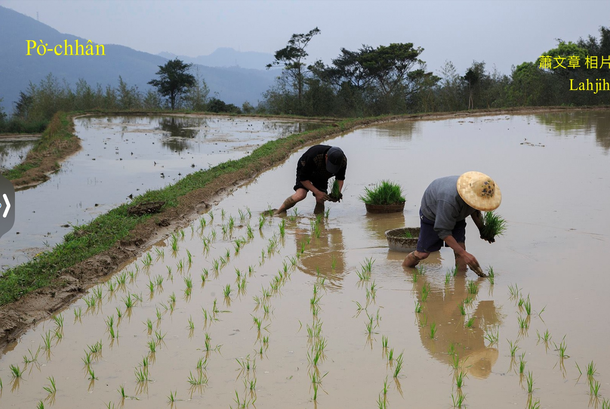

# 1. 按怎種作
> **Án-chóaⁿ Chèng-choh**

台灣一年四季如春，一年ē-tàng收成3冬，兩冬粟á一冬雜糧，無hit-lō春耕、夏種、秋收、冬藏ê觀念。

第一期稻作tī太陽曆一、二月掖秧á，三、四月播田，到七月份收成割稻，大約140工，成長期khah慢，收成khah chē，可惜七--月厚風颱做大水，早冬粟boeh豐收to̍h ē phah折，pháiⁿ按算。

第二期稻作tī太陽曆七月份to̍h-ài掖種，因為早冬粟收割了後，隨時tio̍h犁田pháng田，八月初to̍h-ài插秧á，是作田人siāng無閒ê季節，m̄ chiah有「六月六，頭家落田phah la̍k-ta̍k」 ê俗語，tī chia六月六是太陰曆。秧á插好，經過飽kūi、抽穗、芒花、入漿、飽穗到鉤頭、熟黃、割稻大約120工，成長比早冬稻khah快速，mā是因為快速，收成比早冬減真chē，不過chit段期間，無風颱水災來sńg-tn̄g，少bóng少，卻是穩tak-tak在穩--ê，第二冬to̍h是慢冬、望冬、穩冬。

第二期稻作收割tī十一月kha-tau，寒天已經到，田--裡工課暫時ē-tàng歇喘，俗語講：「入冬，田頭空。」To̍h是講chit段時間，田頭已經khah少穡頭，田頭少穡頭並m̄是田--裡無作物，tī慢冬稻á iáu未割進前，早to̍h tī稻á縫糊番薯藤、tiām番麥á種，a̍h是犁田掖楊麻，mā有thiau-kang放ho͘拋荒hō͘田土小歇睏。

Tī chit-chām khah閒ê làng縫，厝邊隔壁ê cha-bó͘人to̍h-ē相招會齊，炊碗粿、thoah米篩目、舂麻糍慰勞ka-tī 1年ê辛苦，大人無閒挨粿漿，gín-á歡喜削碗粿chhiám-á。「立冬，補嘴空。」有--ê thâi鴨公tīm補，無--ê bun米糕kā gín-á補膀胱有力，暗時á khah bē chhōa尿，koh khah sàn赤--ê只好看人食，三頓都jiok bē赴，ná有thang補嘴空？

過年前後需要開始犁田準備播早冬稻，田--裡種iûⁿ麻--ê tio̍h ài khau，種番麥tio̍h ài at，糊á番薯tio̍h-ài掘。Khau iûⁿ麻『拔黃麻』、peh iûⁿ麻、khau iûⁿ麻『刮黃麻』，大人gín-á總動員，at番麥是分做幾工at去賣，糊á番薯有人kō͘犁來犁，後壁人工toè-leh khioh，講做「piàⁿ番薯」，to̍h koh無閒一段時間，sòa--落-去to̍h是準備炊粿過年。

# 2. 播田ê流程
> **Pò͘-chhân ê Liû-têng**

播田to̍h是播稻á、插秧á，插秧á進前tio̍h先掖秧á，掖秧á tio̍h秧chioh，秧chioh to̍h是華語『秧田』。Pháng田進前有人提供1-khu田稅人做秧chioh，a̍h是ka-tī留1-liau地做秧chioh，秧chioh田tio̍h ài等待秧á lóng thio了，chiah ē-sái-tit犁田插秧á。

Ùi選粟種、浸粟種、掖秧á到播田、so草，koh來等飽kūi、抽穗、芒花、入漿、飽穗到鉤頭、熟黃、割稻，ē-sái-tit講liân-sòa ê關心kap無閒。透早tio̍h出門，受苦無人問，iām天是赤日頭，寒--人是田水冷霜霜，m̄-koh做kah ná牛ê作田兄，m̄敢喝艱苦，「做雞tio̍h chhéng，做人tio̍h péng。」天生認命。

選粟種、用水桶浸粟á浸一暝to̍h ka ko͘起來khǹg  tiàm米籮，早冬天氣khah寒需要hiù燒水，khàm布袋，保持溫度，mā tio̍h用手chhiau振動，chiah ē puh芽，2-3暝後看nā tú pok芽to̍h ài掖秧á，chiah bē斷粟芽。粟芽掖tiàm秧chioh土面，需要用水soān-á soān水，驚粟芽寒to̍h掖麻á-kho͘粕保溫兼做肥料。

第二期慢冬粟種hiù冷水to̍h好，因為熱天天氣燒熱，秧á成長khah緊，秧á nā siuⁿ過長，to̍h需要cháⁿ秧á尾，秧á尾bē-sái-tit割tio̍h íⁿ。

# 3. 秧Chioh管理
> **Ng-chioh Koán-lí**

播田to̍h是插秧á，秧á to̍h是稻á栽，秧á需要一坵秧chioh來掖種，ùi秧chioh到掖秧á到taⁿ秧á去田--裡插秧á，需要用足chē家私，下面咱to̍h來紹介chia ê家私名稱kap路用。

## 3-1. 選粟種
> **Soán Chhek-chéng**

選飽tīⁿ kāng品種ê蓬萊粟、在來粟a̍h是chu̍t-á，kā phē-á（稗á）種子揀hìⁿ-sak。

## 3-2. 浸粟á
> **Chìm Chhek-á**
>
粟種khǹg-tiàm大kha水桶浸，水hē淹淹á（差不多20%）to̍h好，kā浮出水面ê phàⁿ粟ko͘掉，熱天大約浸1工1暝，寒天tio̍h 3-4工以上，chiah kā粟種ko͘起來khǹg tiàm米籮，早冬天氣khah寒，需要hiù燒水、khàm布袋保持溫度，mā tio̍h用手chhiau振動chiah ē puh芽，iáu未出芽進前，用la-lun-á燒ê水ka sip ho͘澹濕澹濕，nā發現已經phok芽，to̍h ē-sái-tit擔去秧chioh掖，chiah-bē斷粟芽。

## 3-3. 秧Chioh
> **Ng-chioh**

有人先犁1-khu田做秧chioh，分做1-liau 1-liau，pa̍k人掖秧á，秧chioh是稻á ê搖籃。掖秧á ê秧chioh需要pêⁿ-tháⁿ（平坦），thio秧á ê土肉chiah-ē平厚，需要人工用大支抹刀kā土面抹平。

> **補充：**
> **秧chioh mā有人講ng-chhio̍h（秧蓆），見《台日》：(泉)『秧苗圃』。**

## 3-4. 掖秧á
> **Iā Ng-á**

Kā tú puh芽ê粟á平均分散掖tiàm進前整理好ê秧chioh內，叫做掖秧á，需要技術，siuⁿ lang siuⁿ cha̍t lóng m̄好。

## 3-5. Thio秧á
> **Thio Ng-á**

秧á大kah超過 1-lia̍h長kha-tau，to̍h ē-sái-tit用秧thio，連土thio 1塊1塊，thang播田插秧á。秧thio連柄1支直直，thio秧á需要khû leh lia̍h-pêⁿ thio，角度lia̍h無準，ē thio tio̍h根a̍h是土肉thio siuⁿ chē，lóng無適合，kap用鋤頭掘草phí無kāng。
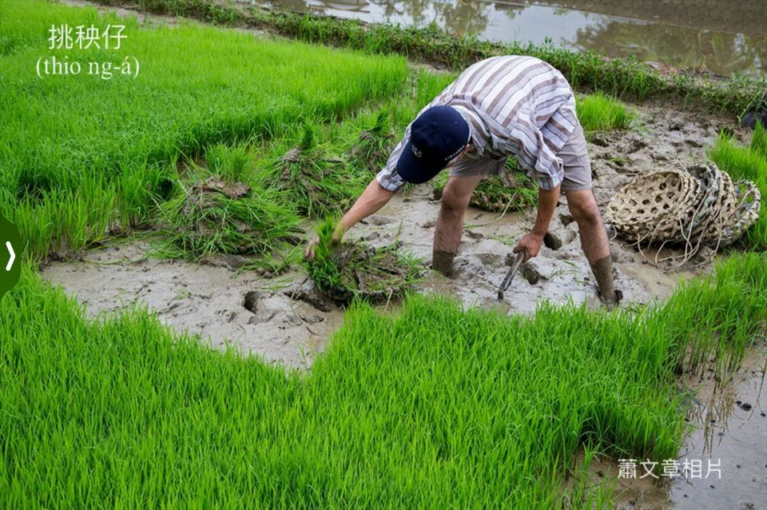

## 3-6. Khau秧á
> **Khau Ng-á**

因為播田lóng是厝邊隔壁放伴播，秧á nā siuⁿ過大欉，to̍h需要用khau--ê，koh用鐮le̍k-á kā秧尾cháⁿ一寡掉，千萬m̄-thang傷tio̍h秧á心，sòa--lo̍h用稻草pa̍k做1束1束。Siuⁿ長ê秧á ē tòm-sôe，khiā bē-thêng。

## 3-7. Taⁿ秧á
> **Taⁿ Ng-á**

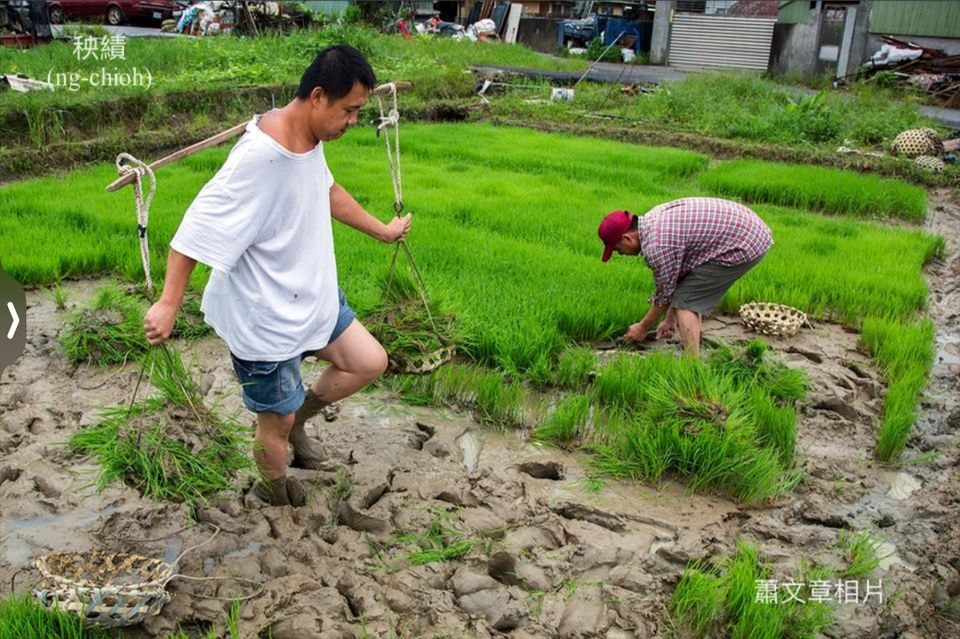
Taⁿ秧á tio̍h用秧lop-á貯秧á，秧lop-á 1-lop 1-lop ē-tàng相tha̍h，taⁿ去田頭khǹg-tiàm秧船á/秧桶船á內。

# 4. 秧Chioh家私
> **Ng-chioh Ke-si**

## 4-1. 浸粟á家私 — 水桶kap水桶藤
> **Chìm Chhek-á Ke-si — Chúi-tháng kap Chúi-tháng-tîn**

Kho͘桶師傅kho͘ ê柴桶，雙pêng有耳，chiah用籐ut ê水桶籐鉤--leh做kōaⁿ耳，水桶籐比pa̍k索á khah方便，ē-sái-tit khiā直，ē-sái-tit khòe平。

水桶平常時用來tī鼓井、水窟á擔水，mā用來浸粟種、貯番薯、醃瓜á去鼓井腳洗。

Chit種柴桶nā ka khǹg-tiàm房間放尿，to̍h是尿桶。
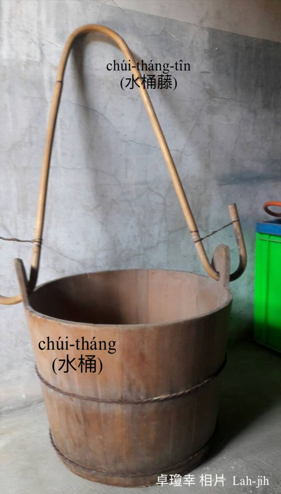
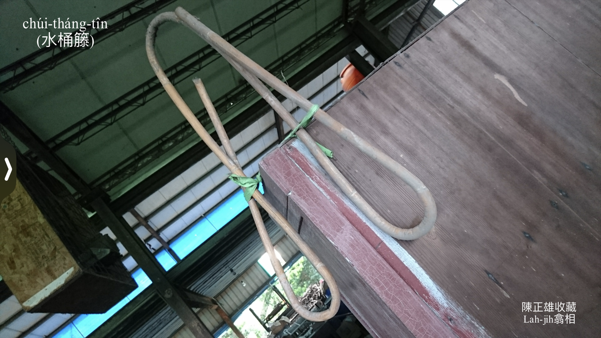
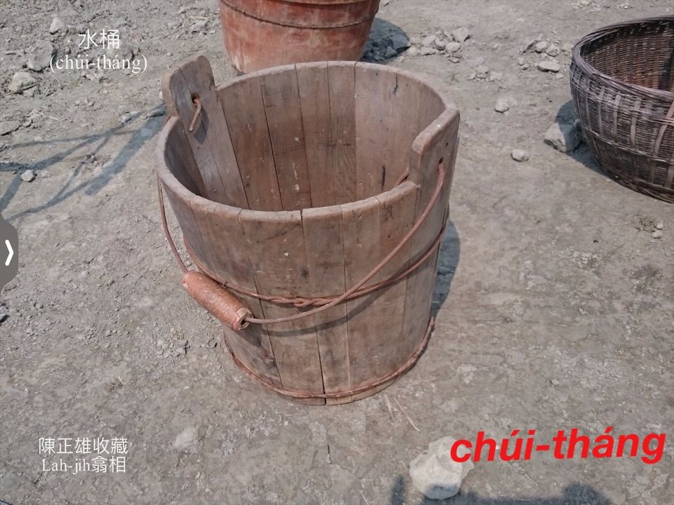

## 4-2. 浸粟á家私 — 布袋
> **Chìm Chhek-á Ke-si — Pò͘-tē**

Iûⁿ-môa布、瓊麻布，織ho͘ pûi-pûi （ba̍t-cha̍t）做ê布袋，用來貯粟貯米，方便運搬。浸粟種ê時，ē-tàng用來khàm粟種，保溫催芽。
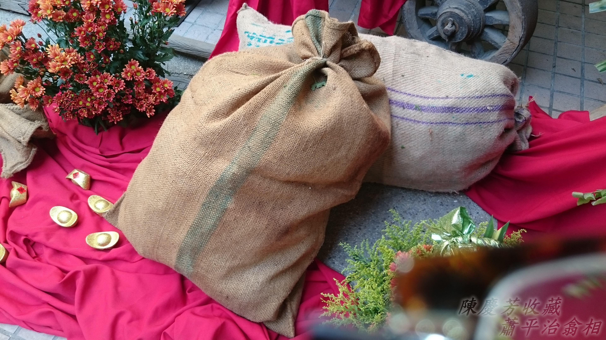
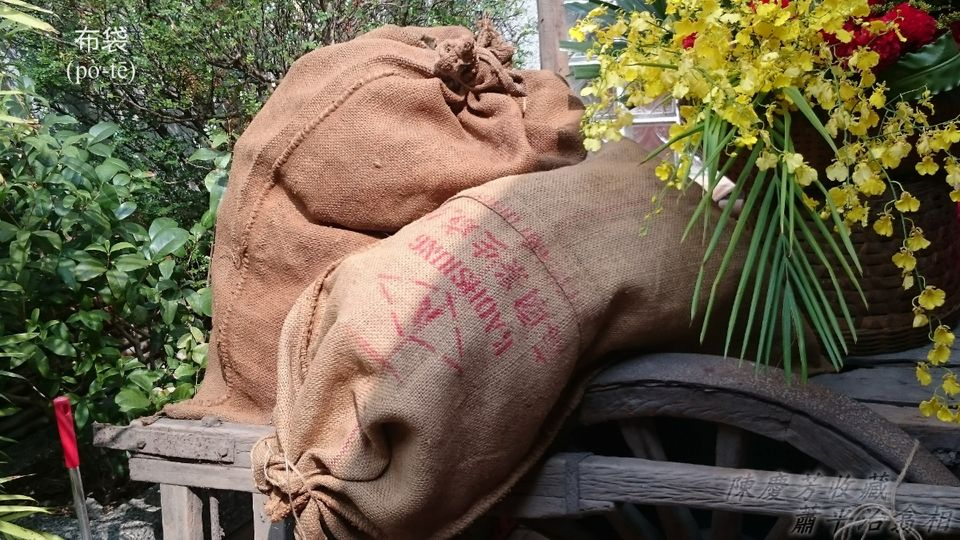

## 4-3. 秧Chioh家私 — 柴抹刀
> **Ng-chioh Ke-si — Chhâ Boah-to**

秧chioh一股一股ná菜股，為tio̍h方便thio秧á，掛土ê土胚khah pêⁿ-pāng（平棒），秧chioh紡好，需要用柴抹刀kā抹ho͘平平。
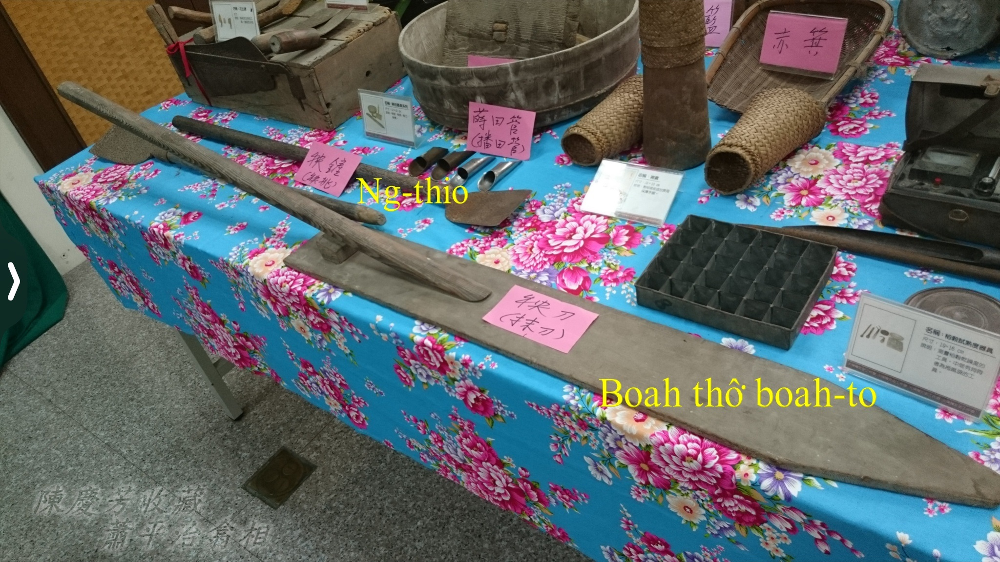

## 4-4. Thio秧á家私 — 秧Thio
> **Thio秧á家私 — 秧Thio**

秧thio一支ná大支煎匙，刀肉平平koh小可利利，kap thio柄成直線型，thio秧á ê時，需要貼土面摻土thio，秧á根tio̍h tiâu土。
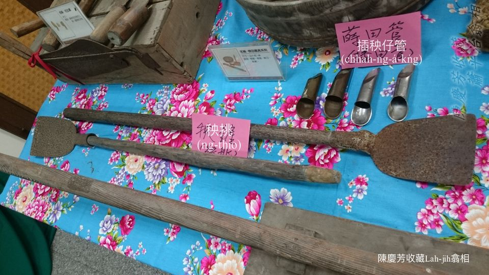
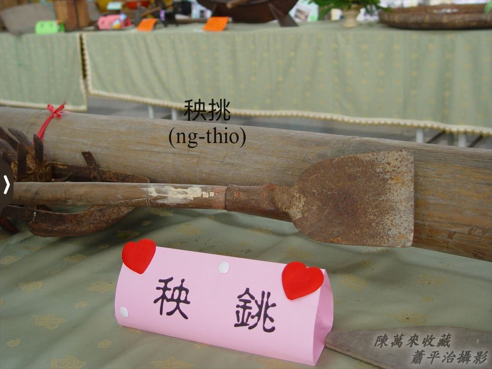

## 4-5. Khau秧á家私 —  鐮Le̍k-á
> **Khau Ng-á Ke-si — Liâm-le̍k-á**

鐮le̍k-á主要用來割稻á，mā ē-sái-tit用來割秧á尾。土腳插一支桂竹á，半人koân所在pa̍k一支鐮le̍k-á，刀肉tī下pêng翹翹，割秧á尾真方便。秧á nā大到siuⁿ長，to̍h-ài用khau--ê，chiah koh cháⁿ秧á尾。
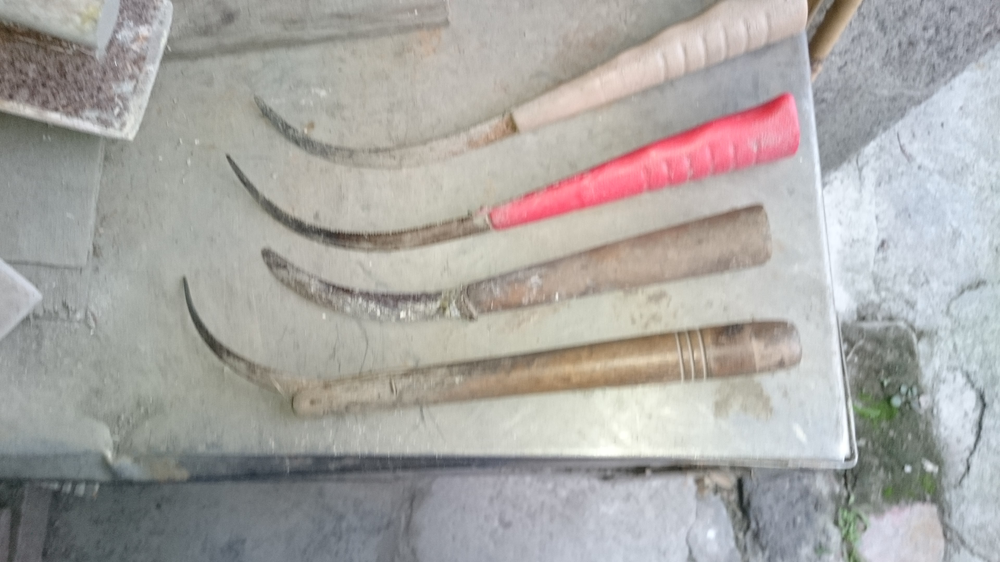

## 4-6. Taⁿ秧á家私 — 秧Lop-á
> **Taⁿ Ng-á Ke-si — Ng-Lop-á**

秧lop-á有人講秧籃á，貯秧á用，1-lop 1-lop相thia̍p，chiah用pùn-taⁿ（畚擔）掛鉛線鉤á擔，taⁿ去播田所在。掛鉛線耳、索á耳ē-tàng用畚擔taⁿ--ê是秧籃á，無耳--ê是秧lop-á。
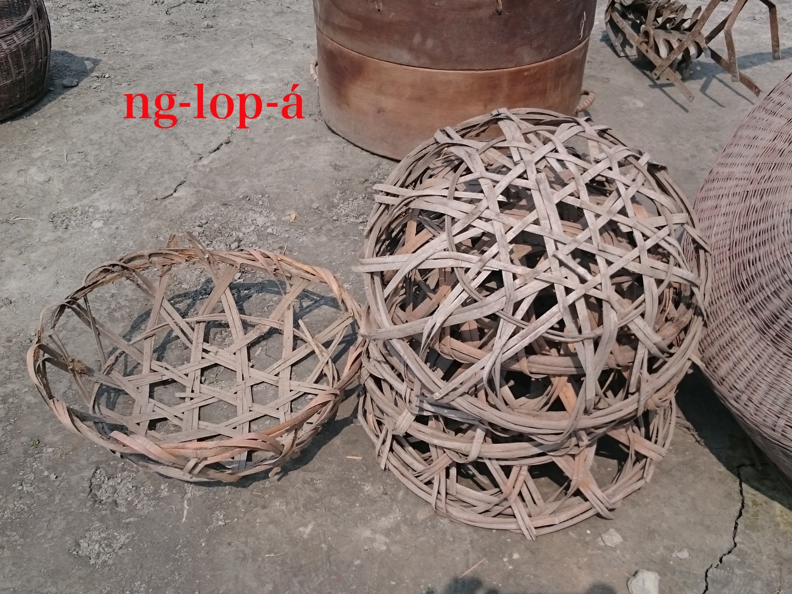
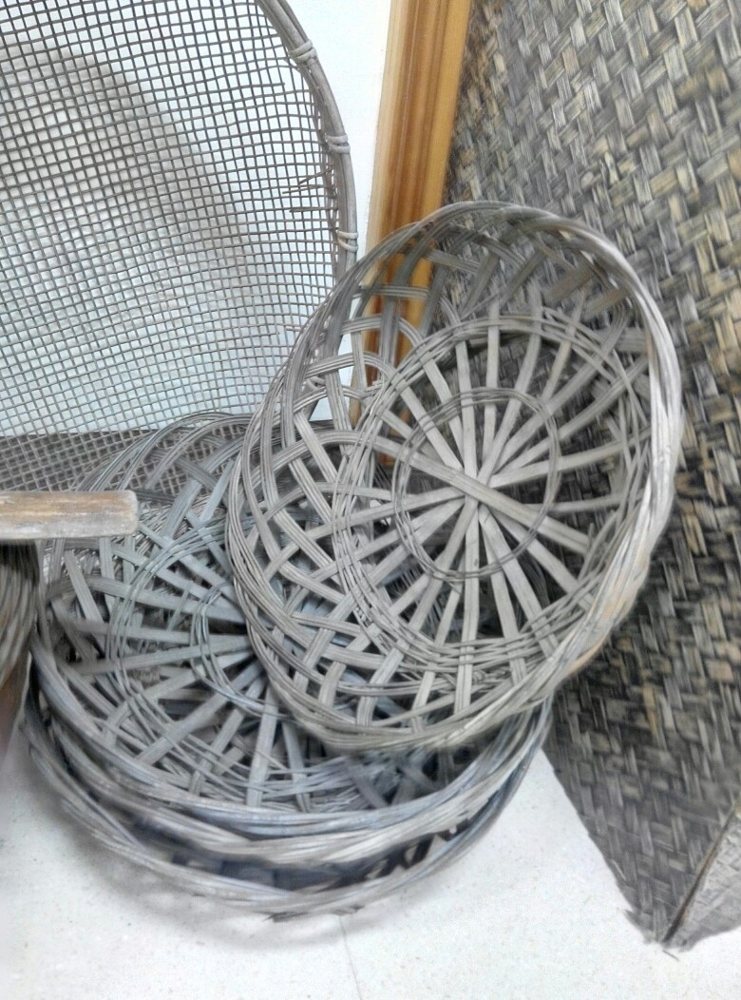
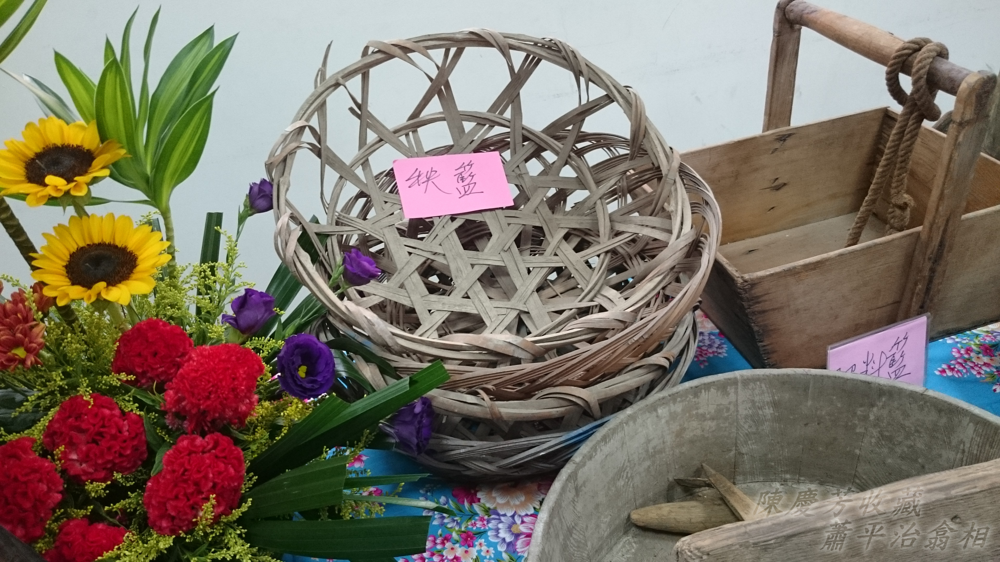
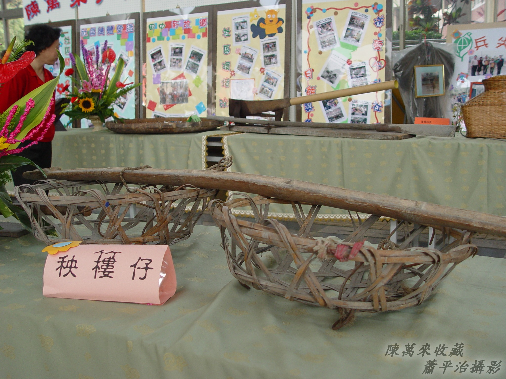

## 4-7. Taⁿ秧á家私 — 秧Lop-á架
> **Taⁿ Ng-á Ke-si — Ng-Lop-á Kè**

簡單柴kho͘釘ê秧lop-á架，實用方便，一擔taⁿ 4-lop秧á。
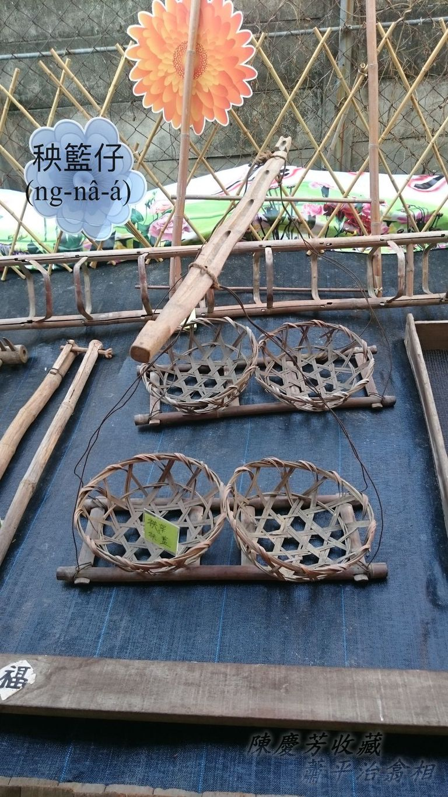

## 4-8. Taⁿ秧á家私 — 秧籃á
> **Taⁿ Ng-á Ke-si — Ng-nâ-á**

有pa̍k索á耳ê秧lop-á號做秧籃á，秧籃á面頂ē-tàng lop 1-kha 2-kha秧lop-á，án-ne 1-pái to̍h ē-tàng擔4~6 lop秧á。

# 5. 註解
> **Chù-kái**

|**詞**|**解說**|
|收成三冬|收成三期，mā ē-tàng講三水。|
|To̍h-ē|『就會』。|
|To̍h-ài|『就要』。|
|作田|Choh-chhân；作，有規劃創造ê意涵。|
|Tī chia|『在這裡』。|
|Ún-tak-tak|『穩當，跑不掉』。|
|Kha-tau|『左右，相近』。|
|Khang-khòe|『工作』。|
|糊番薯藤|『隨便像糊漿糊般，將蕃薯藤種在水田裡』。|
|Tiām番麥á|Tiām，『挖洞將種子種下』。|
|黃麻|黃麻n̂g-môa，楊麻iûⁿ-môa，無kāng品種，阮慣勢kā黃麻講做iûⁿ-môa。|
|Làng縫|Làng-phāng，『空檔』。|
|Thoah米篩目|用米篩目枋lù粿粞ê動作，號做thoah。|
|Chhōa尿|Gín-á放尿tī褲底，號做chhōa尿；大人膀胱無力，kā尿滲tī褲內，號做chhoah尿。|
|Ná有／nā有|Ná有『哪有』；nā有『若有』。|
|Tio̍h-ài|『需要』。|
|To̍h ài|『就要』。|
|At番麥|採收番麥以直接『折斷』番麥柄，號做at番麥。|
|Toè／tè|跟tòe，『跟在後面』。|
|Khioh|『撿拾』。|
|To̍h-koh|『就再』。|
|Tio̍h-koh|『需要再』。|
|Liau／liâu|『長條形』台語有時講liau，有時講liâu；豬肉liau、1-liau豬肉、khan-á-liau（牽á粿），í-liâu（椅條）、tn̂g-liâu（查某人長衫）。|
|Ùi hia來；tùi chia去|Ùi hia lâi；tùi chia khì，『從哪兒來；往那裡去』，ùi是From『從』，tùi是 to『往』。|
|Hiù水|用手指頭á『撥』水。|
|Chhiau振動|『攪動』。|
|Puh芽／Pok芽|Puh芽，發芽；Puh-íⁿ是植物體或種子發出新芽；Pok芽是種子tú-tú爆開看tio̍h胚芽。|
