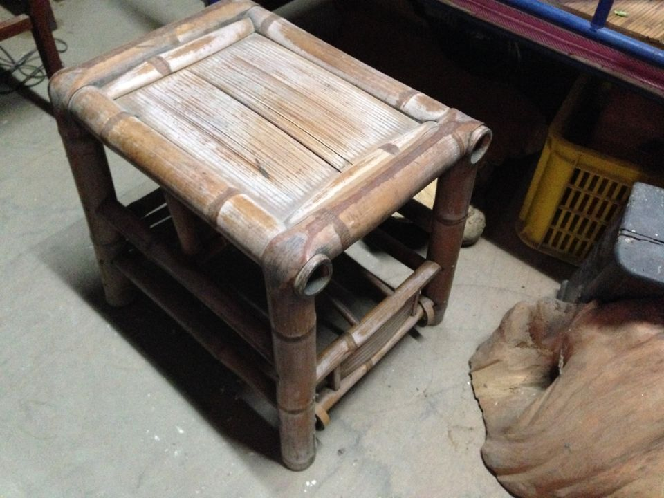
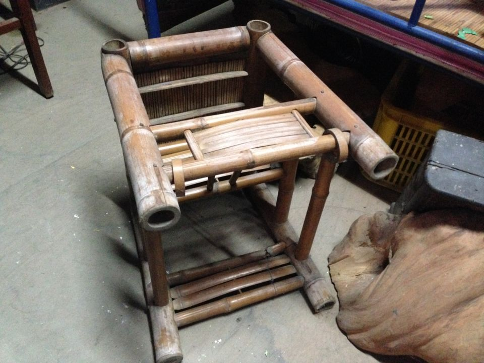

# 曝粟時Gín-á teh無閒Siáⁿ？
> **Pha̍k-chhek Sî Gín-á teh Bô-êng Siáⁿ?**

曝粟時大人是無閒kui工，gín-á nā mài hō͘大人操煩，已經是天公保庇。話講hoan頭，mā sī有gín-á ē-tàng tàu做ê tāi-chì，雞chhéng giâ--leh，tàu趕粟鳥á。大漢--ê kā細漢--ê kho͘ óa--lâi，草蓆á chhu--leh做夥thit-thô。Nā幼gín-á無人thang tàu顧，無ta-ôa to̍h ho͘坐抱kiáⁿ椅，hō͘椅á顧。

## 3-1. 雞Chhéng
> **Ke-chhéng**

一支pùn-taⁿ長度ê桂竹管，用柴刀破做6-liàm到三分二長ê所在，留三分一做柄，to̍h是一支雞chhéng，giâ tiàm手--裡搖搖chhe̍k-chhe̍k--leh，發出破脆聲，ē-sái-tit趕雞á驚走鳥á。曝粟ê時鳥á不時來teh偷食，ài ka趕--走，是gín-á重要ê任務。

另外有1-ê路用，有時大人ē用來phah gín-á。

## 【Lah-jih台灣俗語】
>**Lah-jih Tâi-oân Sio̍k-gí**

- 一支嘴，親像破雞chhéng。
   > 是keng-thé人雜唸se̍h-se̍h唸，唸bē soah。

## 3-2. 舊草蓆
> **Kū Chháu-chhio̍h**

Éng過眠床chhu草蓆，眠床頂thùi--起-來ê舊草蓆寶ni-ni，是gín-á siāng kài kah意ê地板，chhu-tiàm土腳，thèng-á坐thèng-á倒thèng-á睏thèng-á耍，大漢--ê陪細漢--ê，爸母to̍h穩心á作穡頭。

## 3-3. 抱Kiáⁿ椅kap新婦á椅
> **Phō-kiáⁿ-í kap Sim-pū-á-í**

大人無閒chhih-chhah，細漢gín-á只好khǹg hō͘抱kiáⁿ椅照顧，坐一下久無人chhap--伊，抱kiáⁿ椅to̍h變成新婦á椅。

抱kiáⁿ椅一椅兩用，四腳chhāi地是竹椅，大人ē-sái-tit坐，péng過來是抱kiáⁿ椅，細漢gín-á siāng kah意坐，不過坐久ē pìⁿ-chiâⁿ新婦á椅。

# 2. 註解
> **Chù-kái**

|**詞**|**解說**|
|無閒chhih-chhah|『非常忙碌』。|
|無人chhap--伊|『沒人理他』。|
|Chhāi地|『站立地上』。|
|Péng過來|『翻過來』。|
|Pìⁿ-chiâⁿ|變成，『變成』。|
|Thùi--起-來|『替換起來』。|
|寶ni-ni|『非常寶貴』。|
|大漢--ê|大漢ê gín-á。|
|細漢--ê|細漢ê gín-á。|
|Chhu-tiàm|『舖在』。|
|土腳|Thô͘-kha，『地上』。|
|Thèng-á|『可以』。|
|穩心á|Ún-sim-á，『非常放心』。|
