# 灶有Jōa-chē款？
> **Chàu Ū Jōa-chē Khoán?**

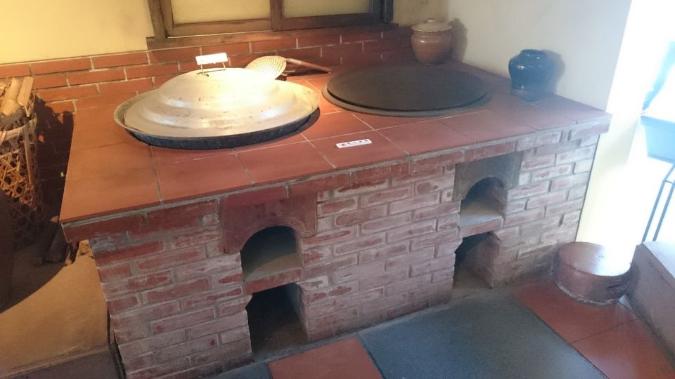

# 1. 灶ê種類
> **Chàu ê Chéng-lūi**

灶有大灶、seⁿ鍋灶、鋸sut-hu灶、烘爐灶、鐵桶灶。

傳統大灶需要師傅tiàm灶腳做灶、舂灶，有磚á灶kap篾á灶。做磚á灶需要先用磚á gih外殼，chiah-koh用土thūn，舂ho͘ cha̍t，然後挖khang，大khang thàng細khang，灶khang門、煙筒khang，大khang khǹg大鼎，細khang khǹg細鼎、銅鼎á、seⁿ鍋。挖khang了後chiah-koh安裝煙筒，kā灶頭、灶門糊紅毛土，a̍h是貼hûi-á磚；篾灶製作mā是kāng款，先用桂竹篾á pīⁿ 1-ê灶殼，然後搬入灶腳坉土、舂土、挖khang，si-á-geh。

大鼎灶門有兩khang，面頂hiâⁿ火，下面sîn火hu，細鼎mā有灶門蓋ē-tàng關，需要hiâⁿ火chiah phah開，平常時煮食ē-tàng khioh大鼎火尾á，因為火tī大鼎下面hōng-hōng叫，細鼎、煙筒有sio-thàng，根據空氣對流現象，熱度、火hun ē傳到後壁細鼎對煙筒chhèng對厝頂尾。

平常時，大鼎負責煮飯炒菜，細鼎hiâⁿ燒水，nā是tn̄g-tio̍h需要炊粿sa̍h豬菜，細鼎to̍h需要負責hiâⁿ燒水、滾水，a̍h是煮食，chit ê時陣，灶門蓋phah開ē-sái-tit hiâⁿ火，chiah有夠熱度。Ùi「大鼎未滾，細鼎chhiāng-chhiāng滾」chit句俗語來看，to̍h-ē知影早前灶ê構造是大鼎細鼎灶khang內面相thàng，mā-ē了解祖先勤儉省火柴ê智慧。

除了磚á灶、篾灶chit種大灶以外，mā有專門hiâⁿ鋸sut-hu ê鋸sut-hu灶，hiâⁿ火炭ê烘爐灶。Mā有he生理人做leh賣ê紅毛土灶，利用鐵桶做ê鐵桶灶。

# 2. 灶 ── 分類紹介
> **Chàu──Hun-lūi Siāu-kài**

## 2-1. 大灶
> **Tōa-chàu**

大灶是灶腳ê主角，三頓煮食、hiâⁿ燒水、sa̍h豬菜，年節炊粿lóng tio̍h大灶料理。大灶一般做tī灶腳倚壁，灶前有低椅，椅後khǹg火柴草in，灶後有貯水醃缸。

大灶灶頂分大細鼎，大鼎hit pêng有hiâⁿ火灶khang kap pê火hu ê火hu-khang；大鼎火thàng過後壁細鼎，細鼎邊安煙筒kā火hun引出厝頂外口，細鼎邊--a mā有灶khang，平常時關ba̍t，需要chiah phah開；灶頂有一寡空間叫做灶頭，用來khǹg豬油筒á kap煮食家私；灶khang前有火ngeh、火ngiáu、火hu-pê-á；壁頂安司命灶君灶君公chhat-á（擦á）kap khǹg番á火。司命灶君chàu-kun-kong阮講做chàu-un-kong，hō͘火hun hun kah烏mà-mà ê灶un公，a̍h是講做chàu-in-kong（灶恩公）。

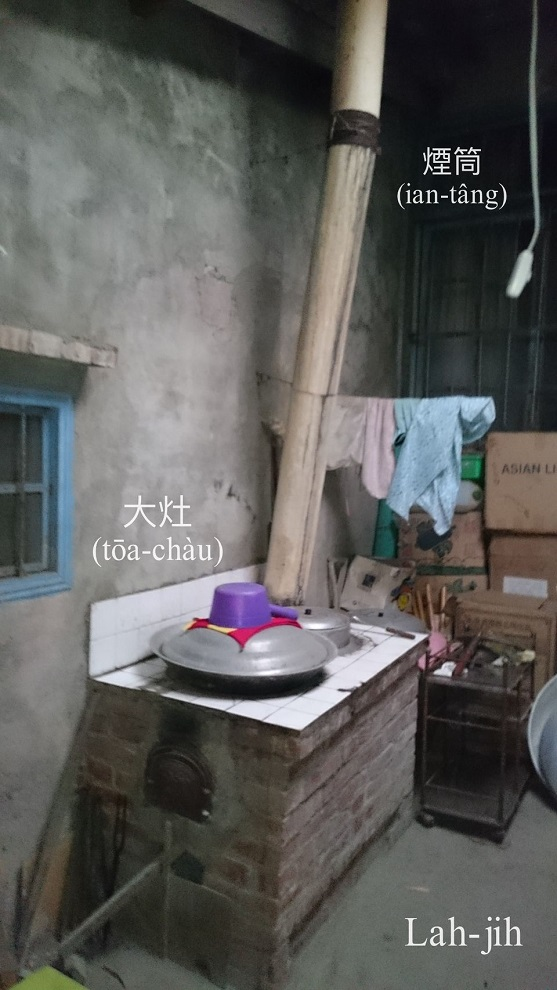

## 2-2. 紅毛土灶
> **Âng-mô͘-thô-chàu**

紅毛土灶是買生理人做便--ê轉來安座。
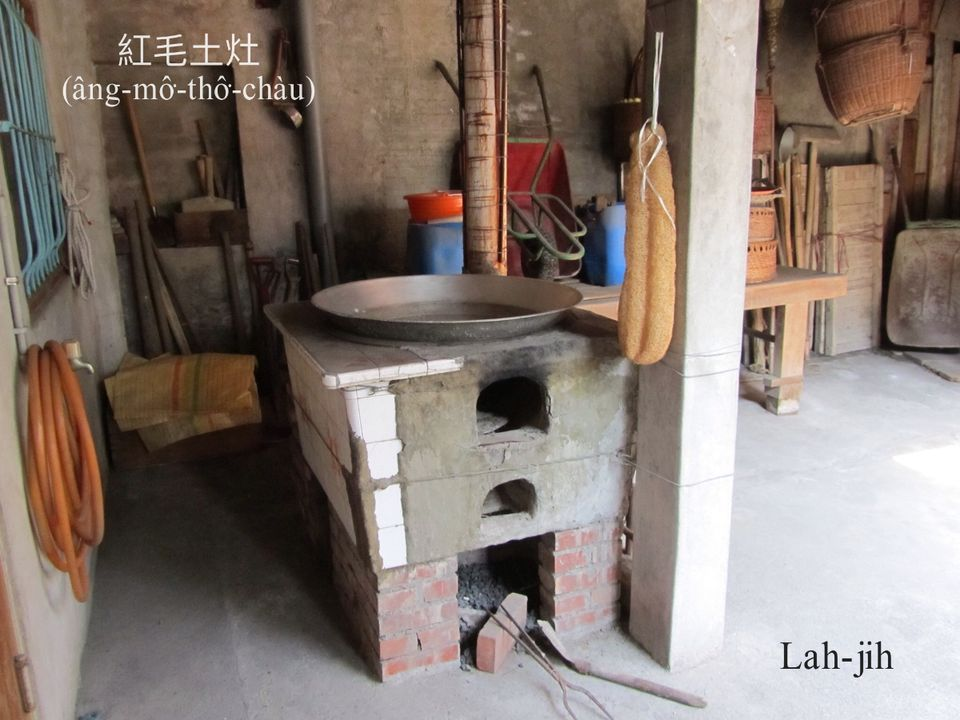

## 2-3. 磚á灶
> **Chng-á-chàu**

磚á灶，雙灶khang kap火hu-khang。
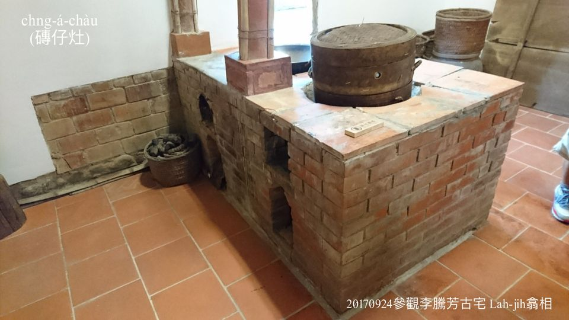

灶頭貼hûi-á磚，是做灶師傅直接tiàm灶腳起造。
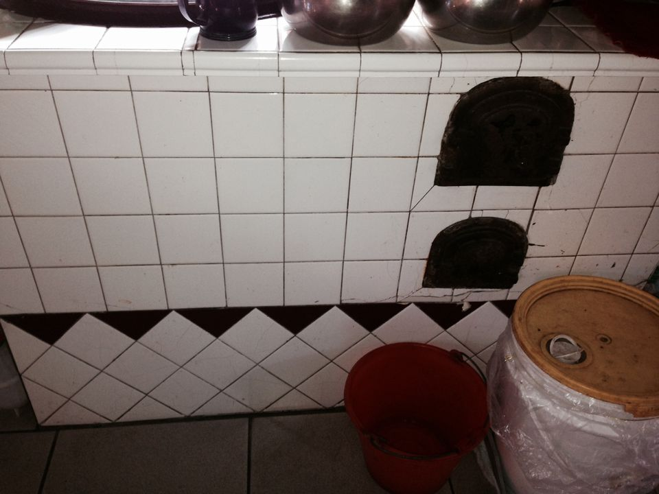

煙筒是石棉管，用桂竹á-pêng kah--leh，khah安全khah勇，石棉耐高溫，ē堪得火hun ê熱度。
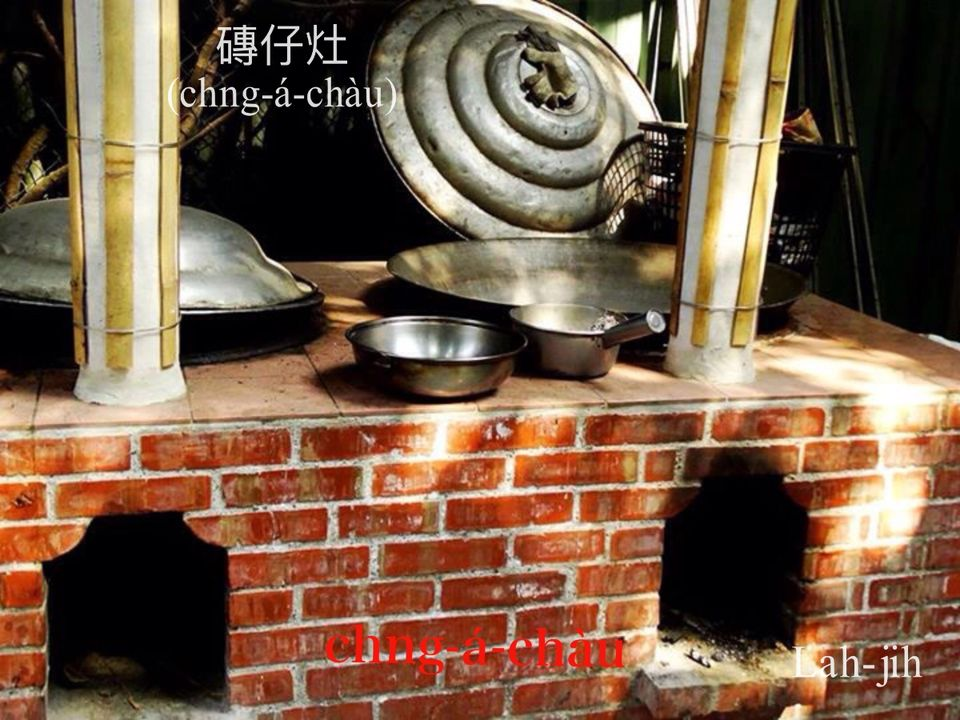

## 2-4. 鋸sut-hu灶
> **Kì-sut-hu-chàu**

鋸sut-hu是木材工場liâu柴鋸柴產生ê幼á，ē-sái-tit做hiâⁿ火火柴，需要特別細kâi灶，he細kâi鋸sut-hu灶比烘爐khah大，ē-sái-tit khǹg seⁿ鍋、銅鼎á，灶底深深，灶khang細細。Boeh煮食時，tio̍h先舂鋸sut-hu，先用兩支圓形柴棍，一支直插灶底，一支ùi灶khang穿入，chiah倒鋸sut-hu落--去，tio̍h用柴舂槌舂ho͘ tiâm-cha̍t koh m̄-thang siuⁿ ân，siuⁿ鬆鋸sut-hu ē崩--去，siuⁿ ân鋸sut-hu bē喘氣hiâⁿ bē-to̍h，che需要經驗，boeh hiâⁿ火to̍h先khǹg  khau刀lian-á做火母，án-ne舂1-pái鋸sut-hu，點1-pái火to̍h ē繼續to̍h，nā無koh煮食，to̍h kā灶khang用柴棍that-tiâu，鋸sut-hu無空氣對流，to̍h-ē chhun 1-sut-á火星，nā boeh koh煮食，灶khang柴棍抽--出-來to̍h-ē繼續to̍h火。
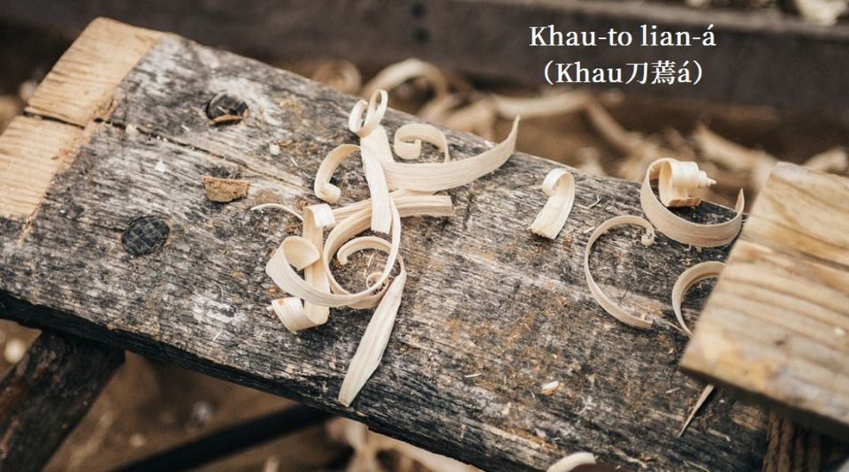

## 2-5. Seⁿ鍋灶
>**Seⁿ-oe-chàu**

Seⁿ鍋燜飯、sa̍h粽、kûn肉，因為seⁿ鍋蓋特別厚，khàm密密，產生熱度kap壓力，比大鼎煮飯加真快速方便。
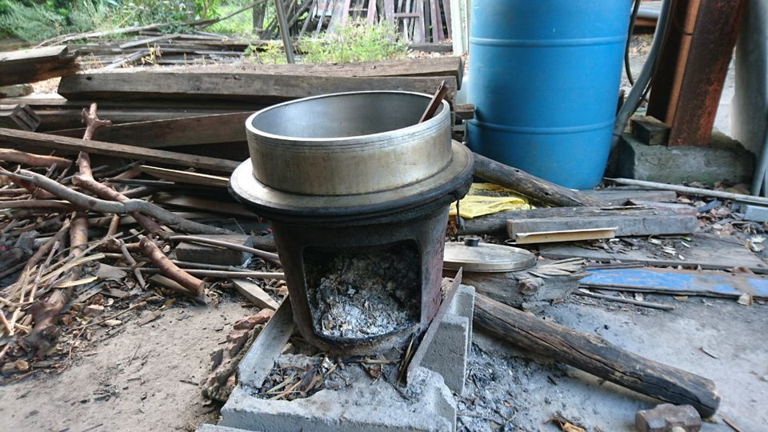
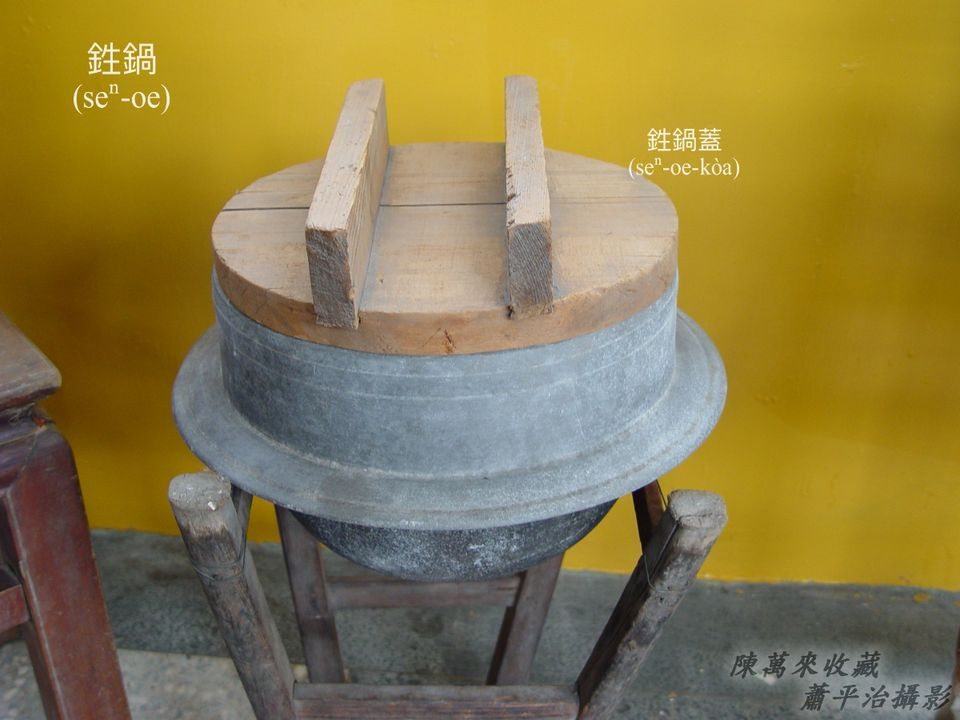

## 2-6. 煉碳灶
>**Liān-thòaⁿ-chàu**

Hiâⁿ chit款煉碳，需要特別ê煉碳灶，kap鋸sut-hu灶差不多。Che煉碳是用土炭幼á製造。
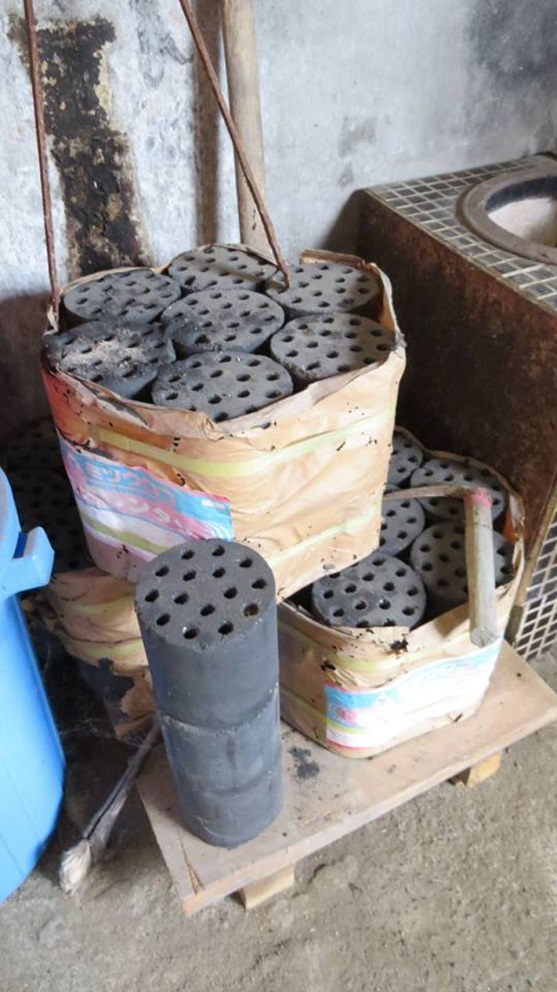

## 2-7. 鐵桶灶
>**Thih-tháng-chàu**

大kha貯油鐵桶裁割，非常簡單，ē-tàng khǹg大鼎煮食，是外口辦桌煮食好家私，搬徙方便。
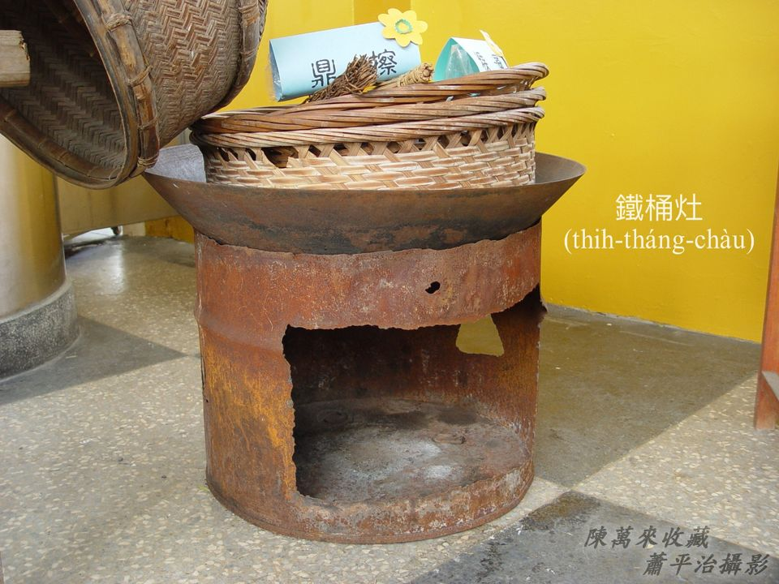
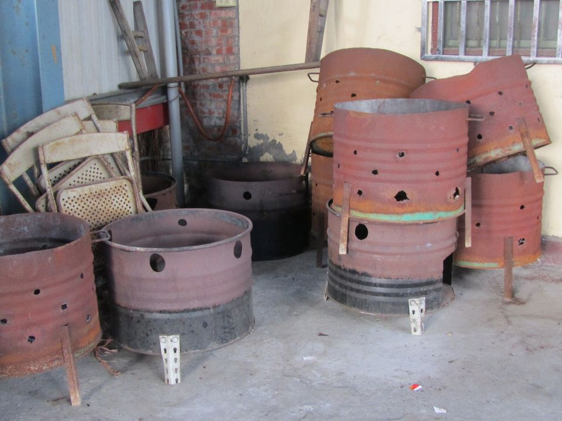
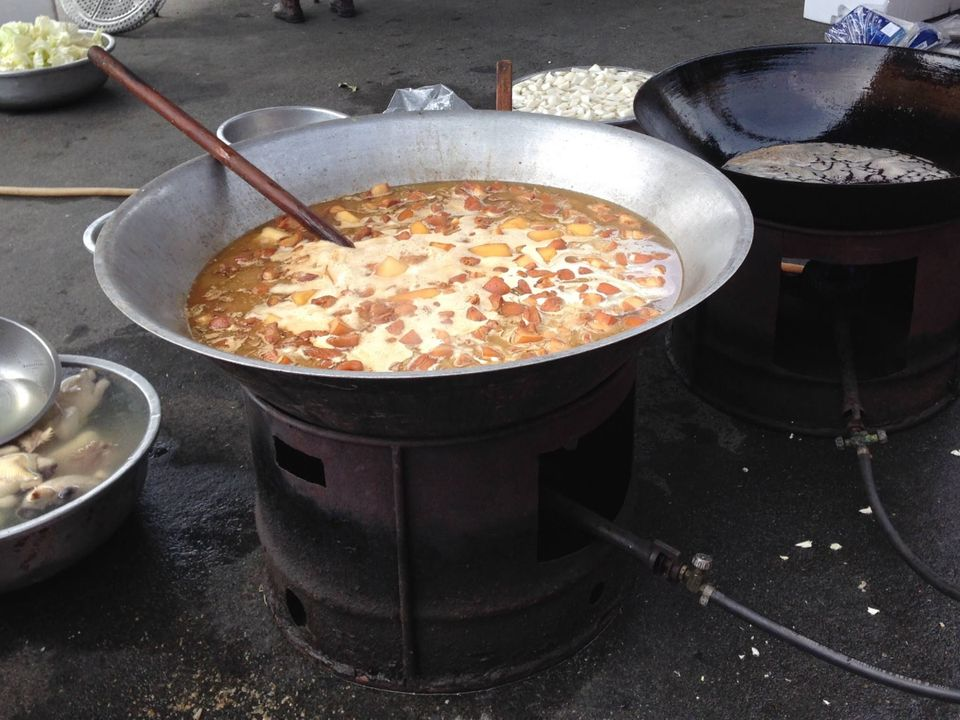

# 【Lah-jih散文書寫】篾灶ê記智
>**【Lah-jih Sòaⁿ-bûn Su-siá】Bi̍h-chàu ê Kì-tì**

阿爸kap二兄ē-hiáu用桂竹á ut畚箕、pīⁿ鴨圍á，二兄koh ē-hiáu舂篾á灶，雖bóng伊siùⁿ虎，因為伊ê功夫，並無妨礙伊kā人舂灶ê生理。

二兄tī厝--裡先ut篾灶ê灶殼，chiah taⁿ 去人tau，安好位置，開始kā土thūn落灶殼內，用柴槌舂，舂ho͘ cha̍t腹了後，開始挖灶khang，挖好tio̍h-koh灶頭、灶khang嘴抹紅毛土，安煙筒，最後等吉日良時安灶君公拜拜食紅圓了後，to̍h ē-sái-tit趁師傅工kap紅包禮。

Chit-mái篾灶已經bô-tàng看。

# 3. 煙筒
>**Ian-tâng**

厝內大灶煮食，需要hiâⁿ柴to̍h火，nā無煙筒，火hun四散亂hun，所以需要煙筒kā火hun引出厝外，煙筒設計nā適合，灶khang煙筒ē產生空氣對流，火hun hun出煙筒尾，空氣ùi灶khang入，hiâⁿ火自然順序。煙筒火hun hun久ē kha̍h火塵lo͘，需要peh chiūⁿ厝頂用柴枝kā煙筒火塵lo͘清掉。古早大灶煙筒是石棉管。
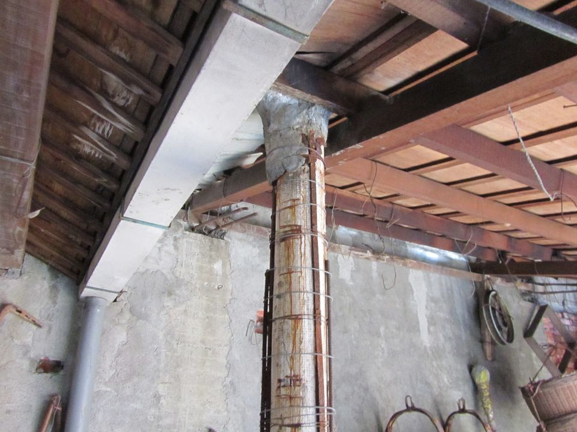
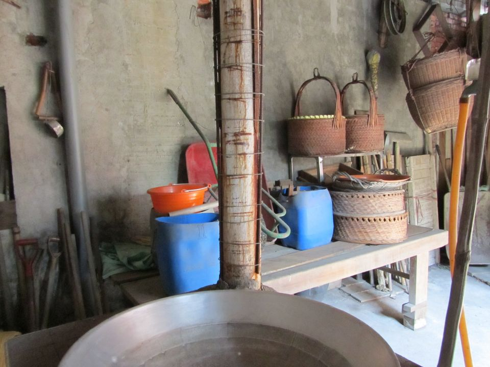
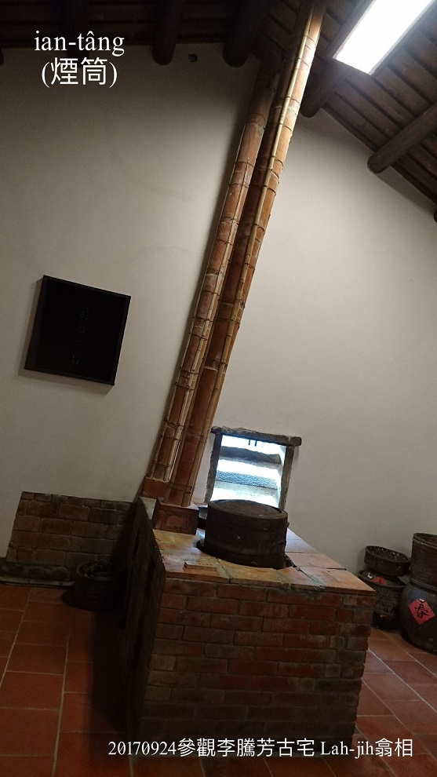
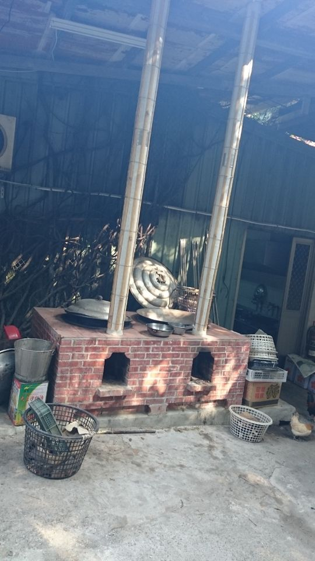

煙筒thóng出厝頂尾，有ê ùi壁邊thóng出外口。

煙筒nā是leh火hun，to̍h是阿母leh煮飯，gín-á m̄-thang koh-chài sńg，趕緊轉來去食飯。
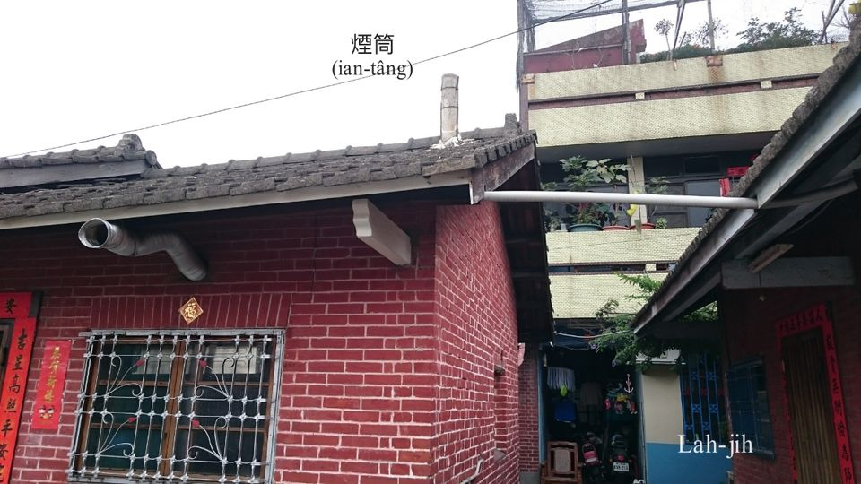

# 4. 註解
> **Chù-kái**

|**詞**|**解說**|
|Gih磚á|『砌磚』。|
|Thūn土|『填土』。|
|Hōng-hōng叫|形容火猛聲音。|
|Sio-thàng|『相通』。|
|鋸sut-hu|『鋸木屑』。|
|司命灶君|Su-bēng chàu-kun，灶ê神。|
|Khau刀lian／Khau刀hoe|（Khau刀蔫／Khau刀花），木工師傅用khau-to khau角材（杉行liâu好ê四角木材）時，khau--起-來柴phòe，薄薄ē kńg-lian（捲蔫），號做Khau-to-lian。|
|火hu|火灰，清水kō͘稻草hóe-hu過濾to̍h是kiⁿ-chúi（鹼水），ē-tàng縛kiⁿ-chàng（鹼粽），hóe-hu提來sám-tī大腿，lián黃麻較澀較bē咬皮膚。|
|Si-á-geh|日來詞，しあげ ，『修飾、潤飾』。|
|Chhat-á|擦á，『掛軸、掛像。』例：觀音媽擦á。|
|Cha̍t腹|Cha̍t-pak，『內部充實、實心、扎實』。|
|Tiâm-cha̍t|沉實。Cha̍t腹sī內部充實；tiâm-cha̍t是經過人工舂--過，chiah pìⁿ-chiâⁿ cha̍t腹。|
