# 灶腳用水kap洗Tn̄g
> **Chàu-kha Iōng-chúi kap Sé-tn̄g**

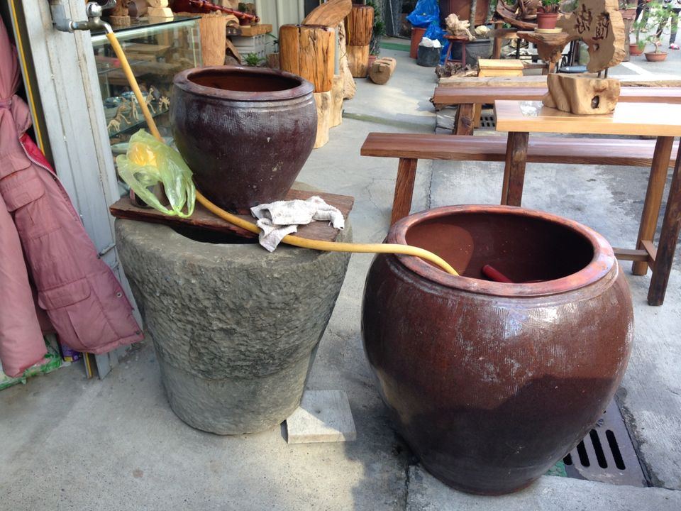

煮食一定ài用水，煮食進前洗煮料，食飽了後洗碗箸，下面咱來紹介chia kap用水相關ê家私。

# 1. Taⁿ水家私
>**Taⁿ Chúi Ke-si**

## 1-1. 水桶
>**Chúi-tháng**

水桶貯水，腳桶洗衫，io桶io kiáⁿ，面桶洗面，碗桶洗碗、摔桶摔粟，熬酒桶熬酒，尿桶放尿，屎桶放屎，chia-ê桶lóng是木材製造，kho͘桶師傅kho͘--e。

水桶有大細kha，大kha水桶一擔兩kha用畚擔taⁿ，a̍h是兩人扛一桶，細kha水桶to̍h用手kōaⁿ。

大kha水桶是鼓井taⁿ水轉去灶腳醃缸ê家私，用藤做耳，號做水桶藤，he水桶藤ē khiā直，方便chhng畚擔。大kha水桶nā khǹg tī房間放尿，to̍h pìⁿ-chiâⁿ尿桶。

去鼓井chhiūⁿ水，kō͘畚擔taⁿ水轉去灶腳貯醃缸，是古早cha-bó͘人ê苦工，體貼ê cha-po͘人nā ē負責，cha-bó͘人to̍h輕鬆，有時叫細漢kiáⁿ用竹管tàu扛，水桶離gín-á khah遠，gín-á to̍h-ē歡喜tàu pun-pheⁿ。
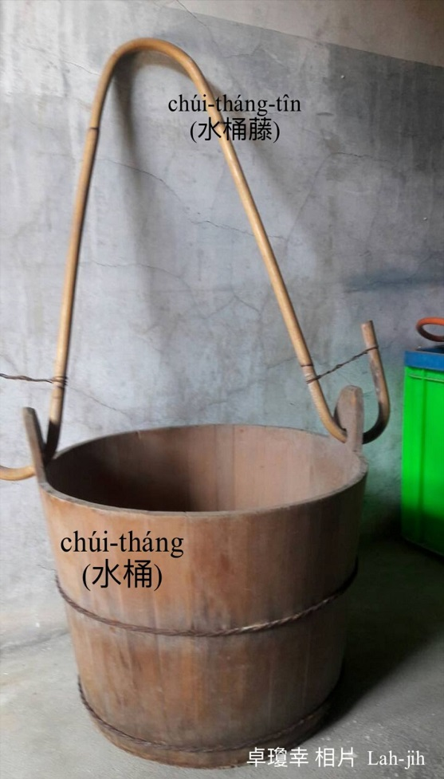
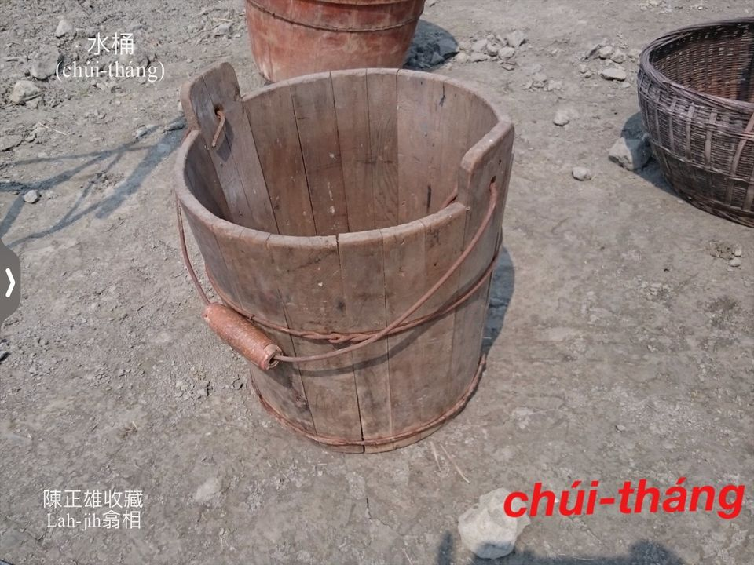

## 1-2. 鉛桶kap Phoa̍h桶
>**Iân-tháng kap Phoa̍h-tháng**

鉛phiáⁿ水桶叫做鉛桶，kōaⁿ水輕省liú-lia̍h。

鉛桶耳nā pa̍k一條丈外長ê黃麻索á，to̍h ē-sái-tit tiàm鼓井chhiūⁿ水，號做phoa̍h桶。

Phoa̍h桶tiàm鼓井chhiūⁿ水是一種技術，hit ê kā鉛桶索tioh--一-下ê動作需要練習，chiah ē-tit kā鉛桶tò-khap入水。

古早鼓井chhiūⁿ水有危險，bô-sè-jī ē poa̍h-lo̍h鼓井，盡量m̄ hō͘ gín-á chhiūⁿ水。
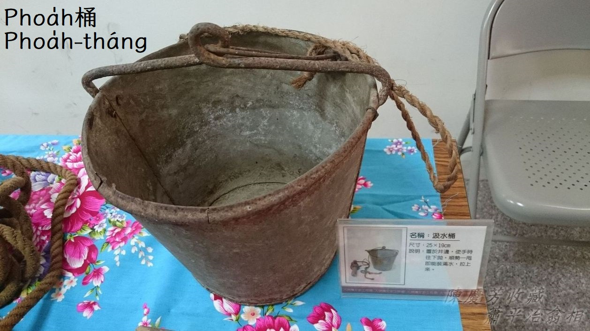
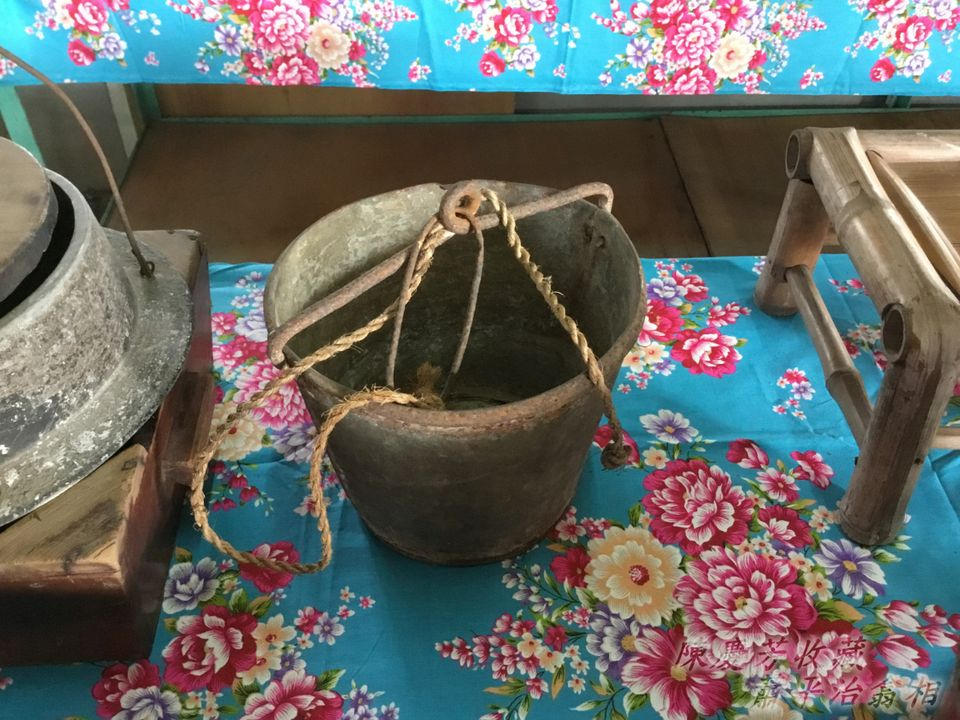

## 1-3. 竹棍á
>**Tek-kùn-á**

揀he長短tú好，大細適合ê桂竹管、麻竹管、刺竹管，taⁿ擔、taⁿ草、扛水、扛粟，有時比畚擔khah好用khah方便。nā是kā雙頭phut做尖尖灌管形，to̍h號做chhiam擔。
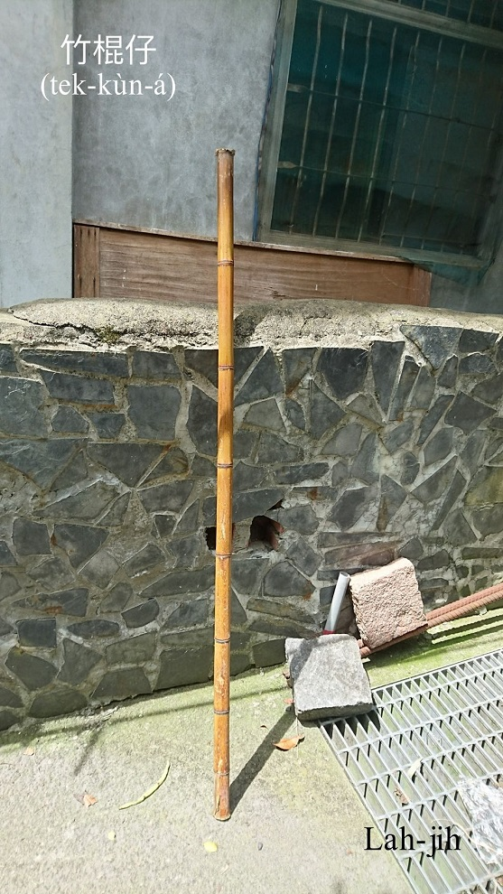
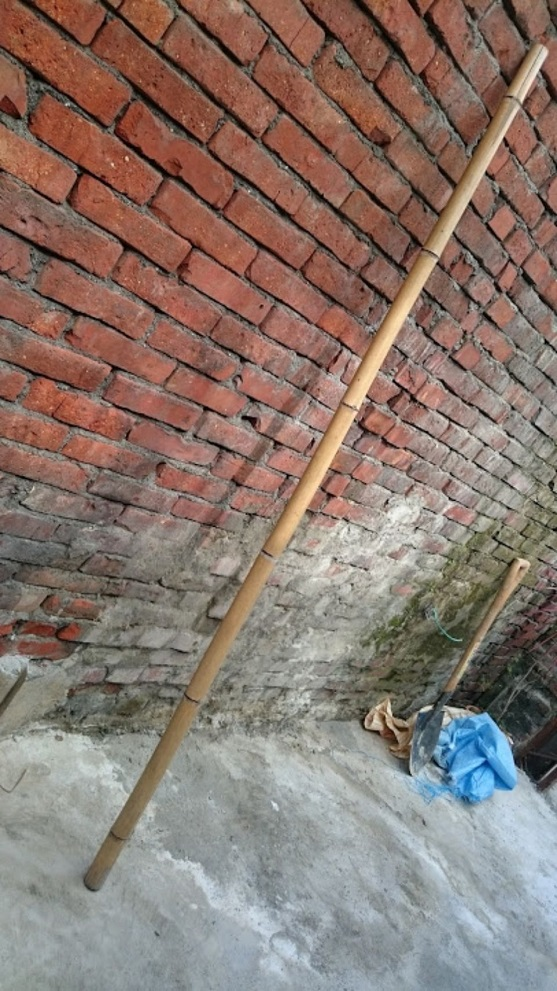
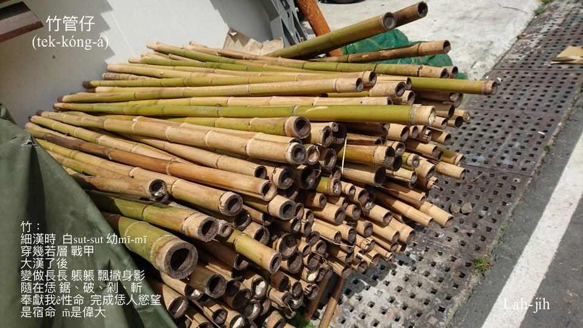

# 2. Té水家私
>**Té Chúi Ke-si**

## 2-1. 醃缸
>**Am-kng**

嘴闊肚大ê大型粗hûi，ē-tàng貯水貯米貯物，ē-tàng蔭豆油sīⁿ醬鹹，mā用來貯水預防火燒厝phah火用。庄腳作穡人用來khǹg tī灶腳貯水煮食，to̍h號做醃缸，差不多每一口灶灶腳lóng有1-kâi。
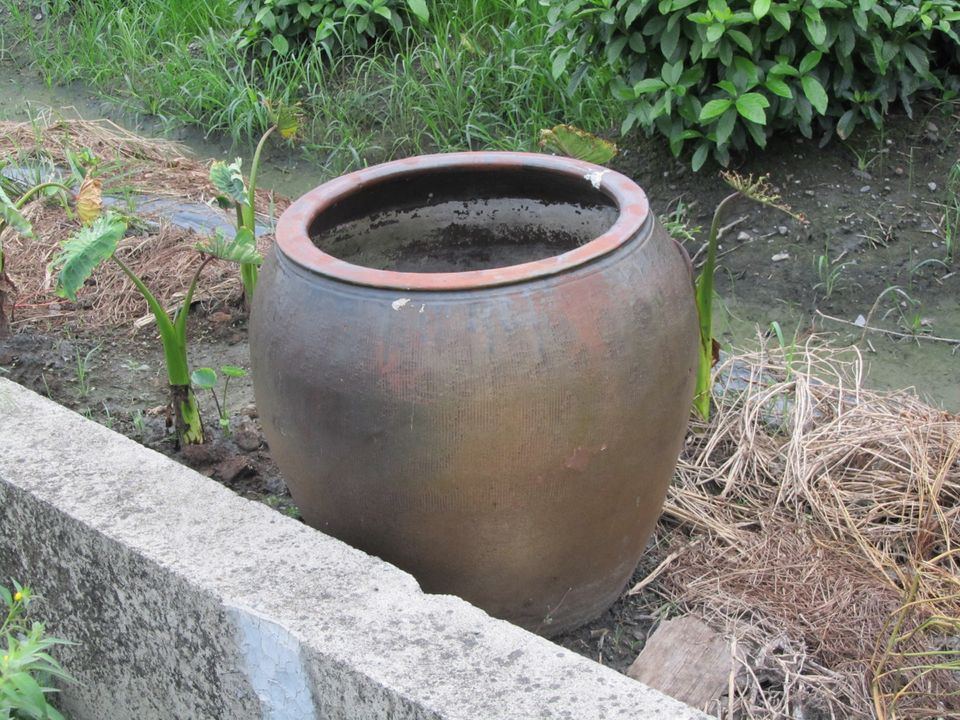
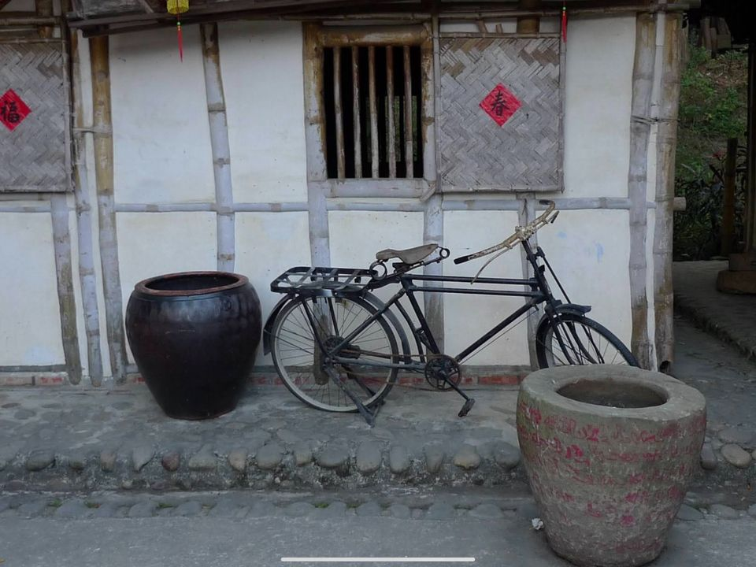

# 3. Khat水洗tn̄g家私
>**Khat Chúi Sé-tn̄g Ke-si**

## 3-1. 匏hia kap匏á匏hia
>**Pû-hia kap Pû-á-pû-hia**

匏hia是醃缸水桶khat水iúⁿ水ê hia殼á，一般有兩種，一種是正港kō͘熟度有夠ê匏á殼破pêng所做--è，慣勢講「匏á匏hia」，匏á匏hia是選he大條形體適合ê匏á，留ho͘ sek-sek皮pìⁿ殼，然後破做兩pêng，瓜瓤挖掉to̍h是兩支匏hia，用來舀水煮食；一種是木材鑿ê水khok-á，號做匏hia，咱平常時講ê匏hia to̍h是木材鑿ê匏hia。

Chiâⁿ心適，匏á匏hia是天然匏á殼ê利用，soah無匏hia名份，可能匏á匏hia khah lám khah容易破，soah hō͘ khah勇ê柴匏hia搶去正名。
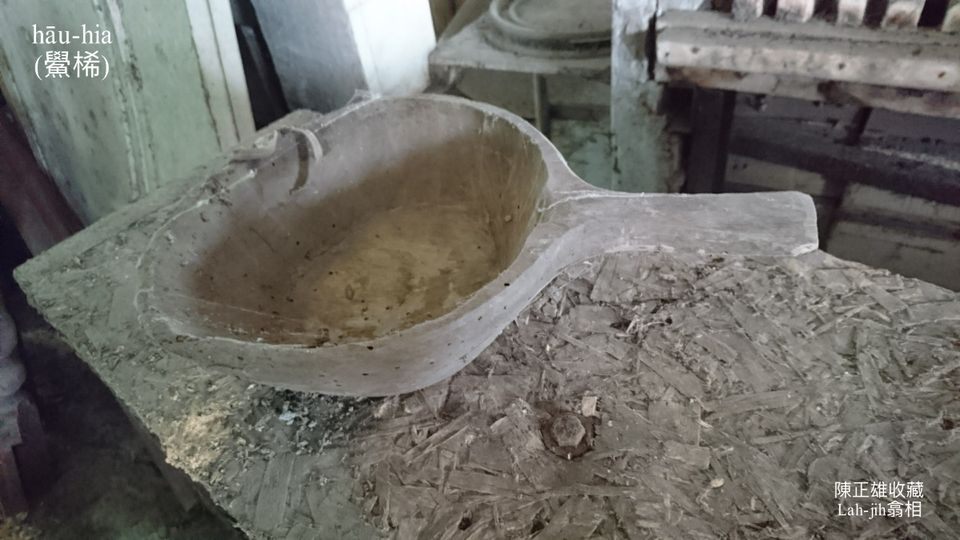
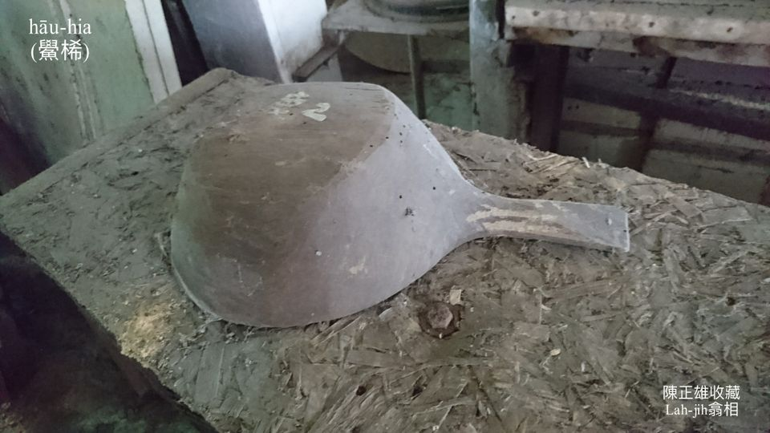
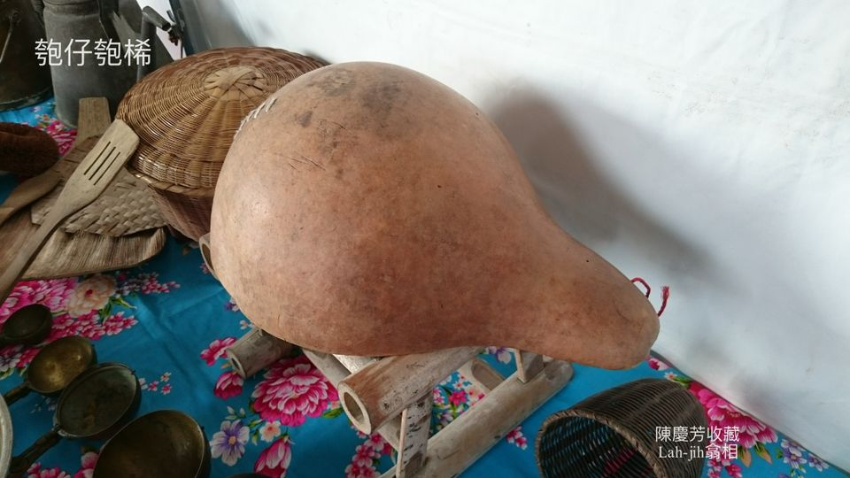
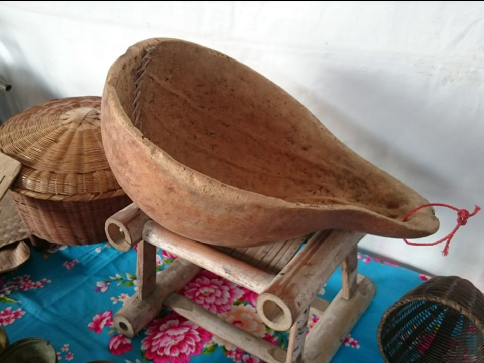

## 3-2. 鼎Chhè
>**Tiáⁿ-chhè**

鼎chhè是洗鼎ê chhè-á，用chhè ê動作洗鼎。大鼎煮食，ē kiap鼎phí a̍h是臭火ta kiap鼎，需要用鼎chhè lù-lù chhè-chhè--leh，鼎chhè柄長長bē燙手，加真方便liú-lia̍h。鼎chhè材料有刺竹phòa絲、藤篾á pa̍k、榕á根pa̍k。用來炒米芳、炒土豆，比煎匙khah好用。
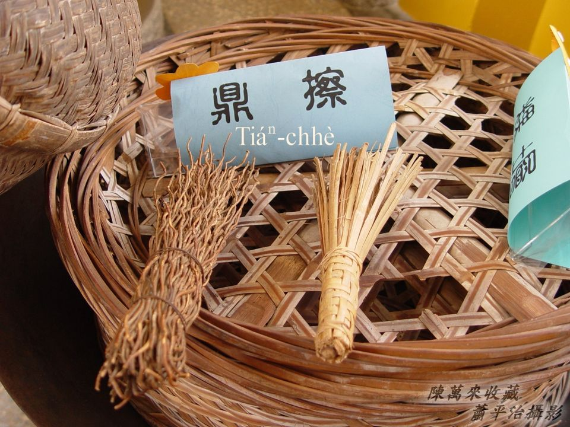

## 【Lah-jih台灣俗語】
- 未嫁khǹg田契，嫁了變鼎chhè。
>**Cha-bó͘ gín-á奶房是寶貝，嫁ang生kiáⁿ了後，母愛贏過pì-sù現胸懷。**

## 3-3. 棕Chhè-lù-á
>**Chang-chhè-lù-á**
  
棕簑毛做ê商品，用lù ê動作洗鼎鍋á，lù鼎、lù鍋、lù椅桌、lù灶頭‥‥‥tn̄g-tio̍h鼎鍋á siuⁿ燙to̍h khah無好用。早期ê棕chhè lù-á無塑膠柄。

鼎chhè chhè鼎是粗洗，sòa--落-去tio̍h用棕chhè lù-á lù ho͘ khah清氣。
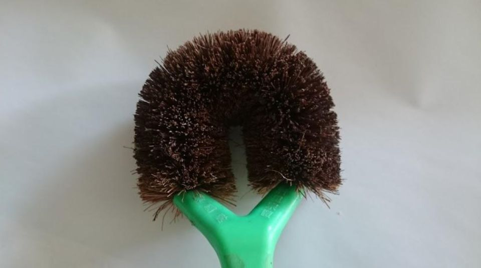
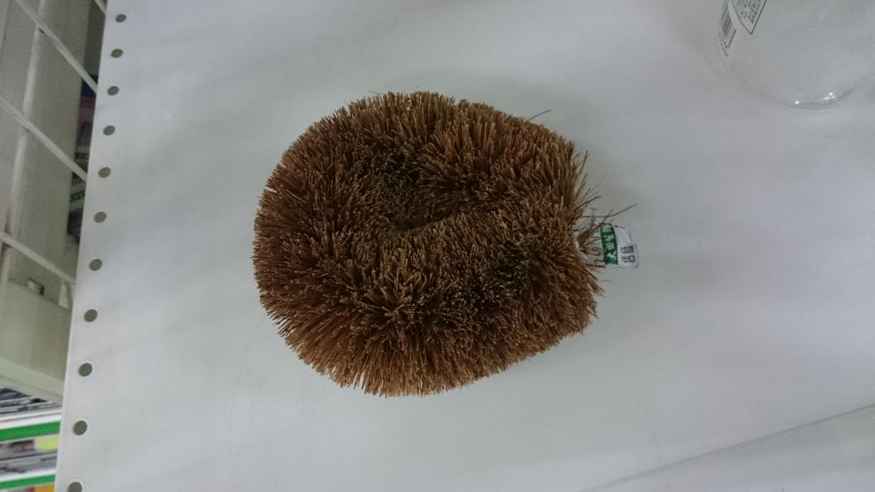
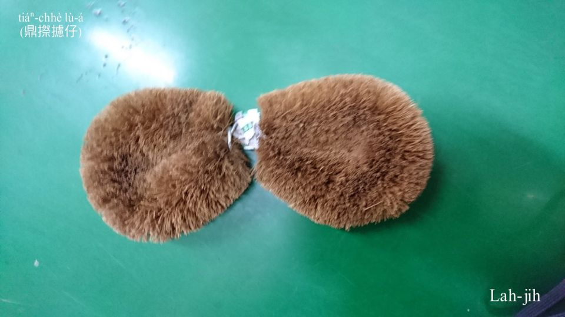

## 3-4. 菜瓜布
>**Chhài-koe-pò͘**
  
菜瓜siuⁿ sek ē牽絲，所以華語講『絲瓜』，咱是當做菜蔬煮來配飯，叫做菜瓜，有絲ê菜瓜bē-sái-tit食，kā ta皮kap菜瓜子提掉，to̍h是菜瓜蒲，用來洗碗箸，chhè桌頂，nńg-lio̍h bē chhè傷碗箸桌面，所以號做菜瓜布。揀khah長ê菜瓜布ē-sái-tit洗身軀jiû kha-chiah-phiaⁿ，soah-chiūⁿ koh清氣。
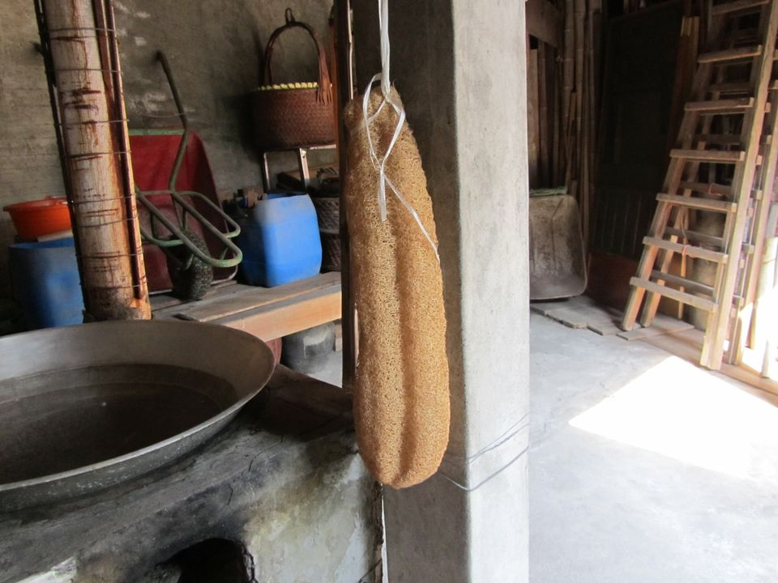
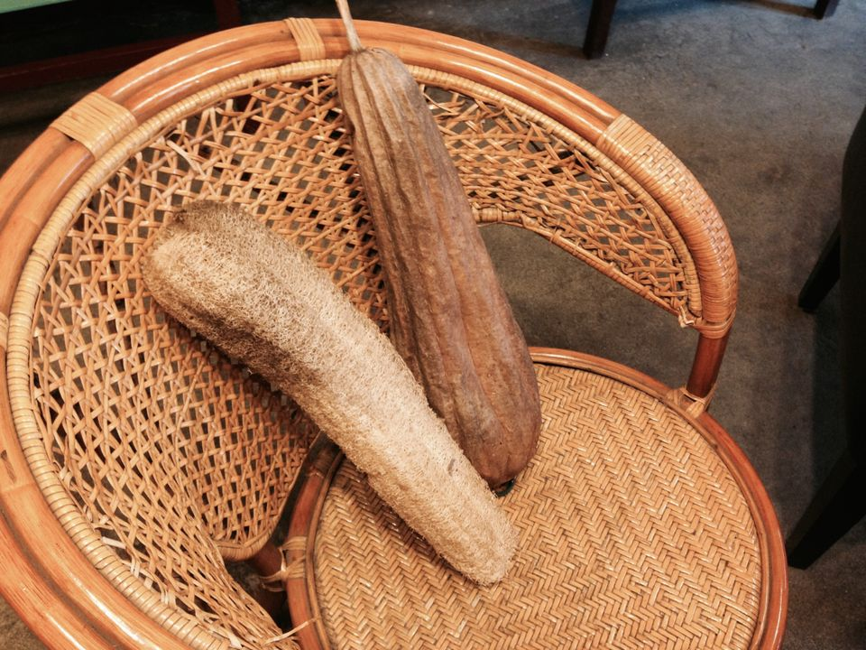

# 4. 註解
> **Chù-kái**

|**詞**|**解說**|
|Tò-khap|『倒蓋』。|
|熟|Sek，『成熟』；se̍k，『煮熟』。|
|Chiâⁿ心適|『很有趣』。|
|Chhiūⁿ水|『從水井裡取水上來』。|
|Tioh--一-下|『抽動一下』。|
|Phut|『用刀子砍』。|
|Chhiam-taⁿ|Chhiam擔，『雙頭尖可做扁擔的竹棍』。|
|鼎phí|『鍋巴』。|
|臭火ta|Chhàu-hé-ta，『燒焦』。|
|Nńg-lio̍h bē chhè傷|『柔軟不會擦傷』。|
|Soah-chiūⁿ|『非常止癢』。|