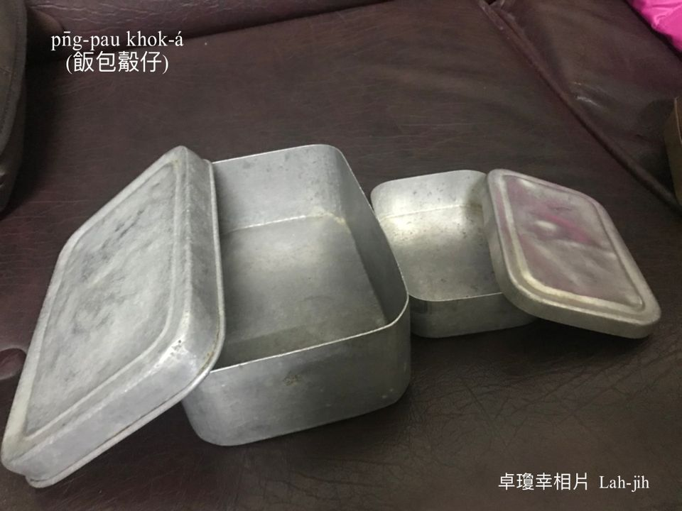
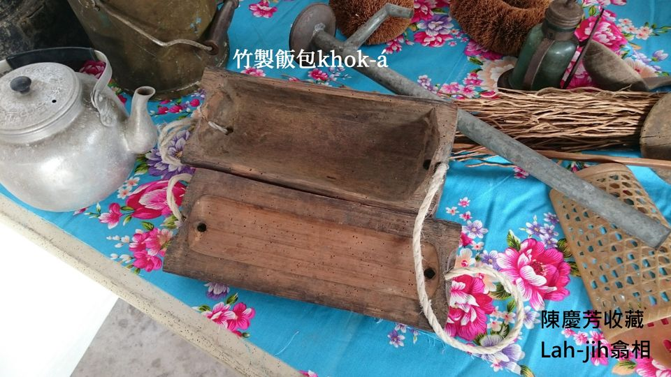
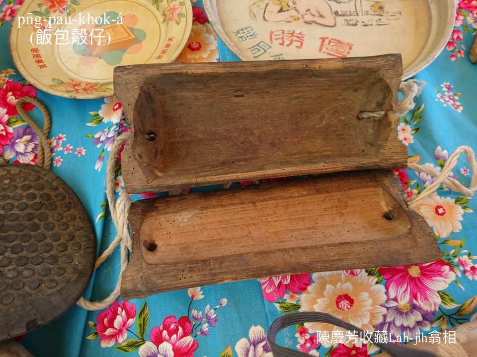
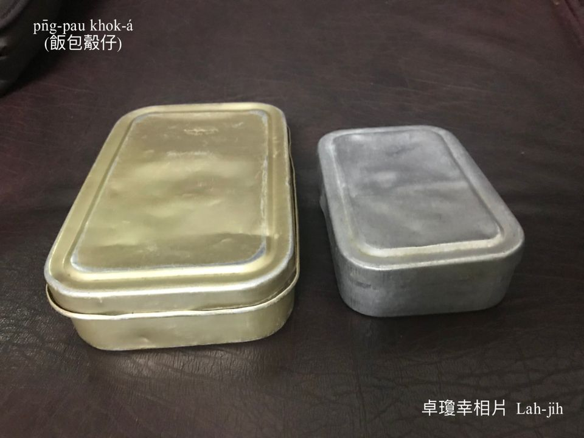
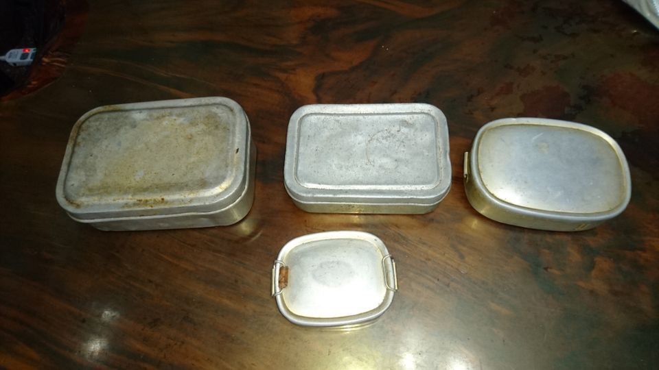
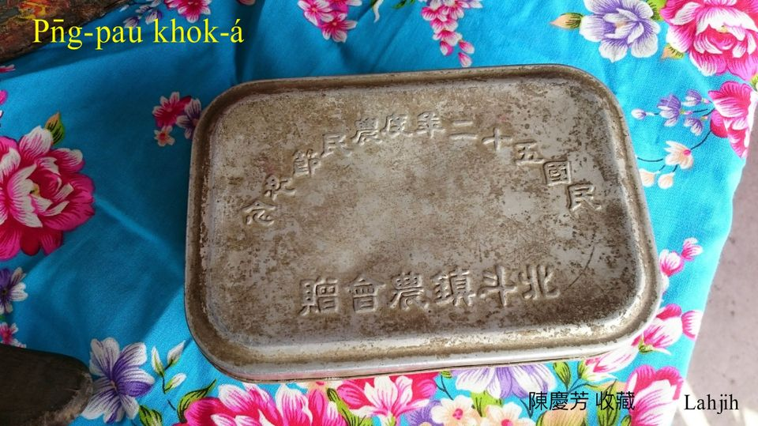
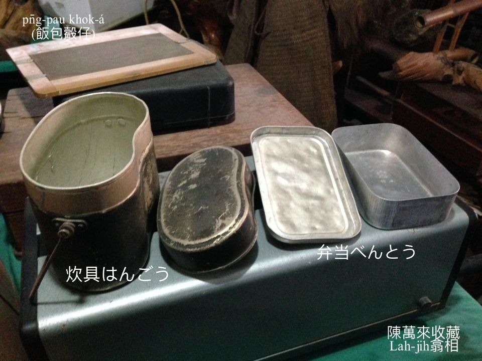

# 飯包──上溫暖ê滋味
> **Pn̄g-pau──Siāng Un-loán ê Chu-bī**

現代人食外口買飯包算是四常tāi，nā是ka-tī chah飯包食飯包可能真少，回想1960-70年代進前，出門遠路作穡，出門外埠頭上班，出門外鄉鎮讀冊，中晝頓bē赴轉來食飯，只好ka-tī款便當、chah飯包出門。斯當時交通無chit-mái ê利便，o͘-tó͘-bái mā m̄是chiah-nī普遍，作穡人出門行路，上班公務人員騎鐵馬，讀初中、高中學生坐公車、火車，中晝頓lóng是食ka-tī chah ê飯包khah chē，chah飯包、食飯包特別是中學學生gín-á ê記智。

# 1. 各種飯包khok-á
>**Kok-chióng Pn̄g-pau Khok-á**
  
飯包用飯包khok-á貯，飯包khok-á有人講便當盒á。

## 1-1. 竹管飯包khok-á
>**Tek-kóng Pn̄g-pau Khok-á**
  
早前庄腳人sàn赤過日，出門作穡不得已chiah chah飯包止飢，貯飯有人用竹ha̍h-á包，有人用竹管做飯包khok-á，有索á kap倚ē-tàng pa̍k tiàm腰身，mā是一種智慧設計。

## 1-2. A-lú-mih飯包khok-á
>**A-lú-mih Pn̄g-pau khok-á**
  
記智siāng深使用siāng chē ê長四角形飯包khok-á，a-lú-mih輕銀ê便當盒á，需要包巾包a̍h是帶á pa̍k，有大kâi有細ê，siāng大kâi ê飯包khok-á貯leh 3碗清米飯，當leh大漢ê cha-po͘ gín-á，半晡á to̍h偷食kah chhun一半，中大ê飯包，cha-bó͘ gín-á tú-á好飽，nā是hit-kâi細細kâi ê飯包khok-á是貯菜用--ê，飯、菜分開貯。

Chah飯包是老母ê愛心，食飯包tio̍h ài感心，sàn赤人ê飯包雖bóng菜色簡單欠油臊，總--是boeh chah hit盒白米飯已經無簡單，tio̍h感恩厝內人儉腸neh肚chiah有法度栽培你讀冊，有清米飯ê中晝飯是已經真ka-chài。

紀念性贈送品a-lú-mih製飯包khok-á。

## 1-3. Hăng-gó͘飯包khok-á
>**Hăng-gó͘ Pn̄g-pau khok-á**

有kōaⁿ耳ê炊具hăng-gó͘飯包khok-á，下面貯飯，頂面層貯菜湯，是有錢人家庭使用，m̄是讀冊gín-á ê飯包。

## 1-4. 鐵道便當
>**Thih-tō Piān-tong**

坐火車出外人ê罕罕記智，去遠路thit-thô、作穡，過晝腹肚iau，自然chhân-chhân買來食，貴bóng貴，止飢koh是一款經驗回憶。

# 【Lah-jih散文書寫】菜脯飯飯包ê記智
>**【Lah-jih Sòaⁿ-bûn Su-siá】Chhài-pó͘-pn̄g Pn̄g-pau ê Kì-tì**

蕭平治 2019-07-04 16:30

中晝食hit粒飯包，kan-nā食一嘴有菜脯炒飯ê滋味，隨kā我chhōa轉去70冬前ê記智。70冬前沉底ê往事，ná-ē hiông-hiông一嘴飯to̍h chhōa倒轉去hit當時ê記智，引起目kho͘ tâm-tâm一陣鼻頭酸。

Hit-tang-chūn日本人離開台灣boeh三年，ī--ā（註1）mā是離開我boeh三年，m̄-bat世事ê gín-á-phí，戇戇食戇戇大，m̄知siáⁿ-mih是無油無sian，m̄知siáⁿ-mih是清米飯，大概是有thang食飽mài肚iau to̍h滿足歡喜，hit ê sàn赤人tn̄g-tio̍h物資缺乏ê年代。

1948年8歲入學一年á生放屎糊房間，戇戇àⁿ-àⁿ跟tòe老師去街路第一國民學校參加田中鎮運動會，記得是戴chi̍t-kâi篾á pīⁿ kō͘紙糊ê阿不倒，走10外公尺換人走ê表演比賽，歡喜kah連阿兄阿嫂mā緊張歡喜。四兄Lô͘-á兄有來看，kā阮喝i-o，中晝時，記得是二兄a̍h是三兄提一粒飯包hō͘我食晝。Hit粒飯包無用飯包khok-á貯，是用刺竹ê甲ha̍h-á包ê飯丸，甲ha̍h-á boeh包飯，需要棕chhè chhè清氣koh用燒水浸ho͘軟，chiah ē得包飯丸，he飯丸是清米飯lām菜脯幼á落去炒豬油，已經是芳kòng-kòng kòng-kòng芳，hit頓好食ê飯包滋味到今記tiâu-tiâu。無ī--ā ê煮食，是大嫂kah二嫂ê疼心飯包，用心計較ê料理，雖bóng簡單，其實是費心情，一粒飯包ê白米飯kah豬油落去炒，已經是一家人一頓ê作料，結果是我孤一人食了了，想tio̍h親情，想tio̍h兄嫂，kiōng-boeh目屎流，感恩ê思念，一粒飯包，菜脯炒飯ê飯包。

今á日去溪頭散步行山路，主辦小姐為ta̍k-ê準備中晝飯包，想bē到中晝食hit粒飯包，kan-nā食一嘴有菜脯炒飯ê滋味，隨kā我chhōa轉去70冬前ê記智。
>**（註1）Ī--ā：作者對ka-tī阿母ê稱呼**

# 2. 註解
> **Chù-kái**

|**詞**|**解說**|
|Piān-tong|日來詞，弁当べんとう，便當。|
|Hăng-gó͘|はんごう，有kōaⁿ耳ê炊具，ē-sái做飯包khok-á使用。|
|無油無sian|煮食欠油臊。|
