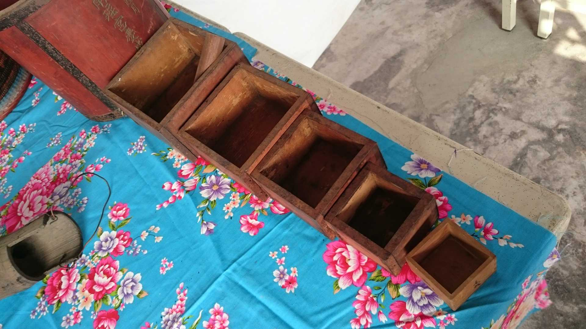

# 買賣用ê尺斗稱秤
> **Bé-bé Iōng ê Chhioh-táu-chhìn**

俗語講「買賣算分，相請無論。」華語mā有『親兄弟，明算賬。』ê講法。世俗人生nā tio̍h「買賣算分」to̍h需要秤斤秤兩、量長短、分大細，nā boeh『明算賬』，to̍h需要「度量衡」儀器來計算khah bē精差誤會。

講是án-ne講，庄腳所在，生理人除外，厝邊隔壁、親情朋友nā m̄是正式買賣，to̍h ē chhìn-chhái用一碗、兩甌、一盤、兩kńg（管）來計算，雖bóng碗盤無平大，茶甌米管有大細，總--是sio-phiⁿ無chē，kài有人情味ê庄腳作穡人是無leh計較hiah chē。

Tō͘ liâng hêng（度量衡）ê「度」是niû長短，「量」是niû chē少，「衡」是秤斤兩，niū輕重。『度是長度，量是容積，衡是重量。』

庄腳做穡人無慣勢官廳ê公制度量衡，siáⁿ-mih公里、公尺，公斗、公升，公斤、公克，he是學校學生gín-á算術算siàu ê單位，阮庄腳人無讀冊，kan-nā知影1尺、2寸，3斗4升，5斤6兩án-chóaⁿ算長短算chē少算輕重niā-niā，有時為tio̍h方便緊速，chi̍t-lia̍h nn̄g-siâm，chi̍t-au nn̄g-kńg，甚至chi̍t-la̍k nn̄g-teⁿ都ē-sái-tit買賣交換，因為sio-phiⁿ無gōa-chē。

> **註**

|Niû長短|『用尺量長度』。|
|niû chē少|『用斗升量容量』。|
|niū輕重是|『用秤量重量』。|

# 3. 註解
> **Chù-kái**

|**詞**|**解說**|
