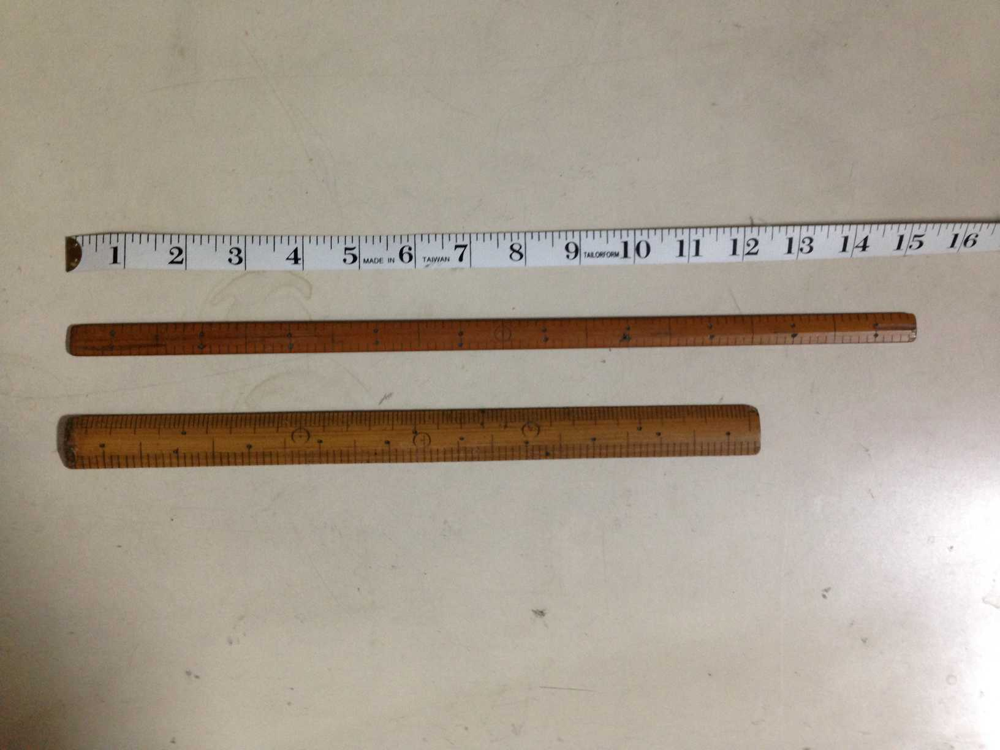
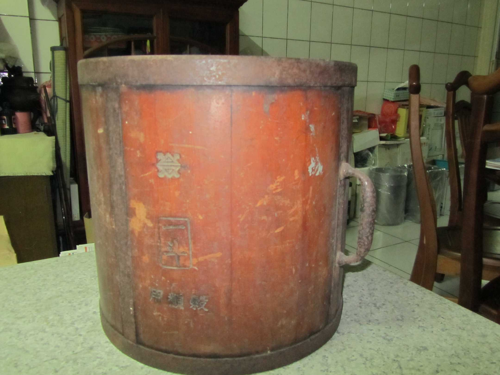
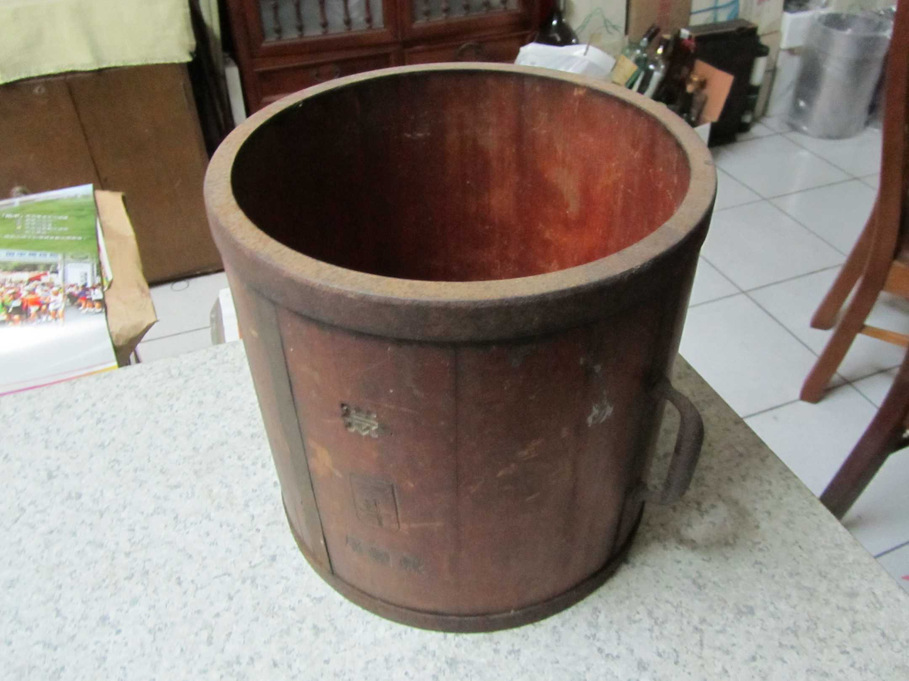
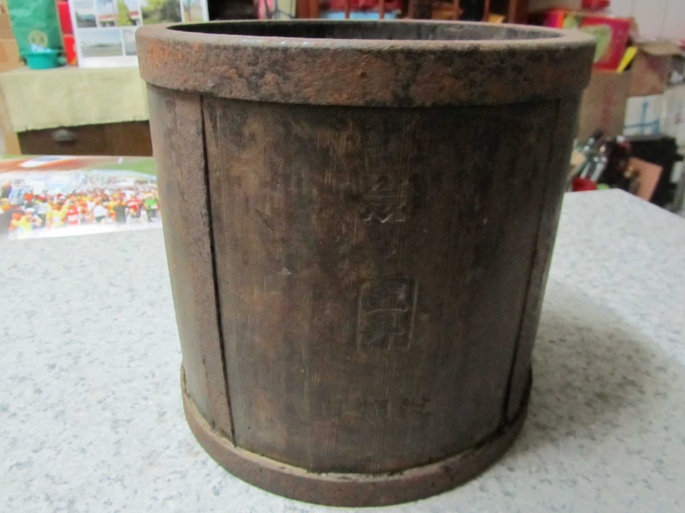

# 買賣用ê尺斗稱秤
> **Bé-bé Iōng ê Chhioh-táu-chhìn**

俗語講「買賣算分，相請無論。」華語mā有『親兄弟，明算賬。』ê講法。世俗人生nā tio̍h「買賣算分」to̍h需要秤斤秤兩、量長短、分大細，nā boeh『明算賬』，to̍h需要「度量衡」儀器來計算khah bē精差誤會。

講是án-ne講，庄腳所在，生理人除外，厝邊隔壁、親情朋友nā m̄是正式買賣，to̍h ē chhìn-chhái用一碗、兩甌、一盤、兩kńg（管）來計算，雖bóng碗盤無平大，茶甌米管有大細，總--是sio-phiⁿ無chē，kài有人情味ê庄腳作穡人是無leh計較hiah chē。

Tō͘ liâng hêng（度量衡）ê「度」是niû長短，「量」是niû chē少，「衡」是秤斤兩，niū輕重。『度是長度，量是容積，衡是重量。』

庄腳做穡人無慣勢官廳ê公制度量衡，siáⁿ-mih公里、公尺，公斗、公升，公斤、公克，he是學校學生gín-á算術算siàu ê單位，阮庄腳人無讀冊，kan-nā知影1尺、2寸，3斗4升，5斤6兩án-chóaⁿ算長短算chē少算輕重niā-niā，有時為tio̍h方便緊速，chi̍t-lia̍h nn̄g-siâm，chi̍t-au nn̄g-kńg，甚至chi̍t-la̍k nn̄g-teⁿ都ē-sái-tit買賣交換，因為sio-phiⁿ無gōa-chē。

> **註**

|Niû長短|『用尺量長度』。|
|niû chē少|『用斗升量容量』。|
|niū輕重是|『用秤量重量』。|

# 1. 「度」：尺
> **"Tō͘": Chhioh**

作穡人niû長短，慣勢用台尺，chit支台尺是ta̍k口灶lóng有ê家私，nā是ìn-chih帶á、khu-jí-lah尺（くじら尺）是khah少人有，公尺公分學校有leh教，庄腳人無觀念bē習慣無leh用，慣勢成自然。

## 1-1. Ìn-chih帶á
> **Ìn-chih Tòa-á**

吋（inch）裁縫師傅講做ìn-chih，做衫褲用來量寸尺，是長長60吋ê布帶，有時講ìn-chih帶á，有時講布尺。布尺一面標公分一面標英吋，慣勢用英吋量身軀寸尺，所以kā布尺叫做ìn-chih帶á，ē-hiáu裁剪衫褲ê家庭to̍h ē買來用。

## 1-2. Khu-jí-lah尺（くじら尺）
> **Khu-jí-lah Chhioh**

對裁縫師傅來講，khu-jí-lah尺是siāng捷用ê一支尺，比台尺khah長khah細板，1尺10寸，1寸10分，師傅人lóng簡單講做khu-jí-lah，he是一支hôa算用ê尺，to̍h sī『換算尺』。

台尺1尺=khu-jí-lah 8寸，10:8=1.25，khu-jí-lah 1尺=台尺1尺2寸5，所以khu-jí-lah尺mā講做尺二á。Khu-jí-lah 1尺=15吋，10:15=2:3=0.66，講--起-來花sà-sà，m̄-koh經過長期練習換算ê結果，師傅車thīⁿ需要用尺時，kan-nā chit支khu-jí-lah to̍h好勢liu-liu。

日語khu-jí-lah（くじら） to̍h是海翁，『鯨魚』，原來khu-jí-lah尺to̍h是鯨尺，是換算用ê尺。海翁日本話講khu-jí-lah，khu-jí-lah尺to̍h是海翁尺。Ē-hiáu裁剪衫褲ê家庭to̍h ē買來用。

## 1-3. 台尺
> **Tâi-chhioh**

台制度量衡，長度單位1丈=10尺，1尺=10寸，1寸=10分。為tio̍h niû長短，每家口á lóng有1支台尺，niû布niû黃麻布lóng是用chit支台尺niû。1台尺大約33公分，m̄-koh罕得án-ne hôa算。

## 1-4. 一篙兩尺
> **Chi̍t Ko Nn̄g Chhioh**

台尺有hit-lō兩尺長--ê，號做1-ko（1篙），主要用來niû khah長ê索á、黃麻布，節省時間，1篙2尺、2篙4尺、3篙6尺、4篙8尺‥‥‥，40篙80尺。

Nā tio̍h記siàu，一般寫1 2 3 4 5 6 7 8 9 0 a̍h是O一二三四五六七八九十百千萬億兆，有時寫tī 1-kui黃麻布頂a̍h是用刀á khau tī一弓菁á頂頭，to̍h ē用tio̍h**台灣碼**：〇 〡 〢 〣 〤 〥 〦 〧 〨 〩。

# 2. 「量」：斗、升、合、勺
> **"Liâng": Táu, Chin, Kap, Chiak**

買賣白米一般用米斗niû，nā是買賣其他雜穀a̍h是tia̍h種子，to̍h用chin、kap、chiak。Chia ê容器雖bóng是台制，kāng款tio̍h政府機關認定，niû tīⁿ chiah koh用斗kài kài--過chiah算精確。

# 2-1. 斗
> **Táu**

斗是白米買賣siāng重要ê容器，1斗=10-chin=100-kap=1000-chiak。一般tia̍h米算斗買賣khah chē，所以號做米斗，有鐵kho͘ kho͘ tiâu，khah耐用。

米斗除了量米買賣以外，mā用做道教科儀「拜斗」路用，kap喪事khǹg往生者神主牌、孝杖路用。
phâng神主牌á一般是大孫，所以阿公講伊ê大孫是「phâng斗--ê」。

# 3. 註解
> **Chù-kái**

|**詞**|**解說**|
