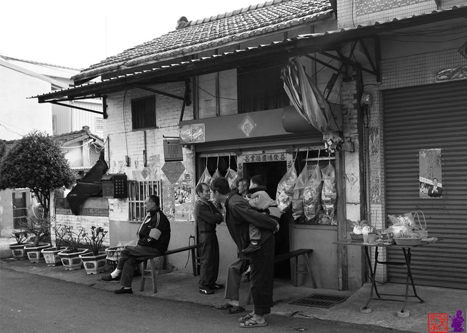
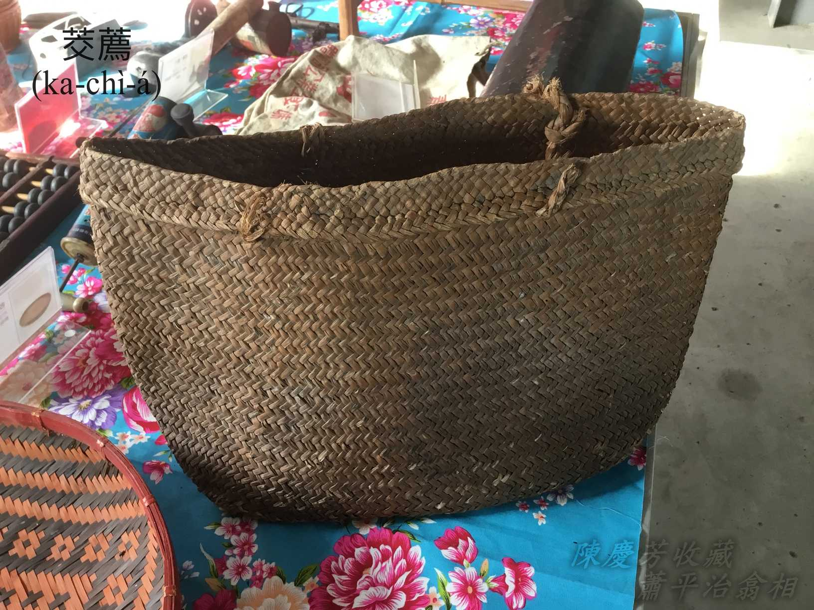
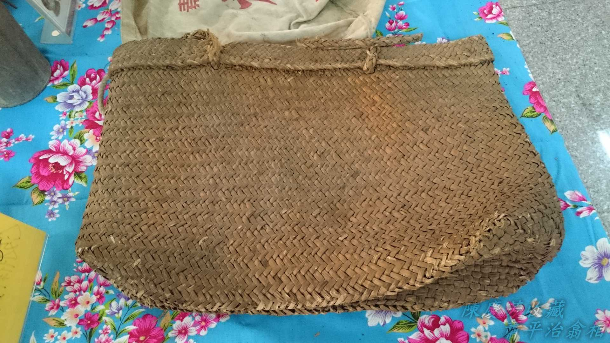

# Chia是工地，Koh teh施工ŏ͘~~
# 庄腳店á買賣
> **Chng-kha-tiàm-á Bé-bē**

庄腳作田人生活樸實勤儉，日常買賣khah捷tī庄內，除非年節鬧熱，罕得chiūⁿ街買物，所以每一庄頭lóng有nn̄g-saⁿ-khám雜貨á店、kám-á店，賣一寡生活用品、檳榔hun酒，tio̍h時果子菜se，kap一般mi̍h-chia̍h、糖餅、sì-siù-á、gín-á物‥‥‥，庄腳人錢水無活，時常「錢銀三不便」自然有賒欠，有人有賒有還，有人是賒了走主顧，m̄-chiah本錢短ê店頭家to̍h ē tn̄g-tio̍h「無賒不成店，賒了店不成」ê無奈。

庄腳店á除了賣物，koh是交陪開講、娛樂poa̍h臭頭kiáu-á、講古放送ê好所在，有人「大舌koh興thi̍h」，有人hèng poa̍h siáⁿ-mih都boeh輸贏，有人消息靈通做「放送頭」，tī hit ê封閉無報紙新聞ê庄腳所在，話仙傳說謠言特別chē。對gín-á人來講，讀冊以外來chia做店á-thèⁿ mā是校外老師無教ê另外一種體驗學習。

看人poa̍h-kiáu，to̍h知撚骰、四色牌、si̍p-pat骰á；看人khōng甘蔗，to̍h知影án-chóaⁿ比輸贏；聽人話仙講古chhò-kàn-kiāu，自然bat真chē生活語言，mê-mê角角ê講話技巧‥‥‥，庄腳店á真正好所在，社會教育ê好所在。

# 1. 庄腳店á印象
> **Chng-kha Tiám-á Ìn-siōng**
## 1-1. Ka-chì-á

用鹹草pīⁿ ê kōaⁿ袋，買物kōaⁿ物專用，m̄驚tâm濕。1950年代前後物資欠缺，國校學生用來kōaⁿ冊，當做冊phāiⁿ-á，不止á方便。

## 1-2. Chhiah-khat-á

五穀豆類買賣，a̍h是khat魚脯肉酥，put米put糖，lóng真利便。
6-4-2-1.米挑

1-3. 算盤
Sǹg-pôaⁿ

古早庄腳店á，有1隻大櫃，大櫃頂khǹg古早算盤，tn̄g-tio̍h交關khah chē物，to̍h用tiak算盤算siàu。
6-7-1.算盤

6-7-2.算盤

6-7-3.算盤

6-7-4.算盤

6-7-5.算盤

6-7-6.算盤

6-7-7.算盤

1-4. Hun酒牌

Hun-chiú-pâi

日本時代hun酒是專賣，1947年臺灣省專賣局改組臺灣菸酒公賣局，kāng款是專賣，生理人boeh賣hun酒需要『菸酒牌』，bē-tàng賣私hun私酒，cha-bó͘人生kiáⁿ做月內需要煮麻油酒，to̍h tī半暝偷激酒，到此當今庄腳iáu真chē cha-bó͘人ē-hiáu激酒。

1952 gín-á時代，隔壁庄一位cha-bó͘人叫Bé-ló--è，時常kōaⁿ 1-kha ka-chì-á四界賣私hun，1-pái hō͘警察lia̍h--tio̍h，伊隨時kā ka-chì-á phiaⁿ落大溪放水流，警察boeh kā伊ê手摺簿提來做證據，結果警察看無he手摺簿內烏白chu̍t，m̄知畫siáⁿ-mih土符，to̍h án-ne放伊soah，警察走了，Bé-ló--è一直喝「好ka-chài，好ka-chài，大人看無我寫ê字，內面幾十ê賒siàu，好ka-chài iáu tī--leh。」
6-5-1.菸酒牌

6-5-2.菸酒牌

6-5-3.掛牌香煙

6-5-4.商品掛牌

# 4. 註解
> **Chù-kái**

|**詞**|**解說**|
