# 農業時代田庄ê火光
> **Lông-gia̍p Sî-tāi Chhân-chng ê Hóe-kng**

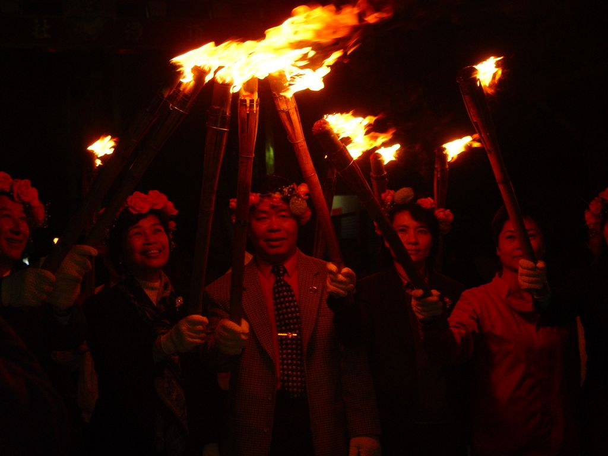

記智tī 1960年代進前，庄腳所在罕得有人牽電火，日頭nā落海，免半點鐘，四界to̍h暗眠摸，除了月光暝，nā boeh過家、店á頭買物，a̍h是屎ha̍k-á放屎，ah to̍h chiâⁿ費氣，有錢人ē giâ手電á、kōaⁿ電土火、kōaⁿ有玻璃罩ê媒油燈chhiō路，nā是阮sàn赤人，雖bóng厝內mā有手電á、電土火備用，平常時是m̄ kam 用，只好giâ番á油燈，微微á光sió-khóa照熟似ê路痕，風nā吹koh驚伊hoa--去，實在有影bô-siá-sì。

Tī hit ê年代，手電á是boeh出外chhiō光，電土火是鬧熱時節chiah-ē買電土提來用，有掛玻璃球á罩ê高級番á油燈，價siàu貴，食油siong，當然khai bē落--去，細支番á油燈bóng用。

除了chia ê火光用具，有時草把火、火炭火mā ē-sái-tit利用。
# 1. 番á火
> **Hoan-á-hóe**

番á火to̍h是『火柴』。

番á火是古早灶腳起火hiâⁿ柴，暗時點番á油燈，公媽廳點蠟燭火、燒香拜拜ê引火工具。看m̄是kài值錢ê番á火，厝內是kài重要，尤其是款三頓煮食ê cha-bó͘人，一頓無番á火，ah to̍h亂操操m̄知如何是好（án-chóaⁿ chiah好）。

1953 gín-á時代，一陣gín-á伴足gâu耍--ê，時常sńg cho̍k窟á、ī鼠牛虎兔poa̍h輸贏，用番á火支做kiáu-tù，1支2支poa̍h chhit-thô，cho̍k窟á技術Lah-jih kài khiàng，kā阿嫂討3支番á火，免半點鐘久to̍h贏1-lok轉來hō͘阿嫂。
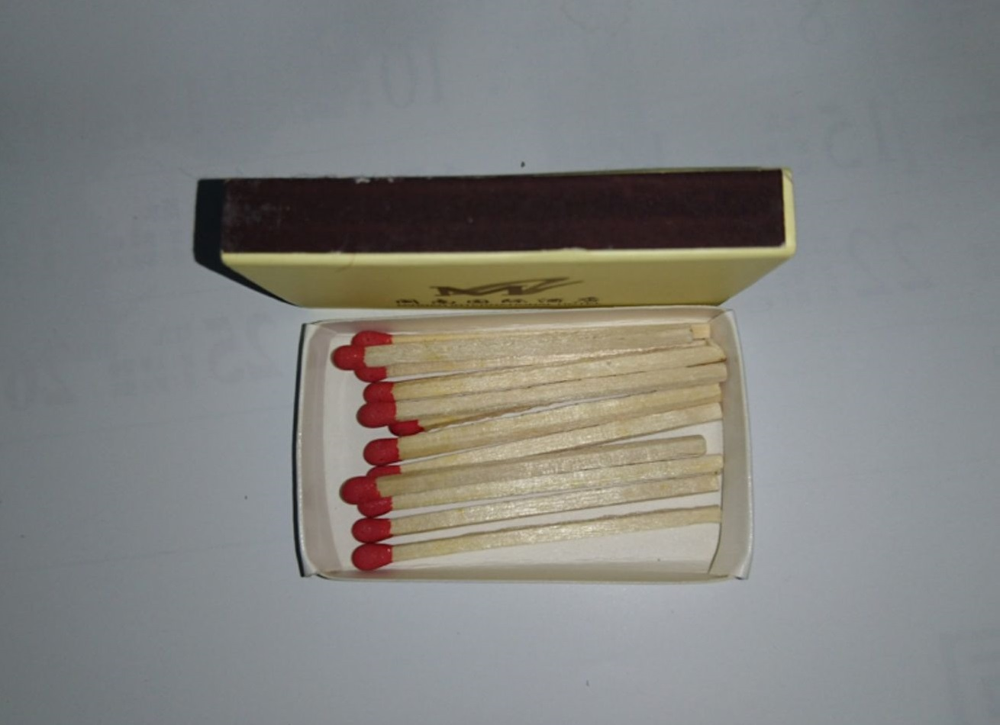
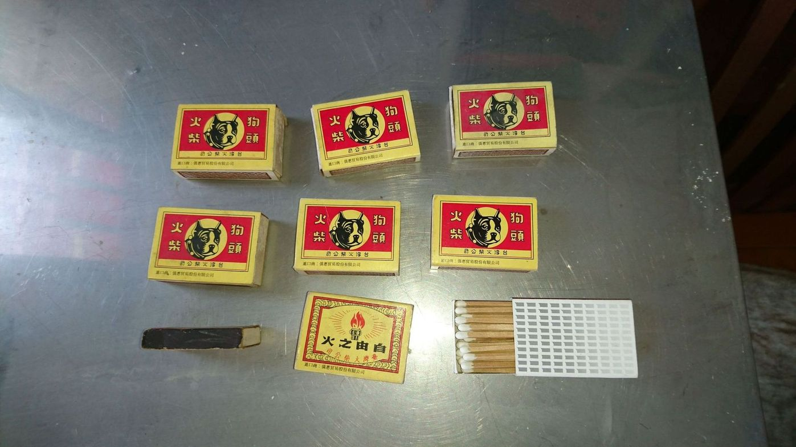
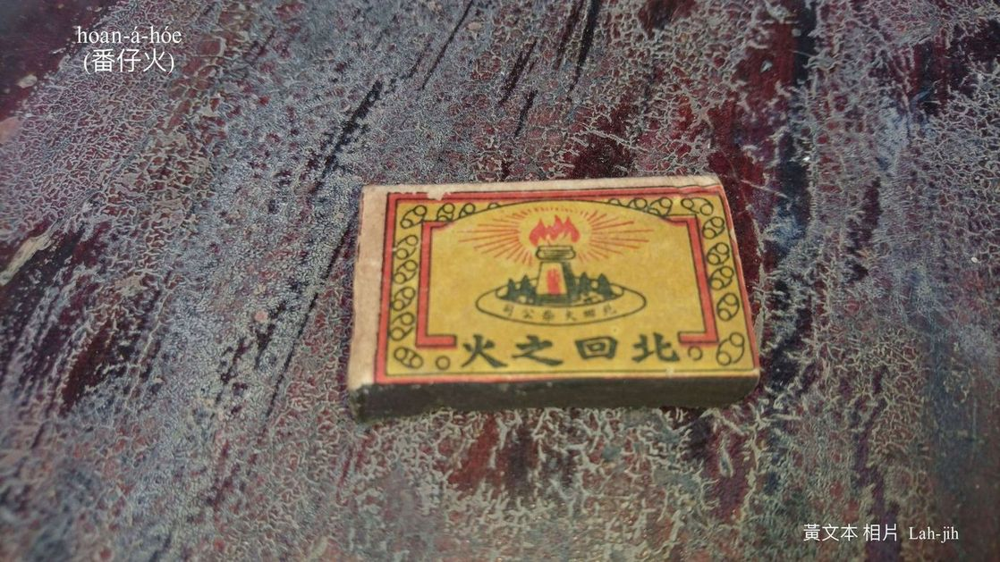

# 2. 草把火
> **Chháu-pé-hóe**

稻草tān ê火把，厝外chhōe物lia̍h蛇，點草把火。鬧熱時陣暗時庄外活動，喪事暗時乞水、接板（chih-pán）、做司公，點草把火。日本時代學生透早神社朝拜，lóng需要點草把火。

# 3. 蠟燭kap燭台
> **La̍h-chek kap Chek-tâi**

蠟燭ē-tàng點火照光，有紅色蠟燭kap白色蠟燭，紅色蠟燭是拜神嫁娶ê禮品，nā是平常時暝時點火照光，用白色蠟條，開銷比點番á油燈加真討債。

燭台ê路用to̍h是插蠟燭點蠟燭火，傳統燭台有銅質、錫質kap柴質。

燭台是禮器，廟寺公媽廳祭拜點蠟燭ê禮器，紅蠟燭是敬神拜神ê光明燈，傳統禮俗kài重要，拜神拜公媽tio̍h先點蠟燭chiah點香敬拜。嫁娶禮俗，男方tio̍h送女方金炮燭，koh tio̍h包「點燭禮」紅包，無經過「點燭」ê婚禮無圓滿，需要chhōe機緣完成「點燭禮」。
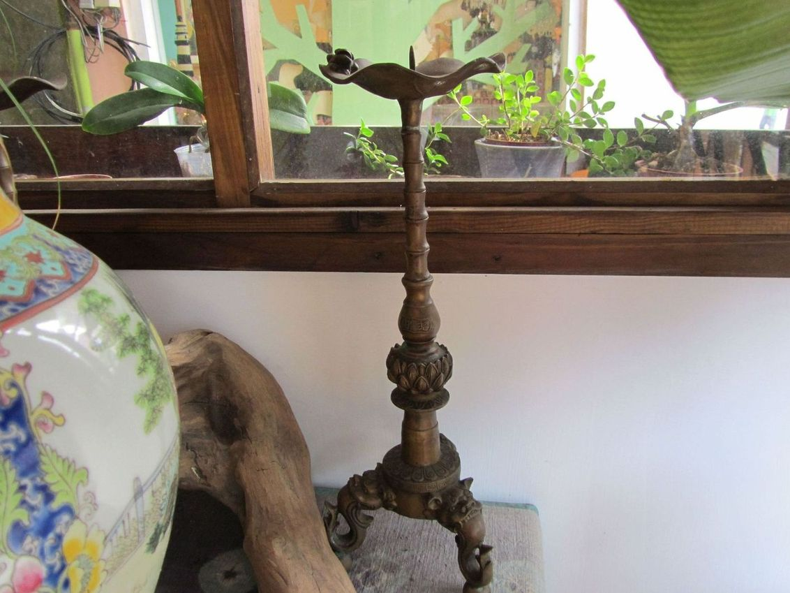
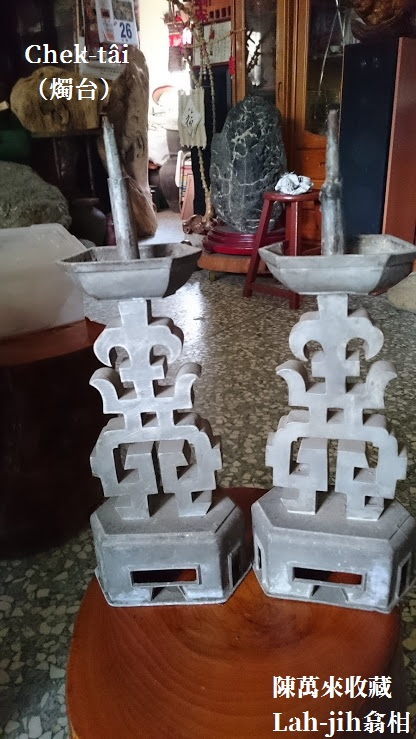
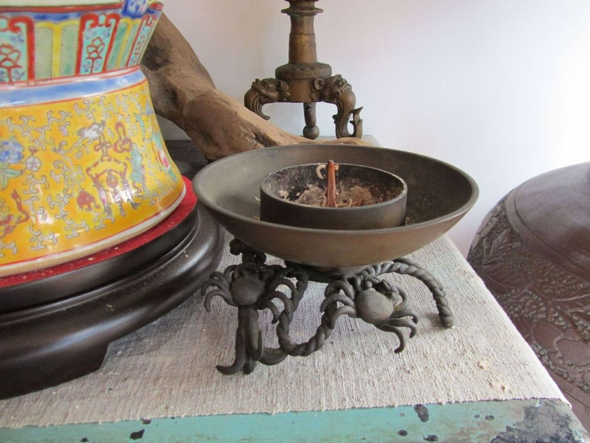
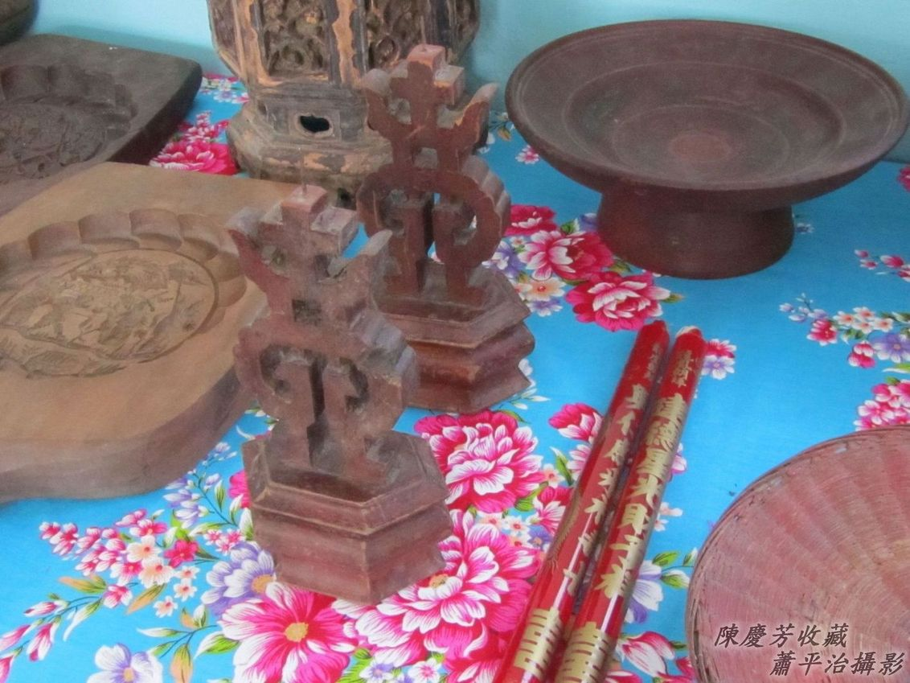
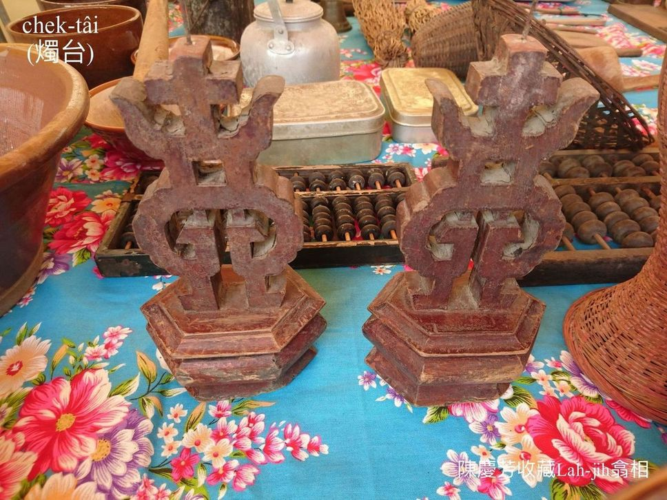

# 4. 油燈
> **Iû-teng**

點油ê火光，除了番á油燈，古早古早，好額人用火油（土豆油）來點火，當然he是貴som-som ê開銷。

## 4-1. 古早ê油燈
> **Kó͘-chá ê iû-teng**

Google比對，中央是燈心，nn̂g-pêng邊是入水khang，ē-tàng冷卻熱度、省油。罔參考。

## 4-2. 七星燈
> **Chhit-chheⁿ-teng**

7-kâi親像豆油碟á ê粗hûi，內面貯番á油（古早古早可能是火油/土豆油），khǹg一節短短像大麵條ê燈心，he燈心是曝ta燈心草ê koáiⁿ-sim（稈心），點to̍h是細細pha微微á光，雖bóng m̄是為tio̍h chhiō光，m̄ koh伊ê功效比chhiō光koh khah光明。

七星燈to̍h是光明燈，是世俗人生ê「功名燈」，chit種七星燈是亡者靈桌下ê光明燈。

（傳統習俗，亡者安靈tī公媽廳，靈桌下面舖幼砂a̍h是火hu，頂面chiah排七星燈，亡者往生七日做頭七時ē轉--來，to̍h ē顯出痕跡。He是在生親屬心靈安慰，m̄是迷信；nā是加添問神問卜，chham雜功利擴大解說，恐驚是迷信所致。）

## 4-3. 番á油燈
> **Hoan-á-iû-teng**

番á油to̍h是『媒油』，因為是外國傳--入-來-ê，to̍h kā叫做番á油，mā因為氣味無thang好，to̍h kā叫做臭油。因為jiân-tiám（燃點）比汽油khah低，點火比較khah安全，是khah早sàn赤人暝--時點火照光ê油料，1支闊嘴玻璃藥水罐á，罐嘴lop 1-kâi ē-tàng chhng棉紗帶ê燈心座，番á油thîn-tīⁿ，to̍h ē-sái-tit點火chhiō光，暗時讀冊lóng mā用chit種番á油燈，光線微微，需要khǹg倚目chiu前，讀半點鐘後，hun kah鼻khang內lóng是烏煙。

有玻璃罩ê番á油燈，比較khah高級，m̄驚風吹，有kōaⁿ ē-tàng kōaⁿ來kōaⁿ去，方便koh光iāⁿ-iāⁿ；細支玻璃罐á ê臭油燈，有耳thang giâ來giâ去，有人講做臭油gia̍h，tn̄g tio̍h風透，需要一手giâ燈一手cha̍h風。番á油燈ê燈心是棉紗線，利用『毛細現象』kā油溼tâm，頂koe̍h燈心to̍h ē to̍h火，新ê燈心需要頭尾浸油，a̍h是thèng-hāu『毛細現象』kā油溼tâm kui ê燈心，chiah有法度點火，燈心to̍h火siuⁿ久ē臭火ta，火bē光，需要用鉸刀鉸燈心。
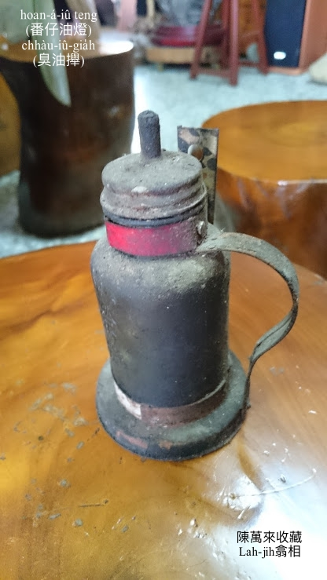
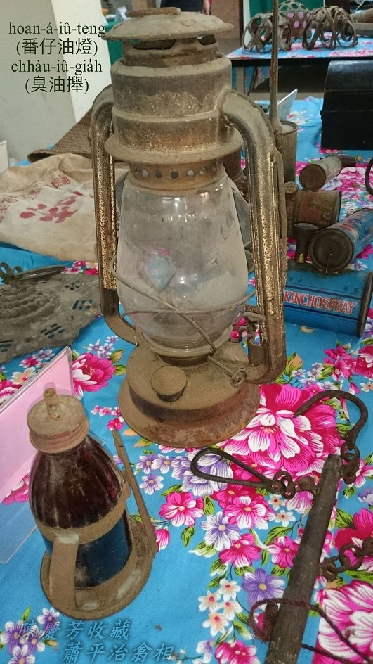
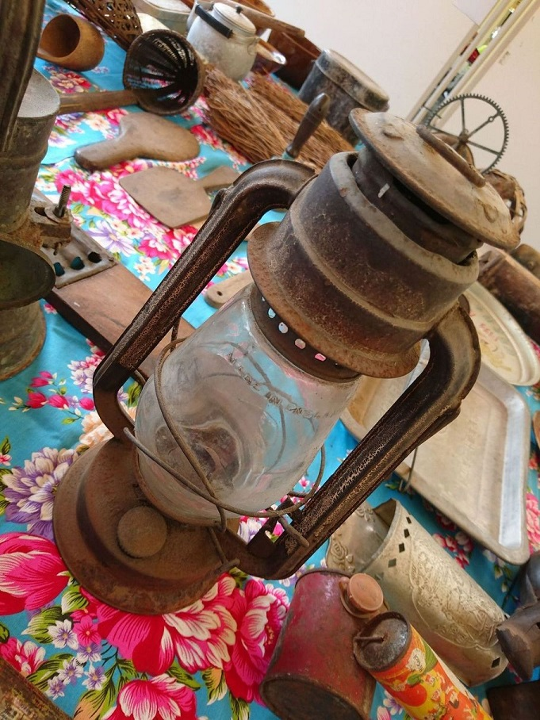
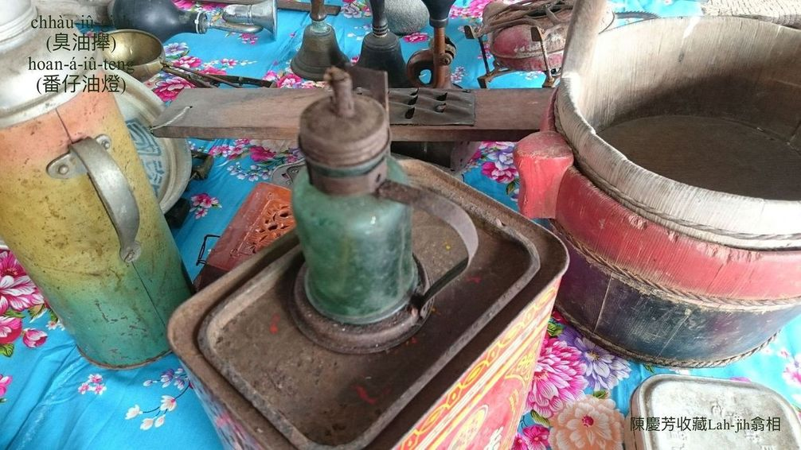
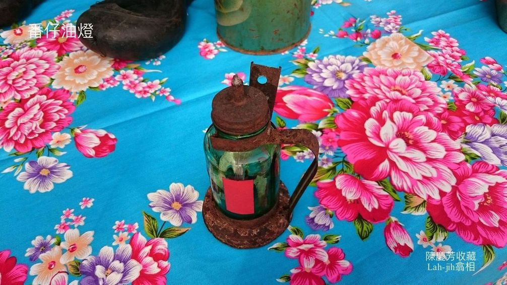
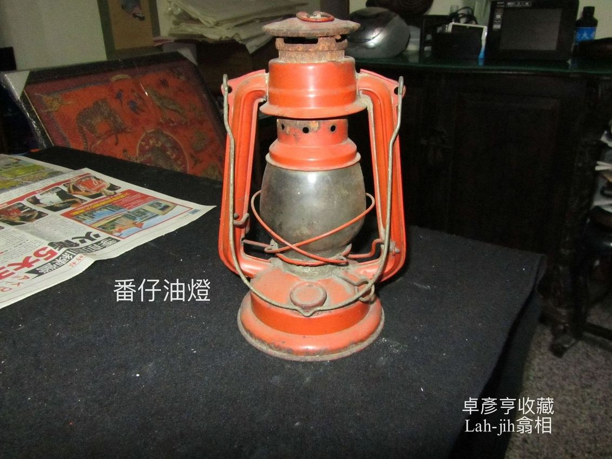
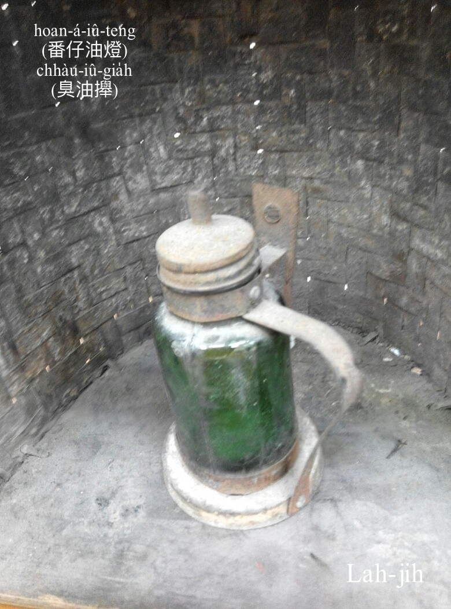

## 4-4. 燈閘
> **Teng-cha̍h**

竹篾á pīⁿ燈閘，造型chiâⁿsúi，編織幼路，ē-tàng khǹg臭油gia̍h kap蠟燭火。

## 4-5. 燈座
> **Teng-chō**

吊掛式番á油燈燈座，富戶人tau客廳裝飾品，ē-tàng tǹg番á油燈、蠟燭火照光，比較tio̍h khah氣派。
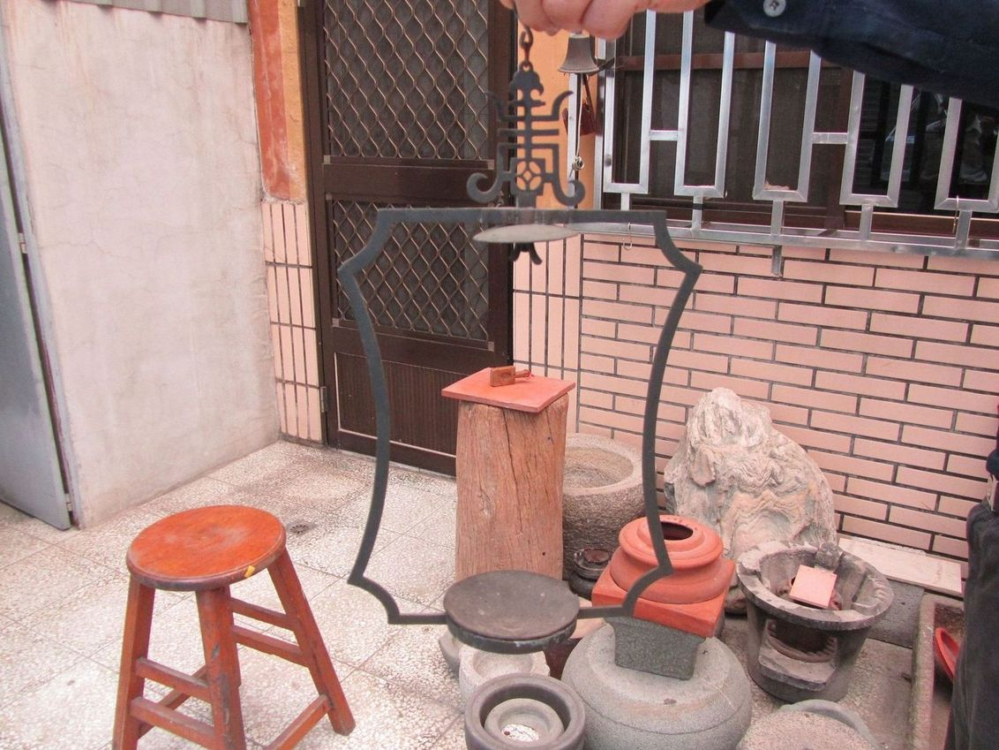

# 5. 電土火
> **Tiān-thô͘-hóe**

教育部辭典：電土/tiān-thô͘。『電石。不純的鈣化物，可以和水作用產生乙炔氣，成為高溫火焰的燃料，用來銲接或切割』。

電土火是利用電土產生ê it-khoat（乙炔）氣點火照光，光度chiâⁿ光，是鬧熱時節暗時siāng讚siāng光ê照明。Mā用來暗時lia̍h水蛙。

電土火分做兩部份，下koe̍h khǹg電土，頂koe̍h貯水kap火嘴á，有調節器ē-tàng調節滴水大細，滴水nā chē火舌to̍h大，滴水nā少，火舌to̍h細，to̍h火nā久，火嘴á ē塞去，需要用親像頭毛幼幼ê鋼絲thong-thàng，chiah ē恢復光iāⁿ。電土和水作用轉化做乙炔氣了後，需要kā電土屎清掉，重新khǹg電土kap添水。
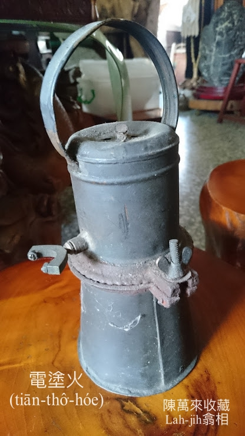
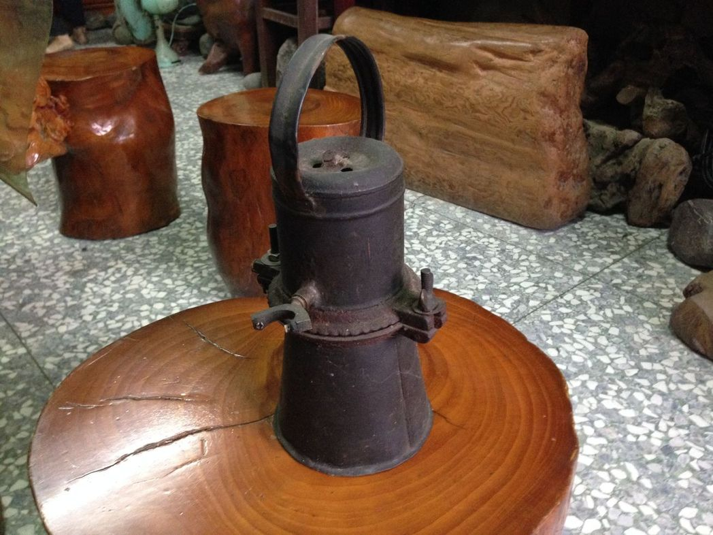
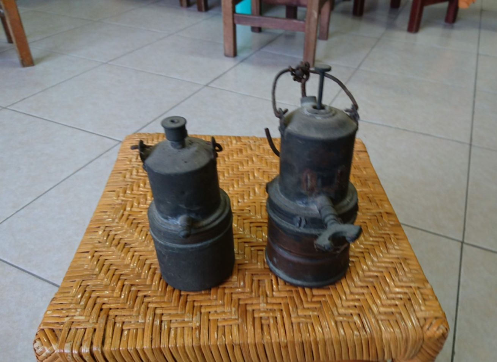
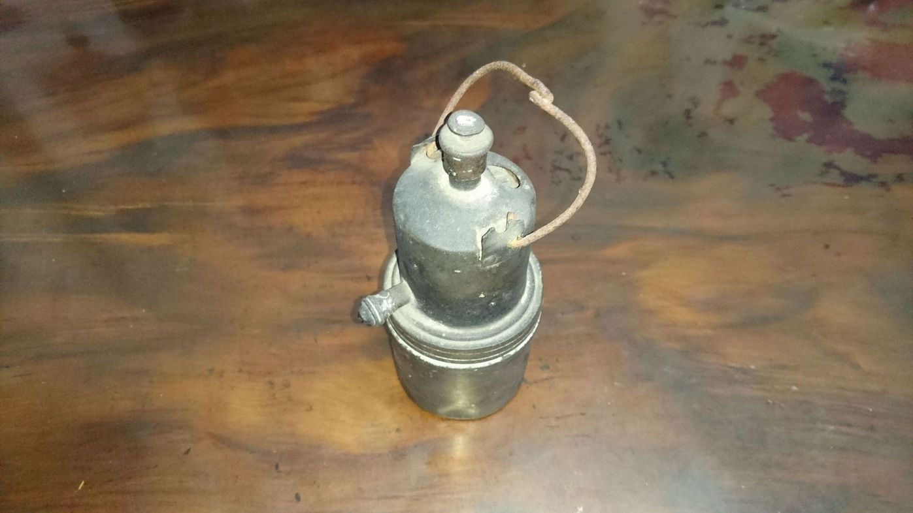

火嘴á nā安裝反射罩，集中光線焦點，to̍h用來lia̍h水蛙。
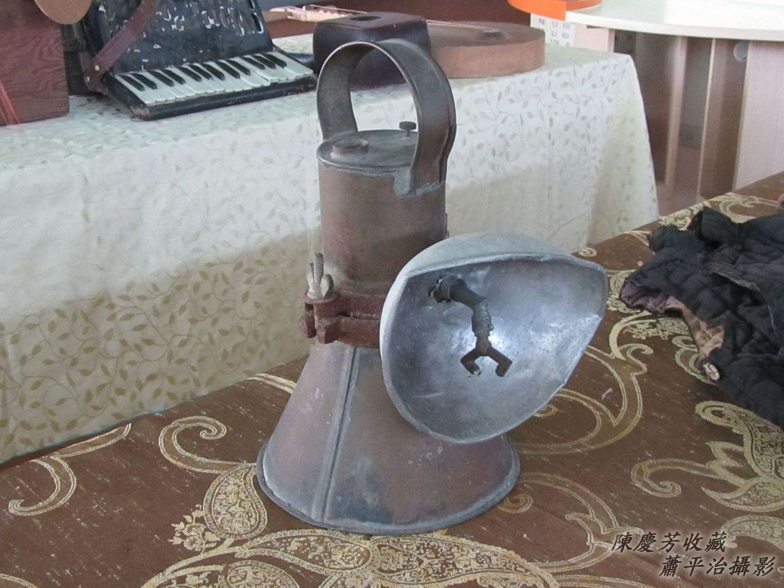

## 5-1. 簡單式ê電土火
> **Kan-tan-sek ê Tiān-thô͘-hóe**

外管貯水，內管其實是1-kâi長筒形ê盒á，khàm bā-bā，khàm到盒á底，盒á蓋黏一支點火ê火嘴á，電土khǹg tī盒á內面，因為『毛細現象』ē kā外管ê水sia̍p入內管轉化電土做乙炔氣，án-ne to̍h ē-tàng點電土火，不過無法度調節火焰ê大細。
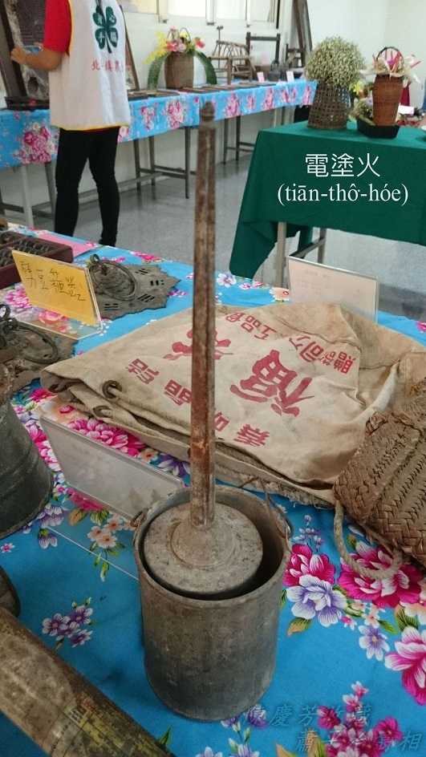
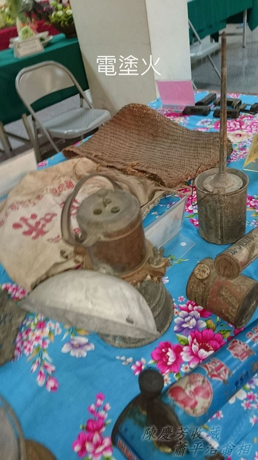

## 5-2. Khioh電土幼á ê記智
> **Khioh Tiān-thô͘ Iù-á ê Kì-tì**

大人換電土火ê電土，內面有he點無溶ê幼粒á，阮to̍h khioh起來點電土火。阮kō͘ tâm溼田土包電土幼á，sòa落giâ番á火枝tōng入電土所在，to̍h ē-tàng點1-2分鐘久細細pha火光，感覺真心適好耍。

# 6. 電火
> **Tiān-hóe**

雖bóng日本時代to̍h有電、電火，阮崁頂庄庄腳所在是到kah 1956 a̍h 是57，阮tau chiah有牽電火，記得斯當時電火料是算pha--ê，1-pha 60燭ê電火球á一個月收gōa-chē錢，boeh暗á送電，早起時天光停電，為tio̍h省錢，兩間房間公家1-pha，thiau工kā兩間隔間壁tó͘挖1-khang吊電火球á，kài-sêng『鑿壁借光』ê hàm古。

有電以後ê電火，lóng是『鎢絲燈泡』，需要1-kâi烏色絞螺á chūn ê電火頭，有ê ē kòa燈罩。
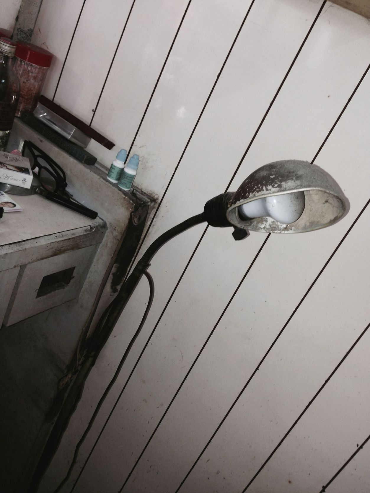

## 6-1. 磨電火
> **Bôa-tiān-hóe**

磨電火是騎鐵馬暗時chhiō光ê電火組，tī馬角á安電火頭，tiàm後輪a̍h是前輪裝小型發電機，利用鐵馬輪ê動力帶動發電機發電，tī hit-lō罕得有路燈ê庄腳路，非常方便出入。

# 7. 手電á
> **Chhiú-tiān-á**

無路燈ê庄腳暗暝，出入giâ番á油燈，熟似路chhiō一下光影，tn̄g-tio̍h透風落雨to̍h真麻煩不便，nā有一支現代化ê手電á thang用，m̄-nā方便光iāⁿ，koh khah是tòe流行ê hiau-pai。

手電á電池是碳鋅電池，價siàu無俗koh真緊無電，大兄驚阿爸暗時出入無方便，to̍h買一支手電á hō͘阿爸giâ，阿爸暗時nā出門，lóng mā chhiō--leh chhiō--leh m̄敢光kui路，我讀補習班hit chām暗時，阿爸手電á借我去街路學校，lóng mā交帶「Hō͘你做膽--ê，m̄-thang一直chhiō。」

# 8. 註解
> **Chù-kái**

|**詞**|**解說**|
|Chhiō路|『照亮路面』。|
|Hoa--去|『火光熄滅了』。|
|燈心草|『燈心草，又名燈芯草，可做油燈燈心』。|
|Lop|『套入』。|
|Chhng|『穿入』。|
|Thîn-tīⁿ|『倒入液體到滿』。|
|Sia̍p入|『滲進』。|
|Tōng入|『鑽進入』。|
|Hàm古|『指荒誕不實際的故事』。|
|Kiáu-tù|『賭注』。|
|Cho̍k窟á|『以銅版丟擲的賭博遊戲』。|
|Ī鼠牛虎兔|『玩十二生肖牌的賭博遊戲』。|
|Kài-khiàng|『很厲害』。|
|1-lok|『火柴一盒』。|
|燭|Chek，『計算光度的單位』。60燭to̍h是60『燭光』。|
|絞螺á chūn|『旋渦狀旋轉』。|
|馬角|Bé-kak，腳踏車號名叫鐵馬，『把手』to̍h號做「馬角」。|