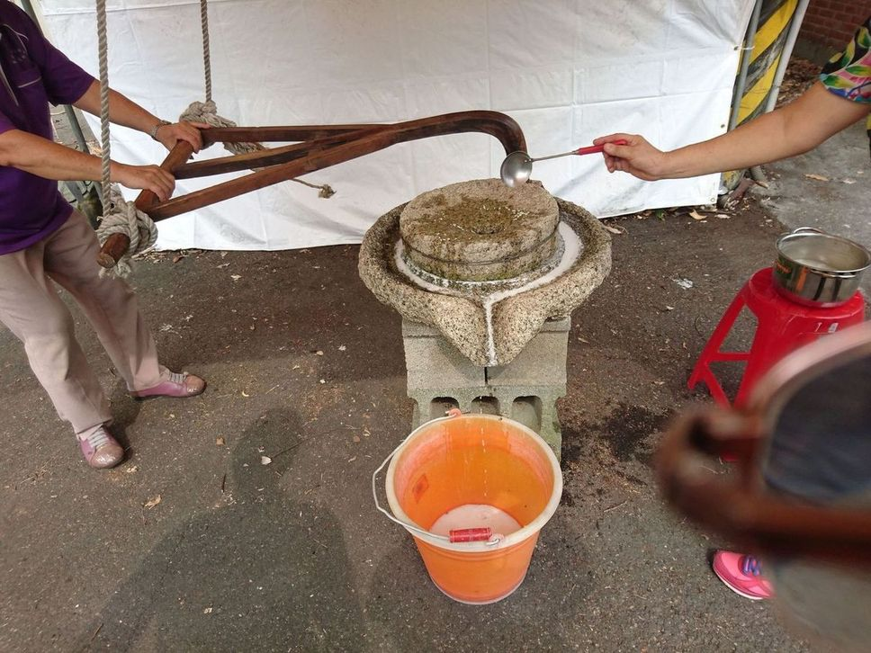
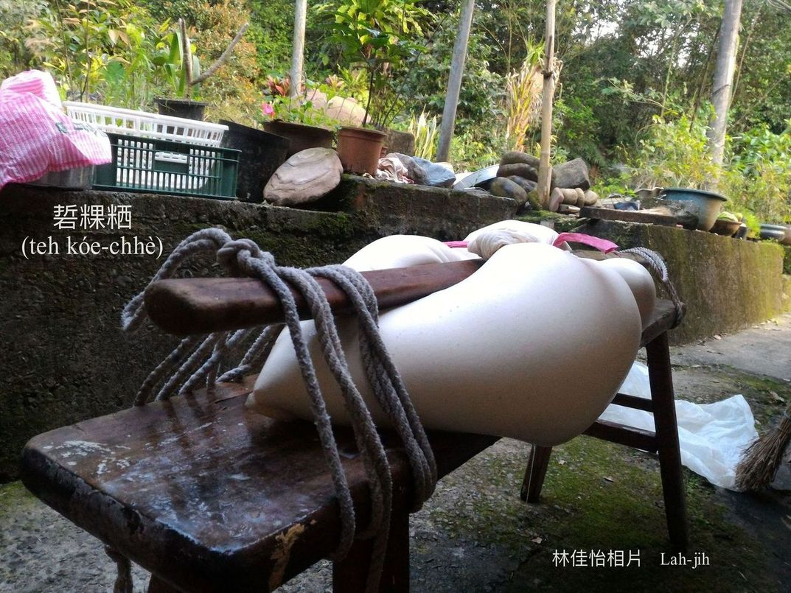
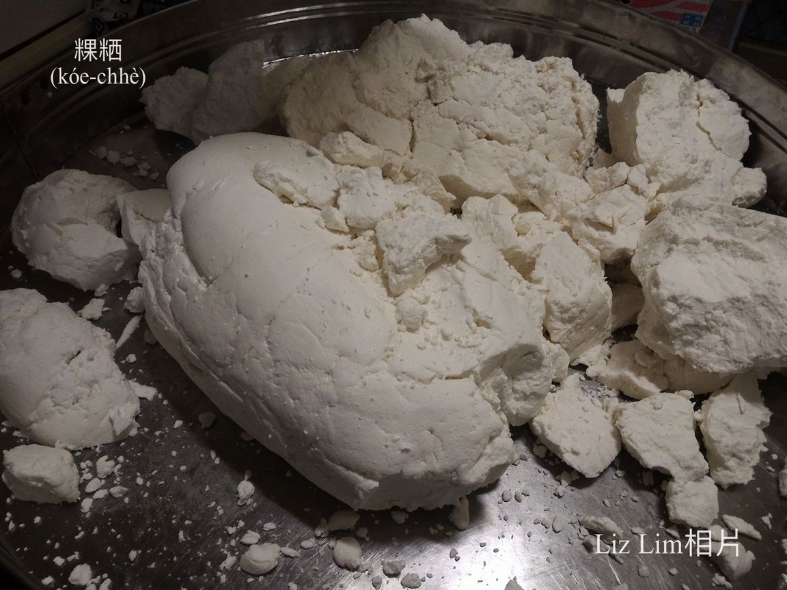
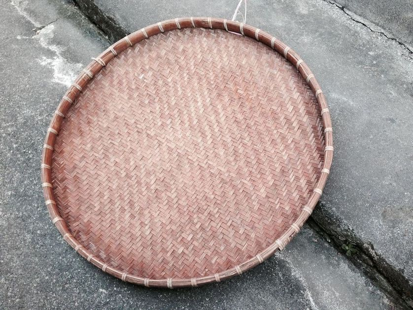
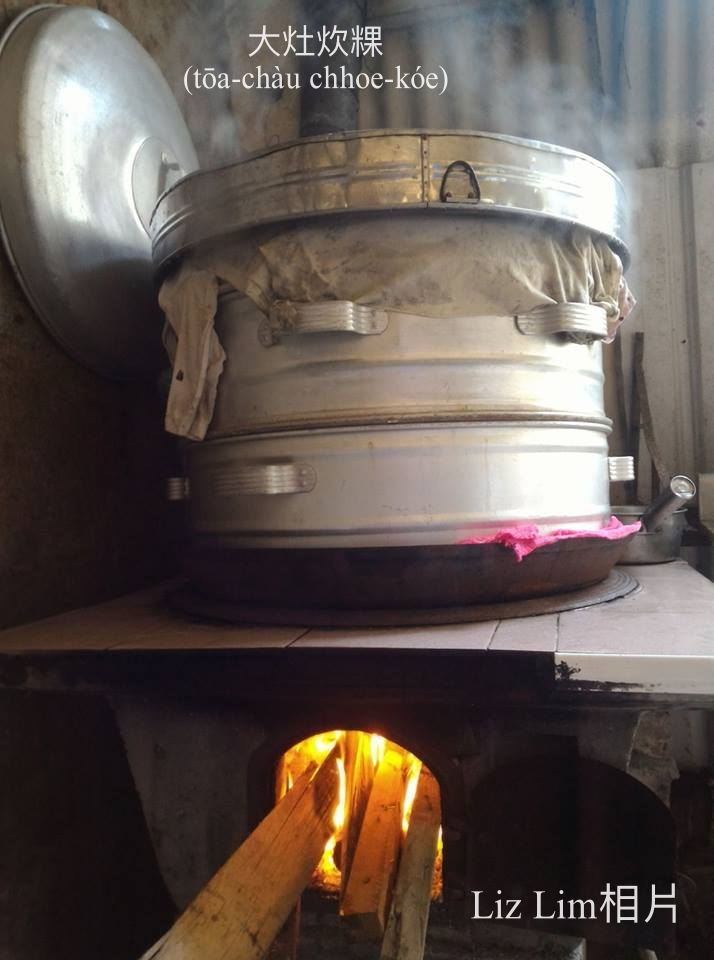
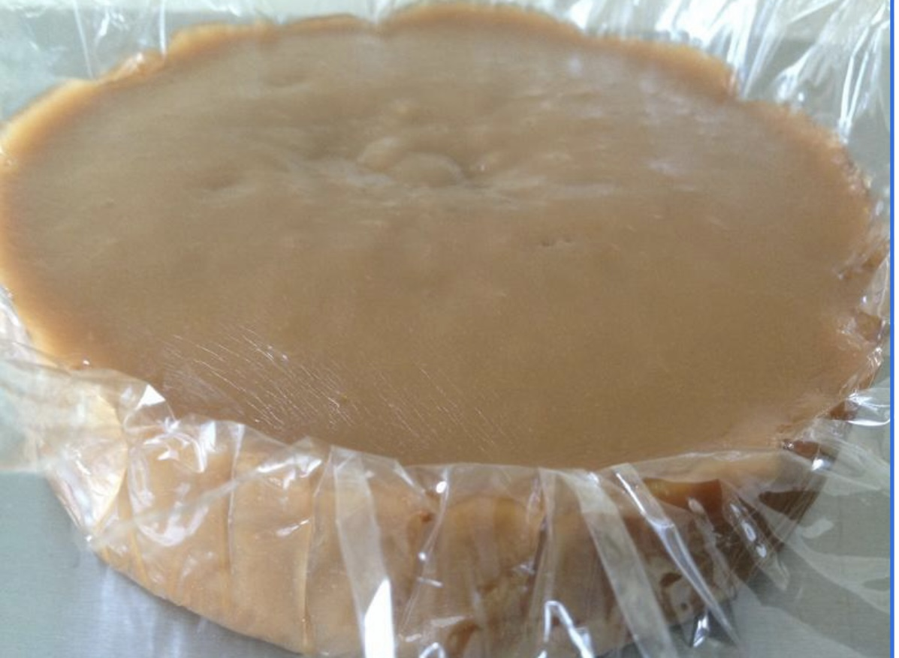

# 粿ài Án-chóaⁿ做？
> **Kóe Ài Án-chóaⁿ Chò?**

# 1. 做粿ê步數
> **Chò Kóe ê Pō͘-sò͘**

## 1-1. 挨粿
> **E-kóe**

年節到，厝前厝後亂操操，有人園á割粿ha̍h（弓蕉葉）挽粽葉（麻竹葉），有人水桶浸chu̍t米浸在來米，有人鼓井á腳洗粽ha̍h洗粿葉，有人石磨挨粿。舂臼á舂土豆hu，椅條kah粿袋teh粿漿，洗籠床洗kám-ô͘，hiaⁿh柴kho͘，準備挨粿、做粿kap炊粿，ta̍k口灶lóng是無閒chhih-chhih。

挨粿tio̍h用石磨á挨，石磨á是房á內公家ê，先到先挨，慢來tio̍h ài等人挨好。挨石磨á siāng少兩ê人，三ê khah輕鬆，1人ám-chhiâ-á（ám杓á） khat米，khat入石磨á khang，兩人hōaⁿ石磨á鉤挨，he石磨á鉤鉤tiàm石磨á手，hū e hū e白白粿漿to̍h漏落粿袋á內。

## 1-2. Teh粿漿
> **Teh Kóe-chiuⁿ**

貯粿漿ê粿袋á tio̍h揀he質料khah肥（pûi）ê白布，貯粿漿ê粿袋á先kā袋á嘴pa̍k ho͘ ân-ân，chiah kā hē-tiàm椅條頂，kō͘畚擔a̍h是竹管khòe-tiàm粿袋á頂，雙pêng頭用索á liāu ho͘ ân（pa̍k ân），hō͘粿漿慢慢á蝕水，經過幾pái chhiâu-chhe̍k têng-kah，粿漿變粿粞，to̍h ē-sái-tit tháu開khǹg-tiàm kám-ô͘做粿。

## 1-3. 撋粿粞
> **Nóa Kóe-chhè**

Tháu開粿袋á khǹg-tiàm kám-ô͘內撋粿粞：先捻幾塊á粿粞，sa̍h做粿pô͘，然後kap粿粞lām做夥tiàm kám-ô͘內nóa，nóa過來，nóa過去，一直nóa到khiū-khiū bē黏手，to̍h ē-sái-tit包餡做粿a̍h是so圓。 

## 1-4. 做粿
> **Chò-kóe**

白米、chu̍t米、在來米，需要挨做粿粞來做粿有：甜粿、紅龜粿、桃粿、銀粿、牽á-liau（牽á粿）、丁á粿、鼠麴á粿、芋梭á（芋粿khiau）、芋粿、草á粿、包á粿、圓á、碗粿、菜頭粿、米篩目。

## 1-5. 炊粿
> **Chhoe-kóe**

炊粿是大工事，籠床lāu-khùi（漏氣）、火無夠猛、時間節了無夠準，a̍h是有人烏白講話，lóng ē影響炊粿，m̄是無熟to̍h是pháiⁿ看頭，m̄-chiah炊粿時，隨時tio̍h斟酌灶khang火，斟酌鼎內滾水，sûn看籠床khàm有bā--bò͘？炊粿Khiat-chiat chiâⁿ chē，千萬m̄-thang chho̍p-chho̍p唸。早前厝內無時鐘，所以kō͘點香節時間，重點tī經驗，少年--ê跟tòe序大學，自然pìⁿ師傅。其實khiat-chiat是chi̍t-khoán禁忌迷信，人leh無閒炊粿，有人邊a chho̍p-chho̍p-liām，to̍h-ē hō͘人 分心失去chim-chiok。

# 2. 炊甜粿
> **Chhoe Tiⁿ-kóe**

過年炊甜粿算是第一重要khang-khòe，農曆十二月二十四送神了後，to̍h開始準備炊甜粿，愛食khah軟，to̍h用圓chu̍t-á；kah意khah khiū khah bē流，to̍h選長chu̍t-á，m̄免phòa，直接經過浸米、挨粿、teh粿漿、撋粿粞了後，to̍h開始炊甜粿ê大工事。

Tāi-seng tiàm大鼎gô（熬）糖膏，ná熬ná捻1塊1塊粿粞落鼎kô，ná熬ná kô，全部kā粿粞kap糖膏kô chiâu-chn̂g，chiah kā khat落準備好勢ê籠舖，khǹg落去大鼎頂，chit-chūn ê大鼎改換燃滾水，籠舖內粿巾外沿插3-4支粿khùi，籠床蓋khàm好勢開始炊粿。

籠舖chhu粿巾，甜粿炊熟chiah倒落去chhu玻璃紙a̍h是刺竹甲ha̍h-á thīⁿ ê籠床層定形，3-4工後切做1-liau 1-liau，過年拜拜備用。

## 2-1. 甜粿Teh年
> **Tiⁿ-kóe Teh Nî**

甜粿炊熟hē冷定形了後，to̍h tī過年前切做1-liau 1-liau，過年日kā 1-liau甜粿hām發粿、飯春khǹg-tiàm尪架桌頂，tio̍h等初五隔開chiah ē-sái-tit收--起-來。過年請人客煎無了ê甜粿，有人ē khǹg到清明，因為甜粿lām糖甜甜，ē-tàng保存真久，外沿ē生菇，內面bē害--去。M̄-chiah有「甜粿teh年，發粿發錢，包á粿包金，菜頭粿kiat點心」ê俗語。

## 2-2. 咬粿巾
> **Kā Kóe-kin**

甜粿炊熟，ē先kô一寡起來碗公食巧teh嘴kho͘，gín-á siāng歡喜咬粿巾，kiap tī粿巾頂面ê甜粿，ē-tàng hō͘ gín-á食kah足滿足，nā是厝內有3-5 ê gín-á，做夥咬粿巾to̍h親像鳥鼠á偷食粿。

## 2-3. 刺竹甲ha̍h ê路用
> **Chhì-tek Kah-ha̍h ê Lō͘-iōng**

刺竹模lak--落-來ê甲ha̍h，ē-tàng hiâⁿ火，nā是iáu未ta ê甲ha̍h，ē-tàng剝落來洗清氣曝ta teh平，舖tiàm籠舖貯甜粿。

# 3. 籠舖炊粿
> **Láng-pho͘ Chhoe Kóe**

1. 炊甜粿、炊菜頭粿直接tī籠舖炊，無koh thia̍p籠床層á，籠舖需要先chhu 1-têng粿巾，炊熟chiah kā搬徙去chhu玻璃紙a̍h是chhu刺竹甲ha̍h-á ê另外1-ê籠舖a̍h是籠床層á。

2. Khioh刺竹甲ha̍h-á，kā面頂幼毛lù掉，洗清氣teh平，提來舖tiàm籠舖，舖ho͘ ba̍t-cha̍t（密實）平坦，籠舖邊需要kō͘布袋針thīⁿ tiâu。

3. 粿巾：揀khah肥白布，chhu-tiàm籠舖khǹg粿漿。

4. 甲ha̍h：刺竹筍ê筍殼，lōng-ko（篙）大欉了後變ta to̍h是甲ha̍h-á。

5. 粿khùi：籠舖內hit 3-4支透氣ê竹管á。

## 3-1.粿khùi ê作用
> **Kóe-khùi ê Chok-iōng**

籠舖炊甜粿、菜頭粿、ō͘-hoâiⁿ粿，是直接kā粿漿hē loeh chhu粿巾ê籠舖內，雖bóng籠舖底是lang--ê，m̄-koh粿巾是密--ê，鼎內滾水蒸氣boeh haⁿh--入-去粿漿比較khah困難，咱tī粿巾外沿，插3-4支thàng khang ê竹管粿氣，鼎內蒸氣熱度透過粿氣鑽入籠舖內，而且蒸氣水滴koh-bē直接滴落籠舖內粿漿，真正是咱祖媽ê智慧。

# 4. 註解
> **Chù-kái**

|**詞**|**解說**|
|Khiū|M̄是Q，『軟軟有彈性』。|
|Phòa|做粿『以特定比例混合不同的米』。|
|鼠麴á|Chhí-khak-á，『鼠麴草』。|
|撋|Nóa，『揉搓』。|
|食巧|Chia̍h-khá，食『奇妙、珍奇。少見而且精緻的食物』。|
|蝕水|Si̍h-chúi，『減少、消退，指水分消散』。|
|Hiaⁿh|『以手拿物，多指取衣服或布類』。|
|Hū e hū e|形容石磨挨粿聲音。|
|Chhiâu-chhe̍k têng-kah|『重新架設』。|
|Hē-tiàm|『放在』。|
|Khòe-tiàm|『架在』。|
|Khǹg-tiàm|『放在』。|
|Ná熬|Ná kô，『邊熬煮邊用木棍攪動』。|
|1-liau 1-liau|『一長條一長條』。|
|Hē loeh|『放下去』。|
|Haⁿh--入-去|『將熱氣逼進入』。|
|Kiat點心|食點心。|
