# 食喜酒kap食茶
> **Chia̍h Hí-chiú kap Chia̍h-tê**

## 1. Phâng菜ê家私——桶盤
> **Phâng-chhài ê Ke-si Tháng-pôaⁿ**

辦桌送料理chiūⁿ桌頂，需要用chit種桶盤，1-pái ē-sái-chit送1盤a̍h是2盤，專門幫總舖師傅phâng桶盤送菜上桌ê人，叫做走桌--ê。Nā是冷盤、炒、chìⁿ料理，iáu算簡單，nā是燒燙燙ê燒湯，雙手phâng mā好，一手thèⁿ mā好，安全第一，m̄-thang chhia-tó，m̄-thang kā人燙--tio̍h，腳手ài mé-lia̍h，速度ài緊，he平衡balance功夫一定ài練。Iáu有，bē-sái-tit驚燒驚燙，超過100度ê溫度，mā tio̍h ài ē堪--得。Boeh做走桌--ê m̄是hiah-nī好choán-chia̍h。
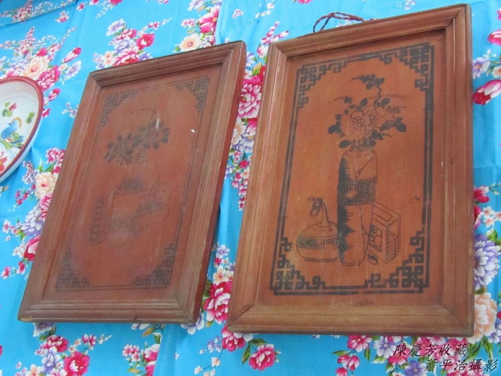

古早桶盤有漆紅色koh有花紋，ē-tàng做禮數用，kā三牲酒醴排tiàm頂面，to̍h ē-tàng拜神a̍h是送禮。娶新娘請人客phâng菜ê柴盤。好bái料理，燒，chiah ē好食，燒燙燙ê料理，直接用手phâng ē燙--人，用桶盤送，衛生koh ē-tàng 1-pái送雙ē（兩碗）。
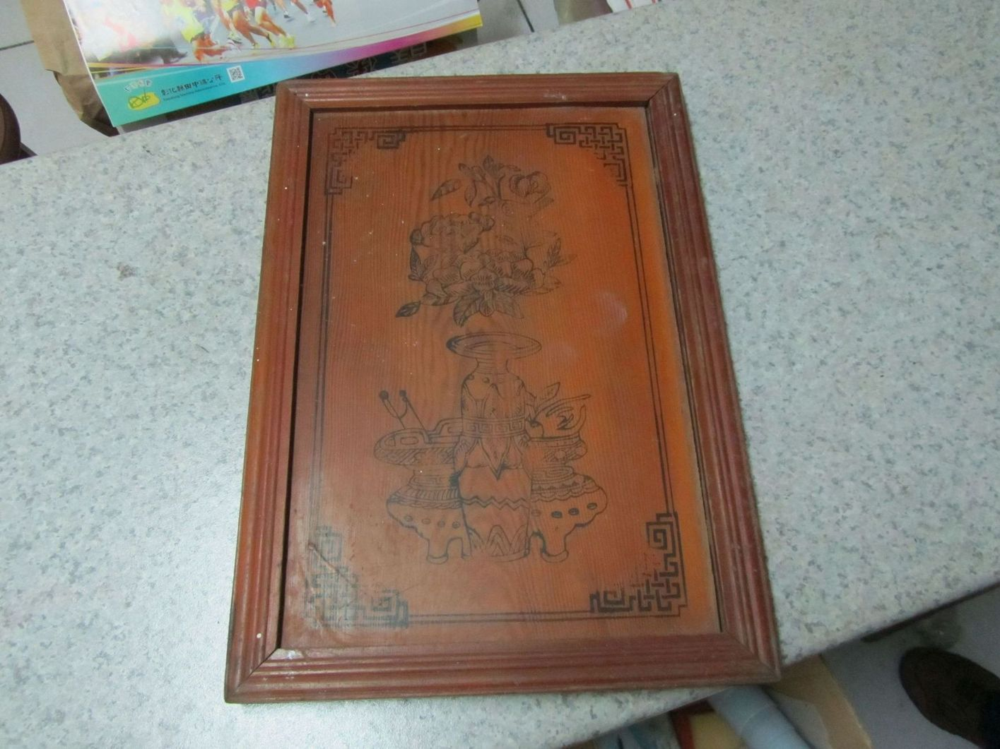

## 2. 食新娘茶
> **Chia̍h Sin-niû-tê**

半暝後咱tio̍h mài講，來講「食新娘茶」，ē-sái-tit講是『餘興節目』，不過kan-nā至親長輩ē-sái-chit參加，mā是新娘kap長輩熟似ê禮數。

Chit個叫妗婆，「妗婆！」
妗婆：「甜茶甜甜，hō͘恁冬尾生後生。」
趕緊kā妗婆說謝，「多謝妗婆！」
Chit個叫姑丈，「姑丈！」
姑丈：「茶盤金金，茶甌深深，saⁿ-kap意愛，新人相chim。Nā無相chim，chit甌茶我無ài lim。」

Taⁿ to̍h害，姑丈ná-ē chiah-nī無chām-chat，連kiáⁿ婿都面á紅紅，媒人趕緊解圍：

「姑丈姑丈真趣味，新郎新娘bē-hiáu--得，阿姑、姑丈做1-ê樣，阮chiah看樣來相chim。」

「這位姑丈真趣味，新人tăⁿ結婚，bē-hiáu相chim，boeh請阿姑、姑丈做1-ê樣，看boeh姑丈chim阿姑，a̍h是阿姑chim姑丈，siāng好是兩人mo͘h leh chim，án-ne新郎新娘m̄-chiah ē-hiáu，掛保證，一定ē相chim。」

Chit款臨時巧氣應答，互動tī媒人kap人客之間，新娘siāng加ē-sái-tit pì-sù bún--chi̍t-ē bún--chi̍t-ē niā-niā。

「食新娘茶」齣頭，需要備辦茶盤、茶甌，chhoân甜茶（Chham糖ê茶米茶，傳統做法是桂圓紅棗茶，意思向望早生貴子。）、hun、冬瓜、糖霜。

奉茶是siāng尾齣，茶lim了後，to̍h-ài teh紅包，紅包有大細，厚話慷慨包khah chē，hân-san tàng-sng--ê包khah少，有人講通和包平chē，khah-bē hông gī-niū pháiⁿ勢。

## 3. 食新娘茶器具紹介

## 3-1. 茶盤
> **Tê-pôaⁿ**

Phâng茶ê茶盤，一般是圓形，lâm-thn̄g--ê，色水súi，題字花紋含意kap ang-á-chiá（翁á姐）幸福相關連。

Lâm-thn̄g（淋碭）ê圓形茶盤

永結同心，紅唇白底，牡丹富貴，雙雙對對。
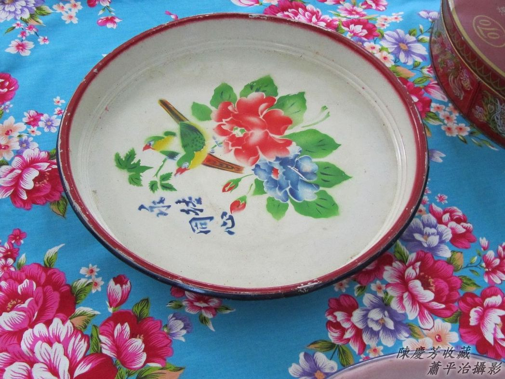

上_紅唇白底，鴛鴦水鴨相交纏，永浴愛河。

下_紅唇白底，牡丹富貴，圓形雙囍。

鴛鴦是公ê鴛鴦，水鴨是母ê鴛鴦。
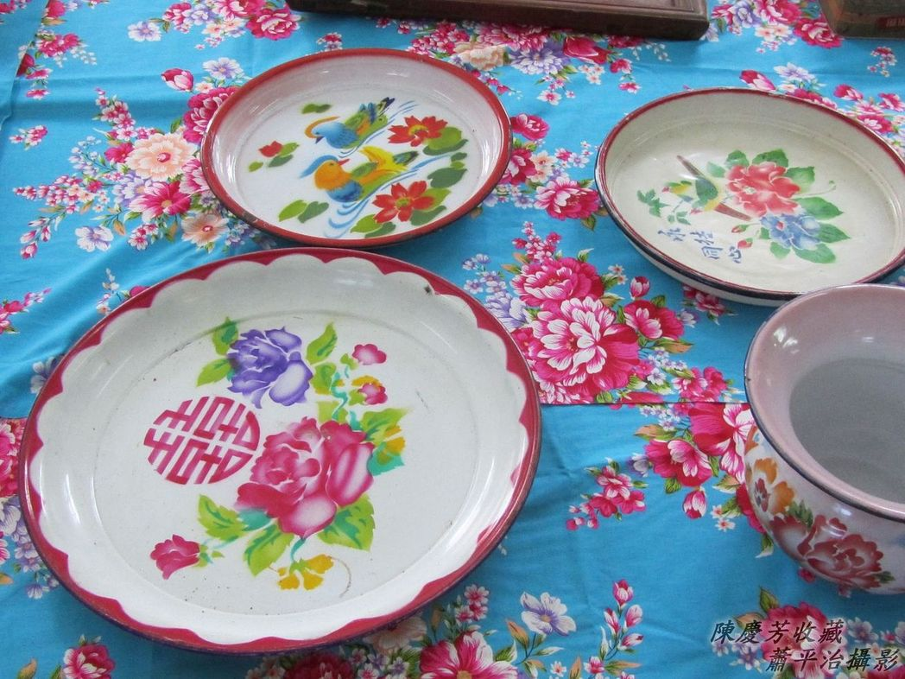

圓形以外造型ê茶盤，題字榮諧伉儷（êng hâi khòng-lē），圖畫紅色牡丹花，雙pêng有耳。
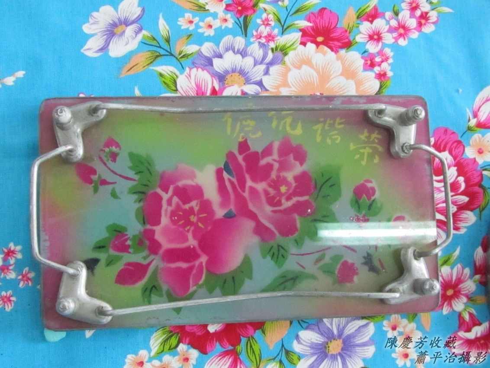

Tāi魚開嘴，雙雙對對，永浴愛河，萬年富貴。

傳統俗語有「闊嘴cha-po͘食四方，闊嘴cha-bó͘食嫁妝。」Tāi-hî to̍h是鯉魚，傳統認為tāi魚嘴ê新娘chiah是súi，tāi魚嘴to̍h是『櫻桃小嘴』。
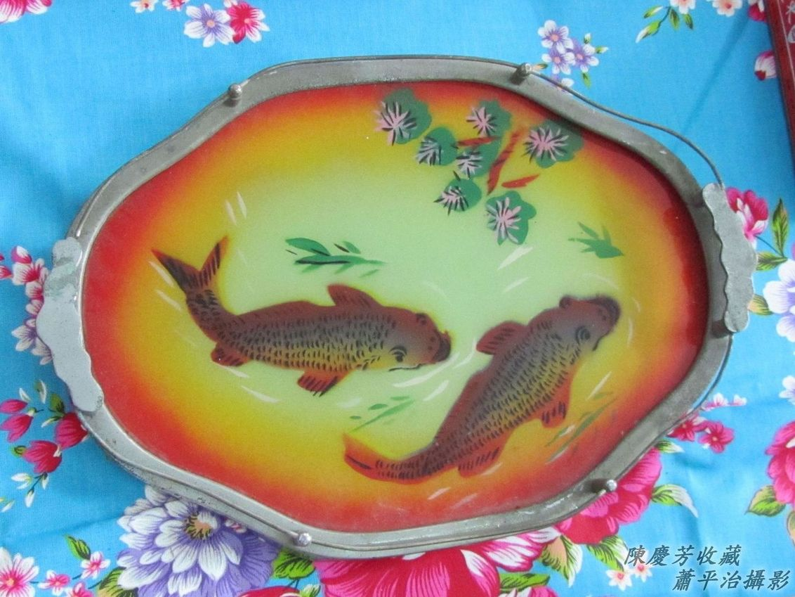

金魚、水草，魚水之歡。
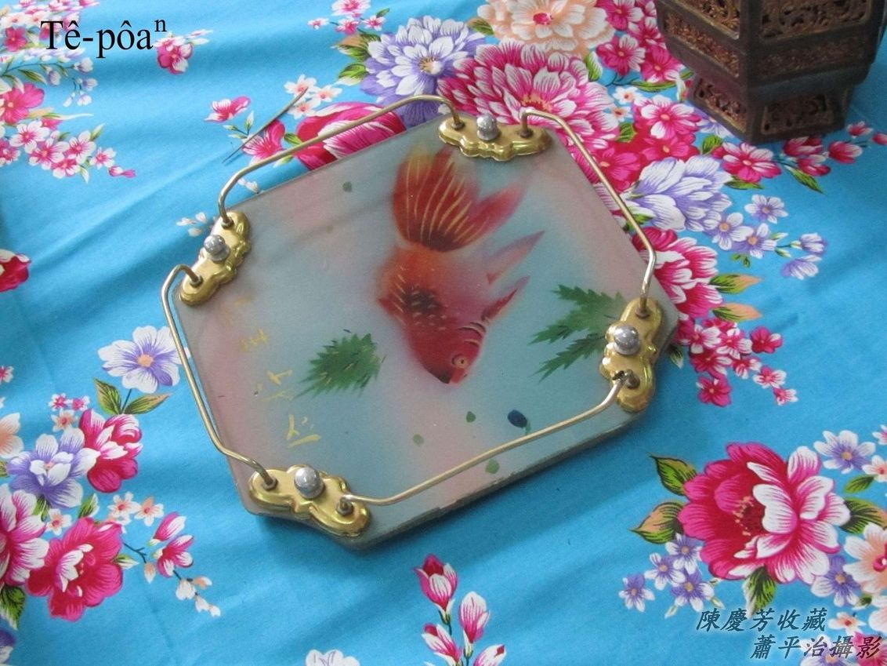

## 3-2. 茶罐á kap茶甌
> **Tê-koàn-á kap Tê-au**

泡茶米茶ê hûi-á茶罐有大支龍罐kap細支茶罐á。1支茶罐，6甌茶甌á。
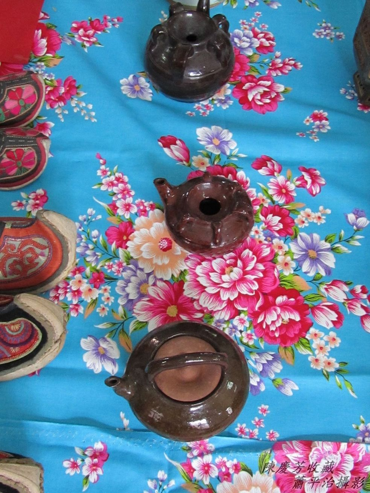
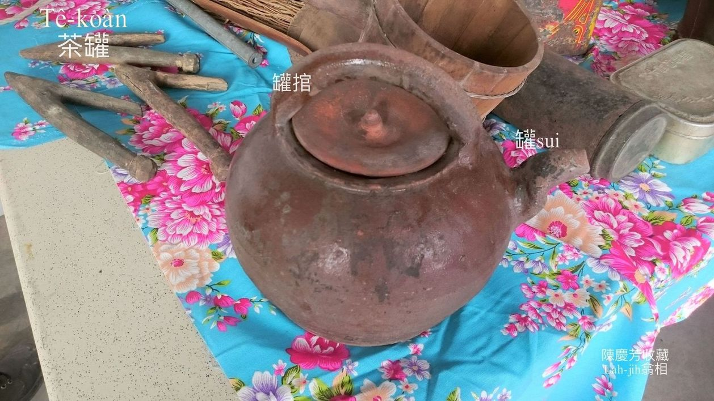
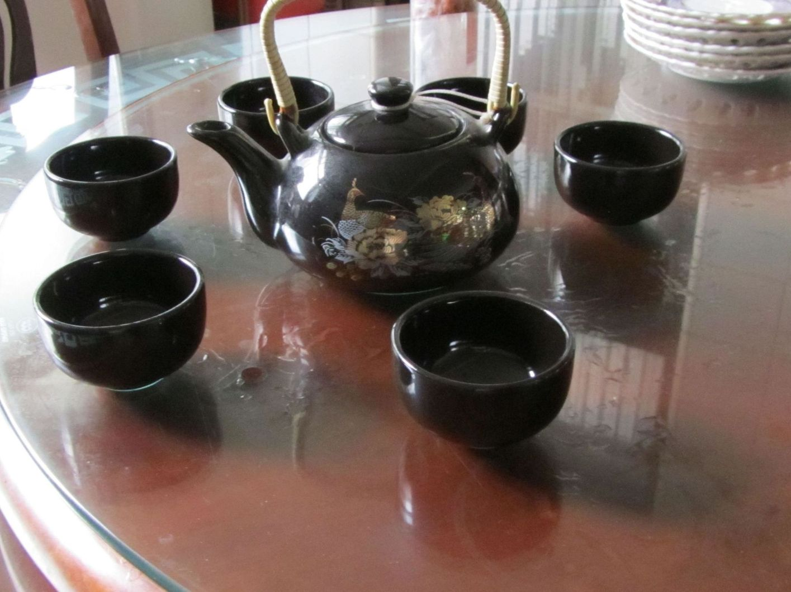

Nā是金屬茶罐號做tê-oe（茶鍋），ē-sái-tit hiâⁿ滾水，mā ē-sái-tit hē茶米泡茶。作穡人平常時用茶鍋hiâⁿ滾水，泡茶米茶。Lim茶是lim滾水。

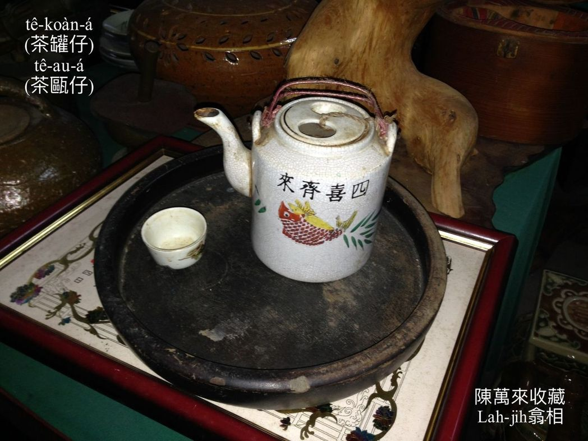
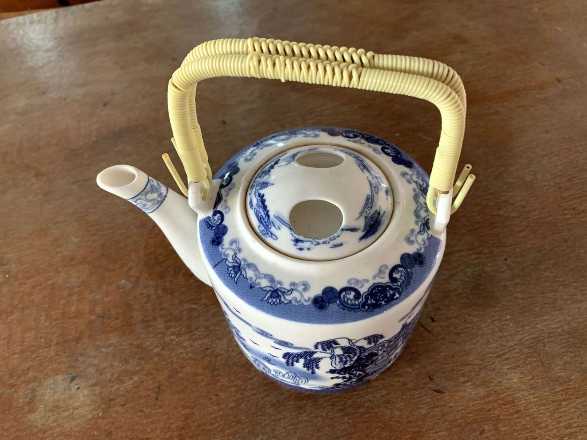

## 3-3. 茶米甕
> **Tê-bí-àng**

Khǹg茶米tio̍h密封，茶米甕ê蓋有bā無bā kài重要，甕蓋無bā m̄-nā茶米ē 走khùi pìⁿ-lùn，koh ē吸收外面油煙怪味，失去原味。

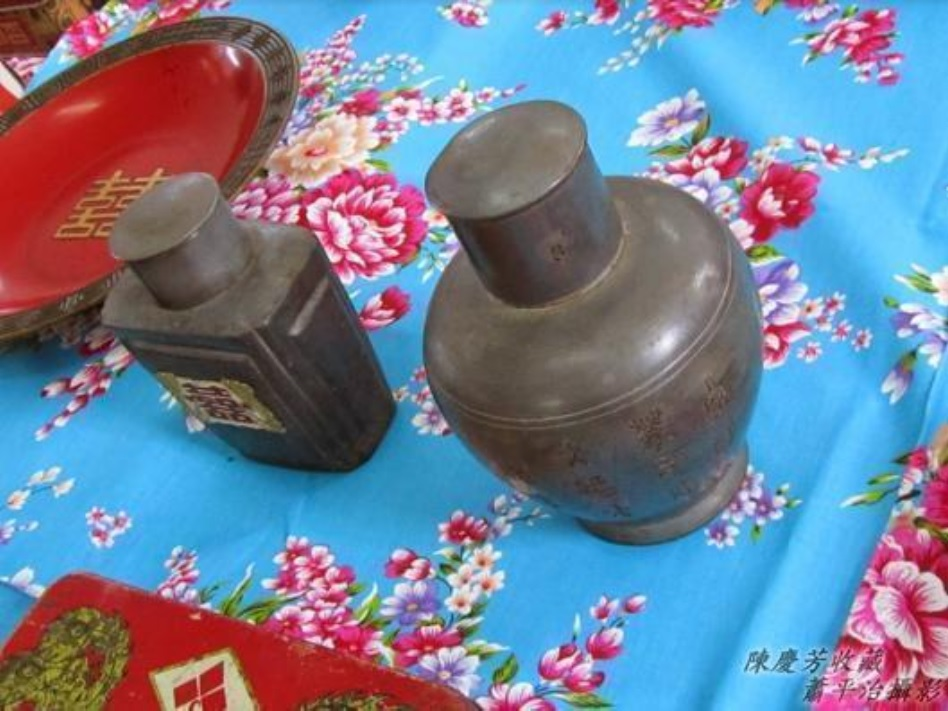

Siah chè Tê-bí-àng-á（錫製茶米甕á）。
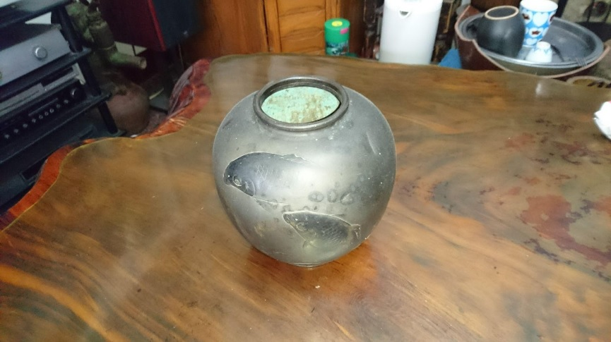

## 3-4. 食茶ê唸謠
> **Chia̍h-tê ê Liām-iâu**

火金星，十五暝，請恁姨á來食茶，茶芳芳，茶米甕，甕大妗，大妗做媒人，媒人tio̍h火燒，親家親姆chhia̍k-chhia̍k-tiô，tiô到柚á腳，黃--ē挽去食，青--e留leh送丈人，丈人o-ló好，阿兄娶阿嫂，阿嫂腳疼bē入房，阿兄手疼bē挨礱‥‥‥

## 3-5. Hun殼á kap Hun盒á
> **Hun-khok-á kap Hun-a̍p-á**

Hun殼á是貯捲hun，散hun hun-ki ê殼á，人客boeh pok ka-tī提。
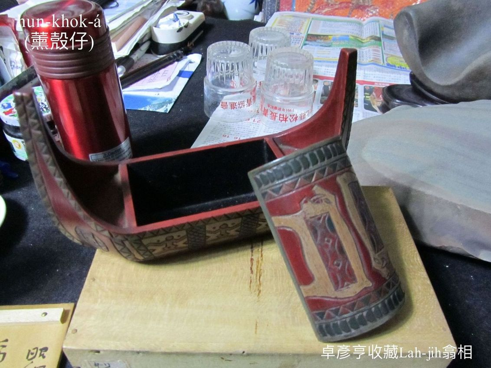

Hun盒á是貯『香煙』ê盒á，ē-tàng貯一包『香煙』。
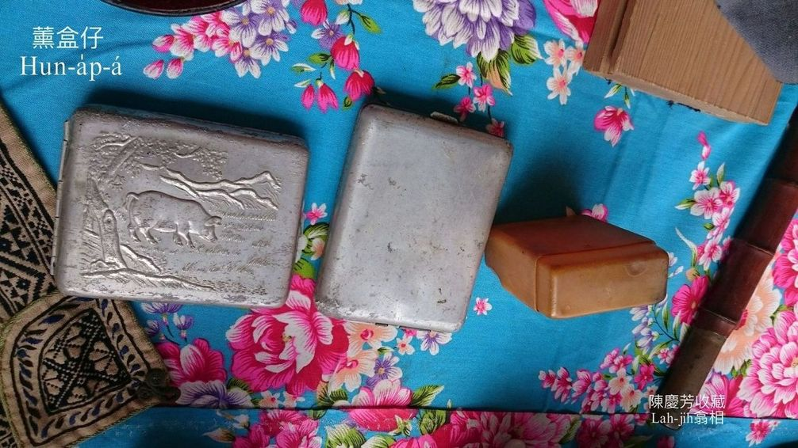

# 4. 註解
> **Chù-kái**

|**詞**|**解說**|
|Thn̄g：教育部解釋|1. 名詞：『陶瓷的色料』。例：淋碭lâm-thn̄g，『將陶瓷上色』。2. 動詞：『將陶瓷上色』。例：碭光thn̄g-kng，『上釉』。|
|Tāi魚開嘴|Tāi-hî to̍h是lí-hî（鯉魚）。Tāi魚開嘴to̍h是華語『櫻桃小口』。|
|Chhia̍k-chhia̍k-tiô|(1) 歡喜kah跳起來。 (2) 受氣kah tiô腳。|
|Chhoân|『張羅、準備』。|
