# 龍眼焙á
> **Lêng-kéng pōe-á**

# 1. 七--月，龍眼收成
> **Chhit--goe̍h, Lêng-kéng Siū-seng**

傳統唸謠正月正：

正月正，聽見poa̍h-kiáu聲。
二月二，boeh敬老土地。
三月三，桃á李á thīn頭擔。
四月四，桃á來，李á去。
五月五，西瓜排kah滿街路。
六月六，頭家落田phah la̍k-ta̍k。
七月七，龍眼烏，石榴pit。
八月八，牽豆藤，挽豆莢。
九月九，風吹滿天吼。
十月十，人收冬，頭家chhiàⁿ長工。
十一月，年tau邊，家家戶戶人so圓。
十二月，換新衫，來過年。

「七月七，龍眼烏，石榴pit。」龍眼若烏核，石榴若pit-sûn，to̍h ē-sái-tit收成。

**孽詰á俗語**
六--月龍眼----Pe̍h-hu̍t（白核『白吃白喝』）。

已經是咱人七月時，Siā-thâu（社頭）、Chhân-tiong-ng（田中央，彰化縣田中）、Jī-pat-chúi（二八水，彰化縣二水）倚八卦山邊ê山腳路東pêng，chiok chē果子宅（果子園），chit-khùi siāng無閒，無閒at龍眼去市場賣，無閒鉸龍眼、焙龍眼殼á、peh龍眼肉。

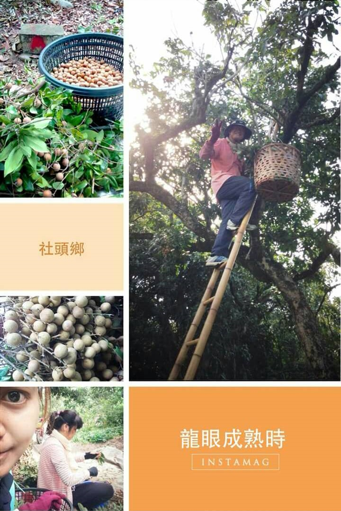
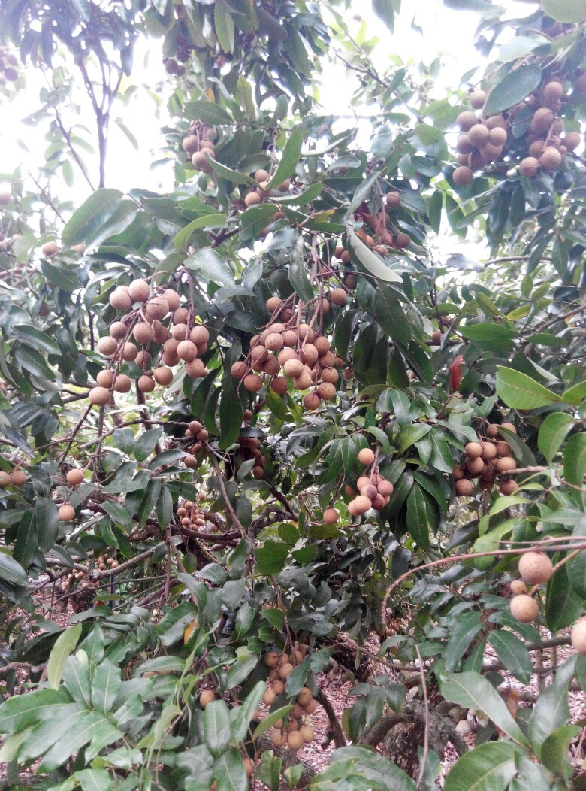
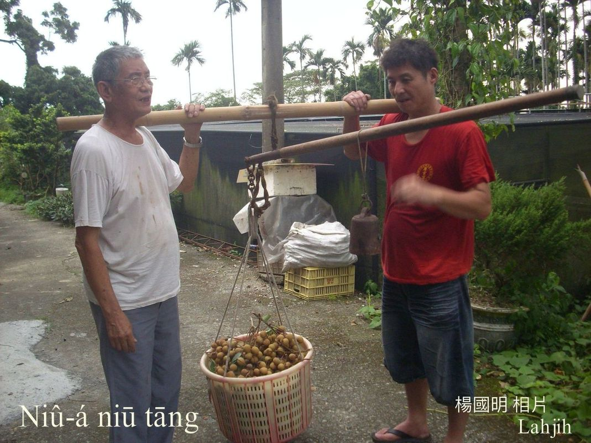

# 2. At龍眼
> **At Lêng-kéng**

At龍眼，tio̍h giâ梯提米籮，peh上龍眼欉，1-pha 1-pha at，khǹg-tiàm米籮內chiah koh用鉤á索lūi落去土腳。竹á梯搬徙khah輕séⁿ（省），米籮縛長索，ē-tàng掛tiàm樹椏，用lūi--ē，需要兩名人工。At龍眼腳手liú-lia̍h ê人，ē-tàng chit椏盤過hit椏，m̄-koh細支樹椏chhè-chhè tio̍h細膩，chiah-bē斷椏poa̍h落土腳tau。At龍眼，上驚蚊蟲，蜂siū，蛇，boeh去龍眼宅á at龍眼，lóng tio̍h chah草in tiàm樹腳點火hun。

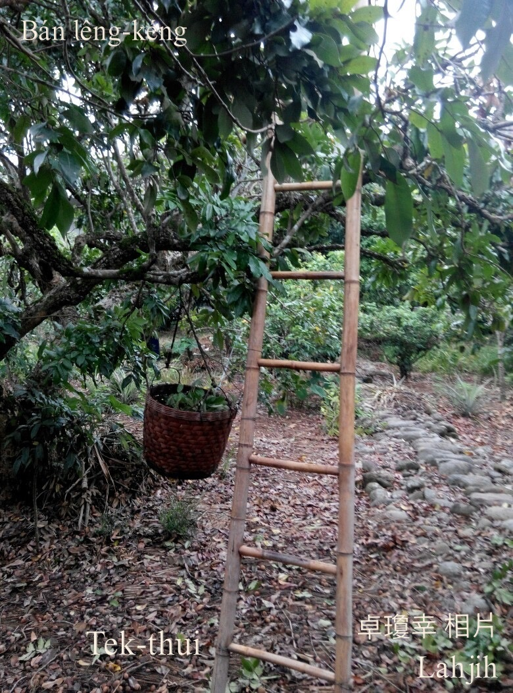

龍眼at--落來了後，kō͘鉸刀1粒1粒鉸，tio̍h-ài留蒂頭，tn̄g-tio̍h有破khang、pit-sûn揀起來khǹg tī龍眼籃á，留leh ka-tī食a̍h是分人食，好--ê鉸鉸kui米籮chiah準備倒落去龍眼焙á烘，烘ho͘蝕水pìⁿ龍眼乾。
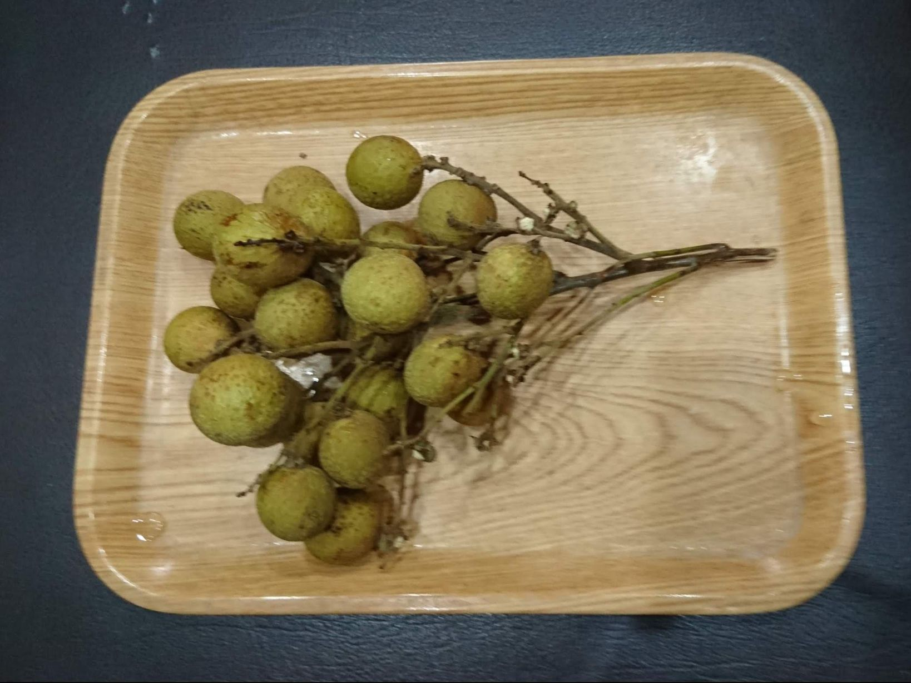

# 3. 龍眼焙á
> **Lêng-kéng-pōe-á**

用磚á gih一个大約7x5x2.5台尺四角形ê槽á，槽內ē-tàng khòe竹篾á pīⁿ ê底，叫做焙床，ka分做頂下兩个空間，竹篾á焙床khǹg龍眼á，真通風，下面ē-tàng suh入『吸入』ùi外口hiâⁿ火ê燒氣。Chit種龍眼焙á是農糧署補助ê規格形體。

雖然m̄是灶，m̄-koh龍眼焙á下底有ná灶khang ê溝槽tī外口，柴火to̍h tī外口hiâⁿ（燃），燒氣kap煙ē主動nǹg入去內面。

龍眼焙á ê灶khang正pêng留一个khang-khiah（空隙），開嘴所在，有1-kâi柴枋槽á kap閘枋，焙龍眼時用枋閘--起來，焙好時chiah kā閘枋提掉，póe龍眼乾落米籮。

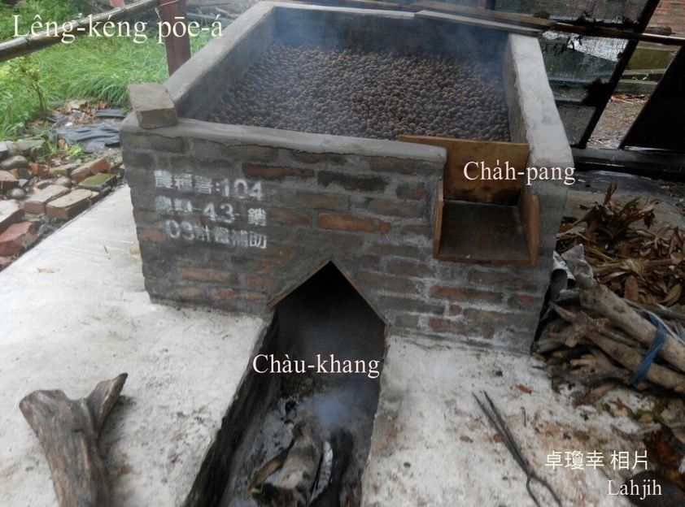
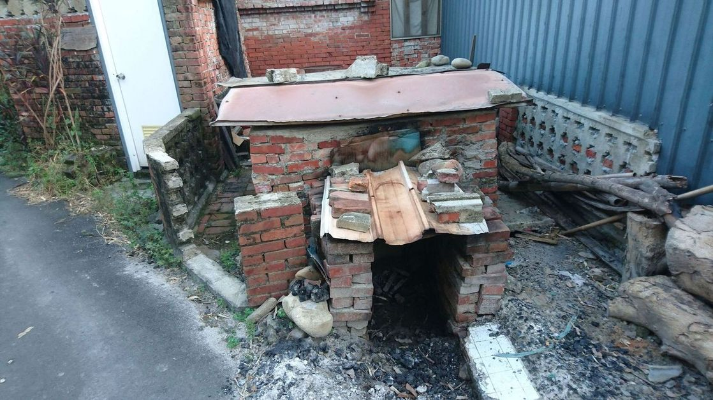
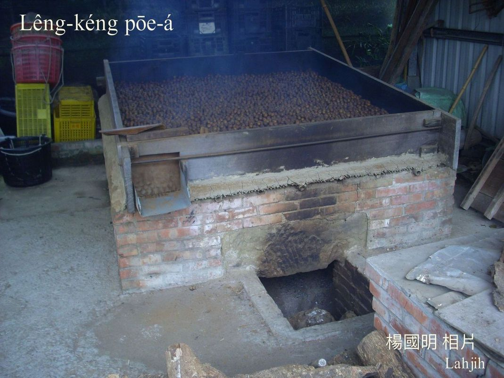
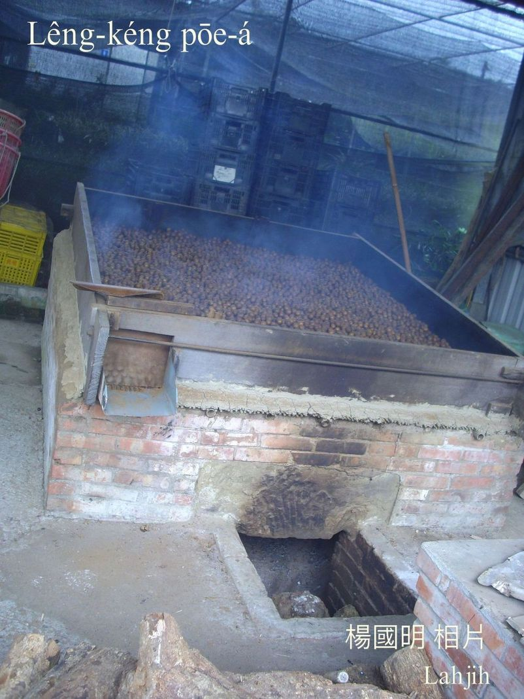

# 4. 焙龍眼
> **Pōe Lêng-kéng**

Hiâⁿ火是大學問，ûn-ûn-á火ê燒度維持tī猛日ê溫度，焙--起來ê龍眼chiah ē軟khiū bē siuⁿ kian，秘訣tī hiâⁿ火kap隨時檢驗龍眼殼ê變化，溫度siuⁿ jia̍t（熱），龍眼殼á pìⁿ烏ta，koh ē傷tio̍h竹篾á，溫度無夠，m̄知boeh烘到siáⁿ-mih時陣？

為tio̍h控制溫度，火bē-sái-tit siuⁿ猛，當然mā bē-sái-tit失火，hiâⁿ火ê龍眼柴tio̍h ài有ta有tâm kah-leh hiâⁿ，hō͘伊boeh to̍h m̄-chiâⁿ to̍h，he燒氣ē hun對內面去，koh chhèng對面頂ê龍眼來，人工ná chhiau ná péng，chiah ē chiâu-ûn haⁿh-sio（熁燒），án-ne焙--出來ê龍眼殼á to̍h有龍眼火炭味，是it-tó͘-chán ê真正古早味。

辛苦有所補，加減趁chē工錢，作穡人to̍h感覺滿意。焙好--à，柴火暫時khàm--leh，1-láng貯tīⁿ換1-láng，thèng-hāu後一焙chiah koh開火。

焙á leh chhèng煙，溫度無kài koân。Hiâⁿ火是hiâⁿ龍眼柴，烘--出來ê氣味it-tó͘-chán，有古早味。

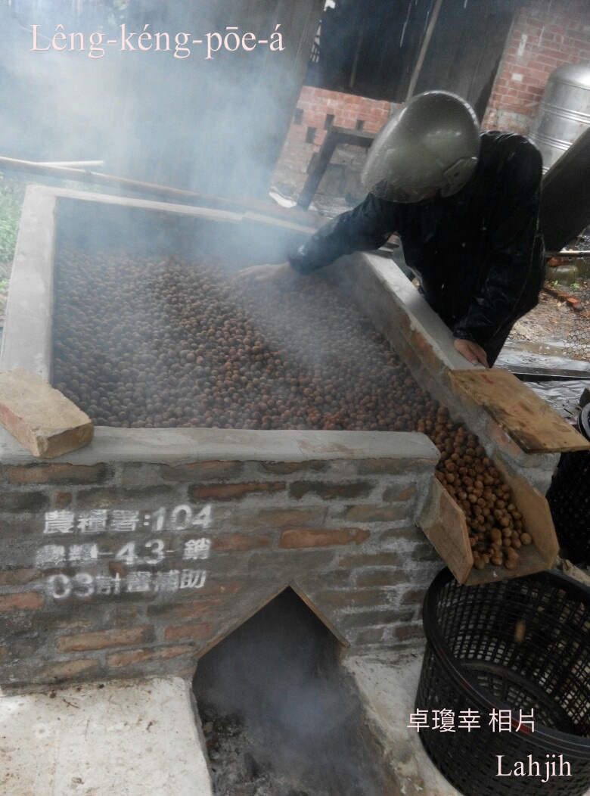

Ná灶khang ê溝槽，ùi焙á外口hiâⁿ火，火hun ē suh入焙á內面。
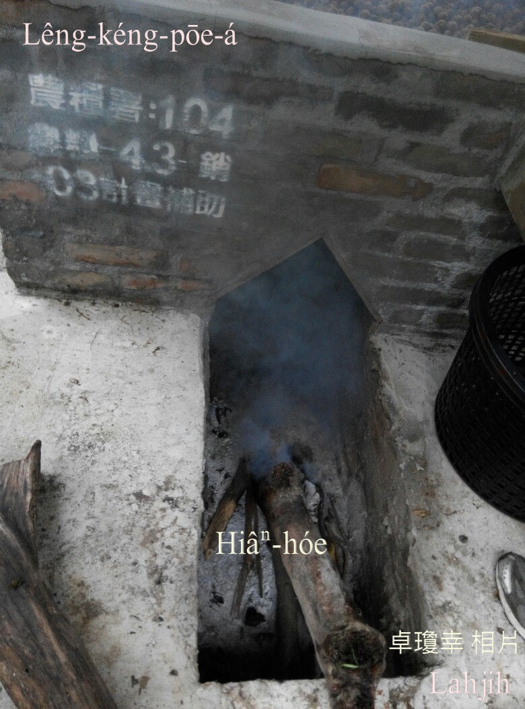

龍眼焙á內面竹篾á pīⁿ--ē ê底，號做焙床。
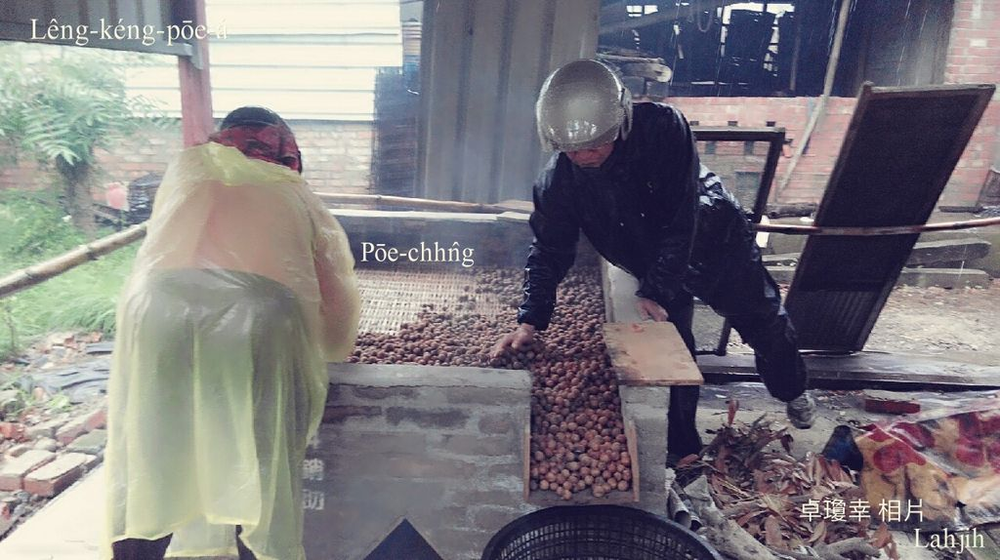

龍眼焙á開嘴所在，有槽á kap閘枋。焙好ê龍眼殼á，用雙手póe落米籮。
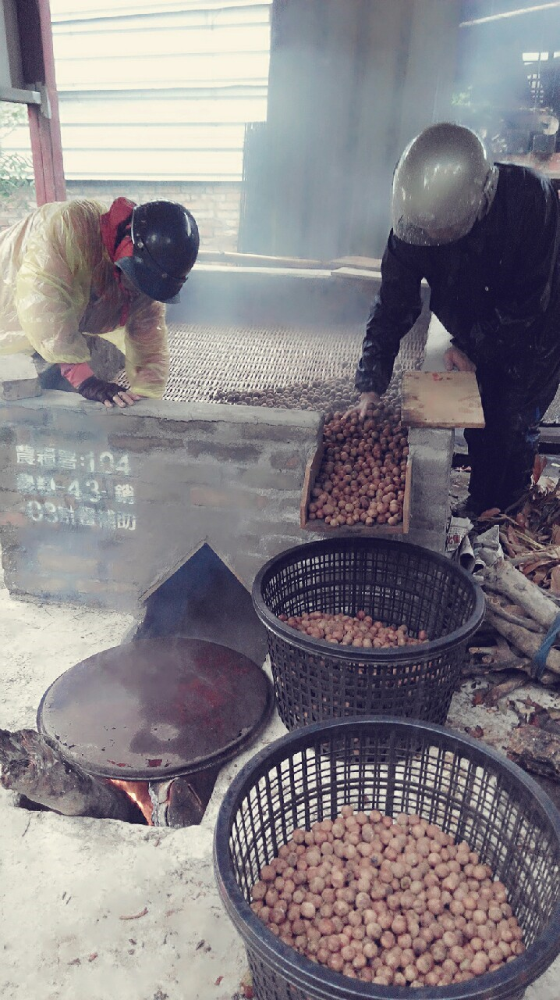

> **感謝：感謝社頭石頭公湳á蕭--家新婦卓小姐提供相片kap焙龍眼撇步。**

# 5. 龍眼柴Kho͘
> **Lêng-kéng Chhâ-kho͘**

龍眼收成了後，需要落椏cháⁿ枝thang-hō͘後冬 thó͘-hông puh新íⁿ發新枝，chhò--落來ê柴kho͘ tú好做焙龍眼ê火柴。
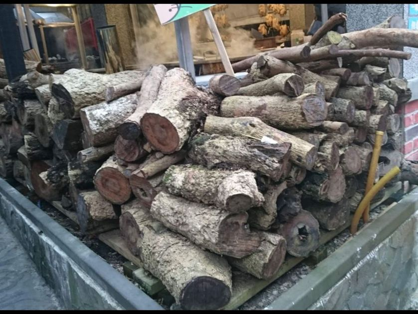

# 6. 曝龍眼殼á
> **Pha̍k Lêng-kéng Khak-á**

龍眼焙好需要koh-chài tī日頭腳nà，nà了chiah koh peh殼chiâⁿ-chò龍眼肉，若是無boeh peh殼，需要nà ho͘ khah ta，保存khah bē生菇。
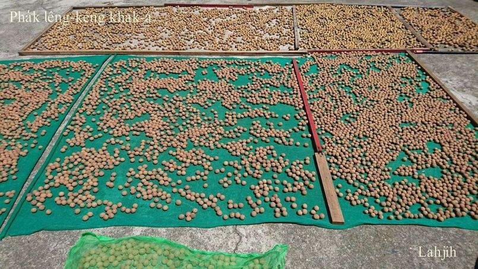

龍眼殼á
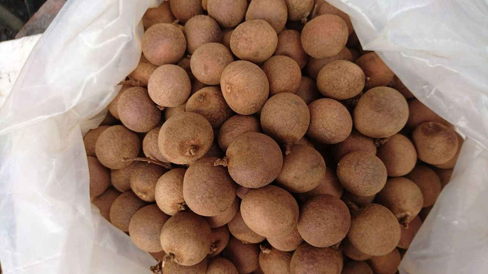
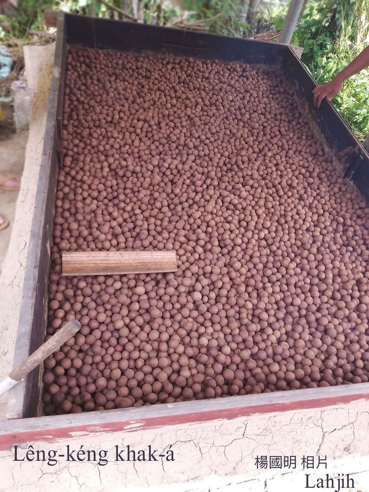

# 7. 貯龍眼ê器具
> **Té Lêng-kéng ê Khì-kū**

## 7-1. Ka-ló-á

Ka-ló-á是一種古老ê農具，用竹篾á辮，路用無kāng，形體to̍h無kāng，che是焙龍眼用ê大kha ka-ló-á，有ka-ló-á手ē-tàng縛索á吊tiàm樹椏a̍h是厝內楹á，兩人hōaⁿ leh chhe̍k。

焙龍眼ê產量有夠chē ê時，為tio̍h龍眼殼khah薄、khah金頭好看，鉸好ê龍眼to̍h khǹg-tiàm ka-ló-á內面，摻一寡粗砂kap噴水lām leh chhe̍k，chhe̍k ho͘外皮khah薄khah金頭，chiah hē落去龍眼焙á焙。

Ka-ló-á貯龍眼1-ló『筐』大約100斤重，重khoâiⁿ-khoâiⁿ，需要兩ê粗工sái-la̍t（使力）chhe̍k振動，正chhe̍k倒chhe̍k，前chhe̍k後chhe̍k，利用粗砂粒kap ka-ló篾á ê粗粗篾á邊，kā龍眼外皮chhè-chhè（摖摖）ho͘變薄，án-ne烘ta焙好ê龍眼殼á to̍h有龍眼柴芳味。

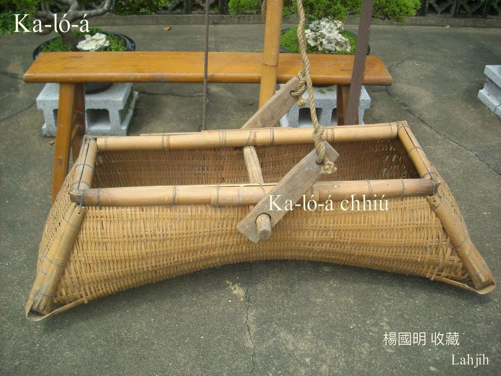
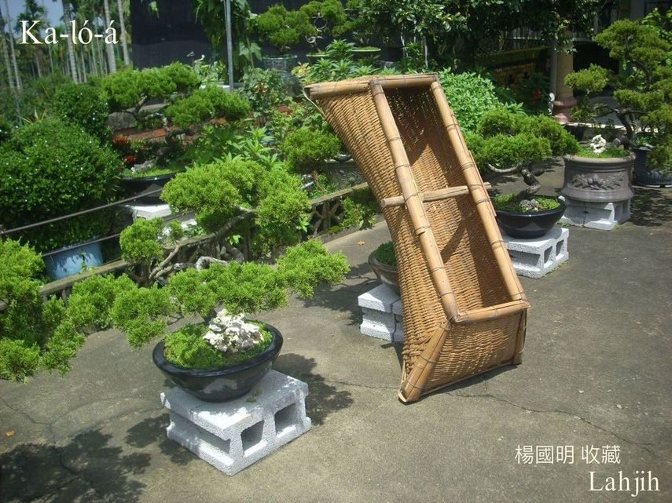
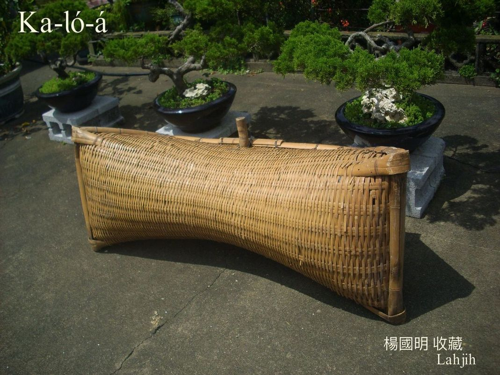
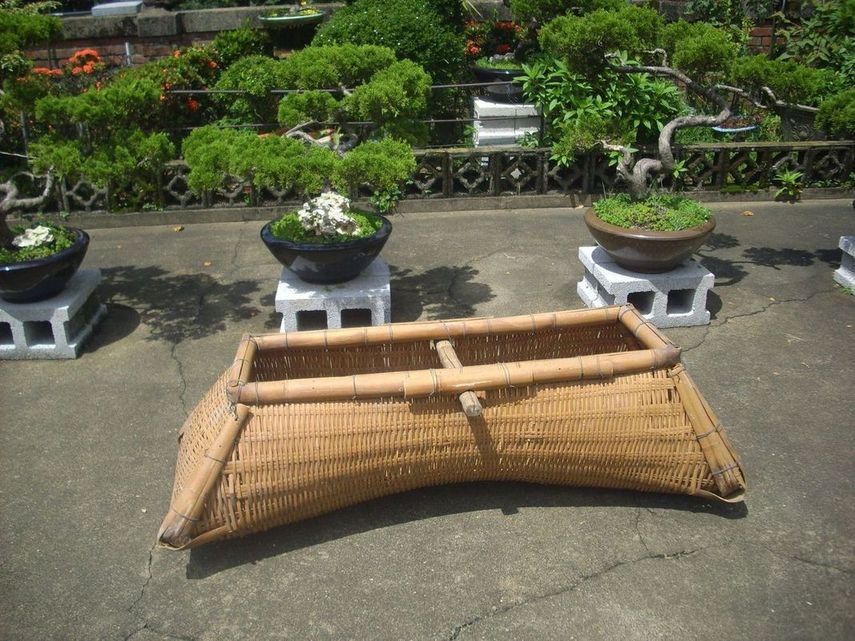

## 7-2. 龍眼籃á
> **Lêng-kéng Nâ-á**

Che是特別為貯龍眼落米á辮ê龍眼籃á。
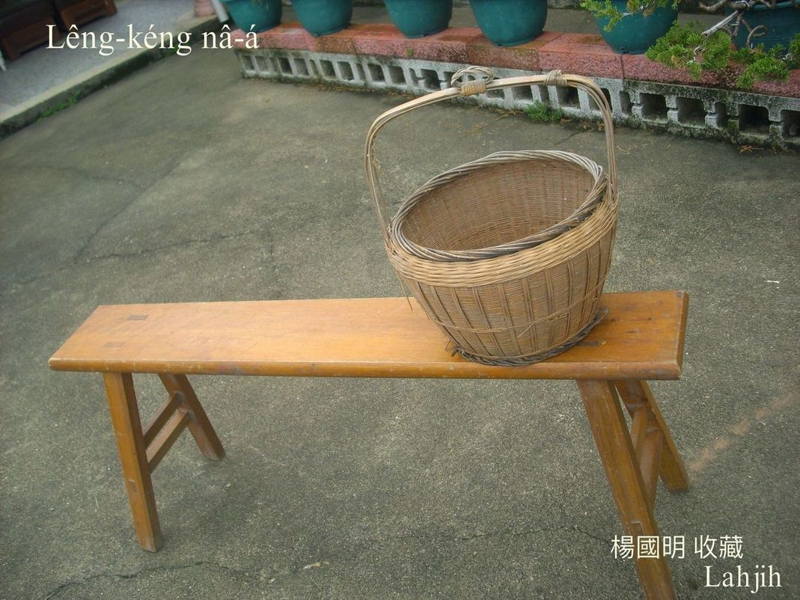

> **感謝：感謝楊國明老師提供ka-ló-á、籃á相片，kap紹介ka-ló-á ê用法。**

# 8. 註解
> **Chù-kái**

|**詞**|**解說**|

|Chit-khùi|『這一季，這一陣子』。|
|At龍眼|『摘龍眼』。|
|用lūi--ē|『用繩子縛物，慢慢墮落』。|
|樹椏chhè-chhè|『樹枝脆』。|
|點火hun|Tiám hóe-hun，『點火使冒煙』。|
|Si̍h-chúi（蝕水）|『水份慢慢消失』。|
|Gih磚á|『砌磚頭』。|
|Hiâⁿ火|『燃柴火』。|
|軟khiū bē siuⁿ kian|『柔軟有彈性，不會太乾。』|
|Siuⁿ熱（jia̍t）|Siuⁿ熱（jia̍t）是 『溫度過高』； siuⁿ熱（joa̍h）是 『氣溫過熱』。|
|Sit-hóe（失火）|『熄火。』 火燒厝是 『失火』。|
|有ta有tâm kah-leh hiâⁿ|『乾溼木材混雜燃火』。|
|Hō͘伊boeh to̍h m̄-chiâⁿ to̍h|『讓它好似著火又好似快要熄火』。|
|Ná chhiau ná péng|『邊攪邊翻』。|
|Haⁿh-sio（熁燒）|『利用陽光或熱氣增加溫度』。|
|Cha̍h-pang（閘枋）|『隔開用的木板』。|
|Iú-só͘-pó͘（有所補）|『有所補償』。|
|落椏cháⁿ枝|『斬掉樹木的枝椏』。|
|日頭腳nà|Nà-ji̍t（爁日），『太陽下稍微晒一點兒』。|
|Chhe̍k（摵）|『上下用力搖晃』。|
|重khoâiⁿ-khoâiⁿ|『好重好重』。|
|粗工|『笨重的工作/做笨重工作的工人』。|
|Sái-la̍t（使力）|『用力』。|
|落米á|Lak/làu-bí-á，『龍眼荔枝掉落蒂頭的果粒』。|
