# 崁頂庄黃麻布
> **Khàm-téng-chng N̂g-môa-pò͘**

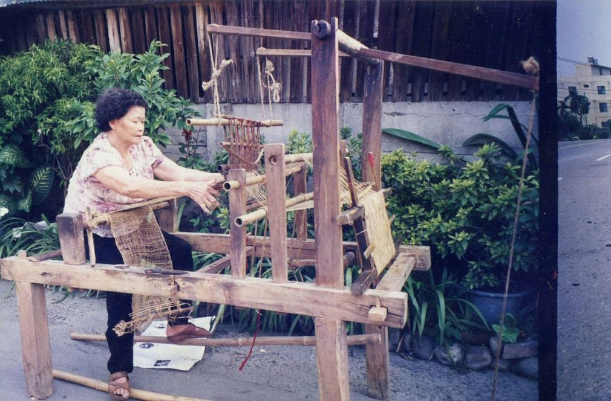

【感謝陳萬來先生提供田中鎮復興里錄影DVD hō͘我copy相片】
[彰化縣田中鎮復興社區經黃麻布(六)：DVD 陳萬來先生提供](https://www.youtube.com/watch?v=m4c1iow9kSA)

# 1. 崁頂庄經黃麻布ê歷史
> **Khàm-téng-chng Kiⁿ N̂g-môa-pò͘ ê Le̍k-sú**

記智tī 1970年代進前，阮崁頂庄大約90%姓蕭，m̄是姓蕭mā kap姓蕭--e有親chiâⁿ關係，m̄-chiah kui庄lóng是兄弟叔孫，互相公、婆、伯、叔、姆、嬸、姑、嫂、兄、弟、舅、姨稱呼，蕭--姓奮公祖廟to̍h tī庄內，土地公廟、將爺廟是信仰中心。庄民大部份是作田人，水田to̍h tī庄外hit kho͘圍á，駛田、掖秧、放田水，so草、割稻、曝粟，大部份是放伴做，互相幫忙tàu腳手，嫁娶、陪tòe、hēng餅、請人客，為tio̍h節約，mài siuⁿ過負擔，傳統有sió-khóa分角頭，nā是庄內拜神、祭祖、做平安戲，to̍h kui庄做夥同齊來，崁頂人ê團結，到今iáu是真好名聲。阮chia水田土肉肥、鬆，koh im he濁水溪水，1冬ē-tàng 3收成，2冬粟á，1冬雜錯種，番薯、豆類、番麥、油芥菜，青皮á（豆）siāng捷種，siāng特別to̍h是差不多每口灶lóng ē種1-khu黃麻。

黃麻阮講做iûⁿ-môa，1欉長長lò-lò 大pû-ong大，好種好收成，種來peh iûⁿ-môa絲，keⁿ黃麻布，賣錢趁所費，栽培gín-á讀冊，是每口灶重要ê副業。Hit tong時崁頂庄ê門口埕kap厝內房間to̍h是工場，cha-bó͘人lóng是工人兼師傅，keⁿ布師傅，cha-po͘人、讀冊gín-á mā ē tàu腳手tàu-saⁿ-kāng。外位人lóng知影，崁頂庄是黃麻布專門，keⁿ黃麻布是崁頂cha-bó͘人ê專業。

1955前後gín-á時，除了讀冊、寫宿題以外to̍h是thit-thô、sǹg，因為是屘á-kiáⁿ，罕得做粗重khang-khòe，有時hō͘阿爸kin去田--裡khau草、趕雞á鳥á，其他siāng捷ê穡頭to̍h是幫忙大嫂、二嫂chhōa gín-á，撚黃麻，纏黃麻絲。

相片是二嫂、Chhau--e leh keⁿ黃麻布，「iⁿ-oaiⁿ iⁿ-oaiⁿ」正腳踏落tò腳起，正手cho̍k梭tò手梳，日也keⁿ暝也keⁿ，有時三更kāng半暝猶原「iⁿ-oaiⁿ iⁿ-oaiⁿ」無停睏，一聲iⁿ-oaiⁿ 1-ê向望，1-pha番á油燈微微光影伴一二更，有時伴到三更kāng半暝。
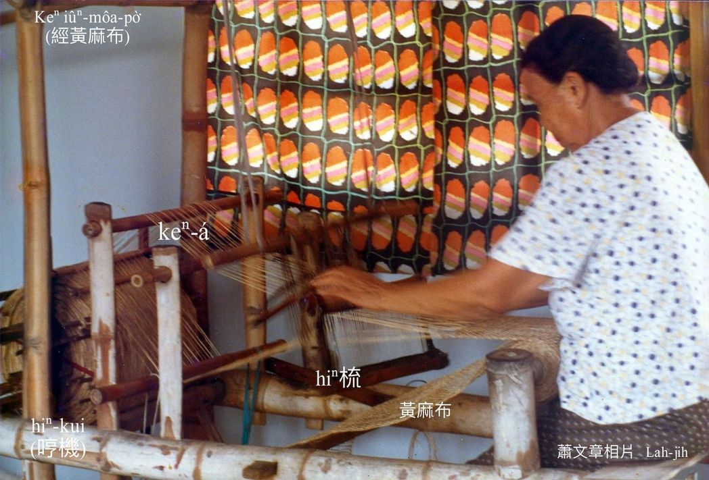

# 2. 種黃麻
> **Chèng N̂g-môa**
黃麻，阮講iûⁿ-môa（楊麻），黃麻園好閃涼，黃麻園內是望冬tiuh-á做siū好所在，幼chíⁿ黃麻íⁿ ē-sái-tit kûn番薯kho͘湯，苦甘苦甘真退火，黃麻皮曝ta ē-sái-tit keⁿ黃麻布，phah黃麻索，黃麻骨á ē-sái-tit hiâⁿ火，ē-sái-tit做屎pe。
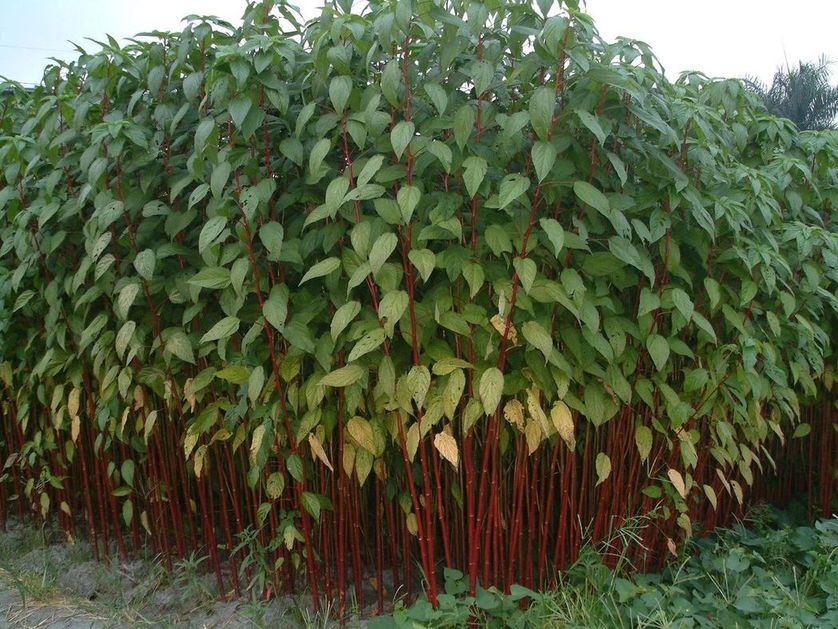
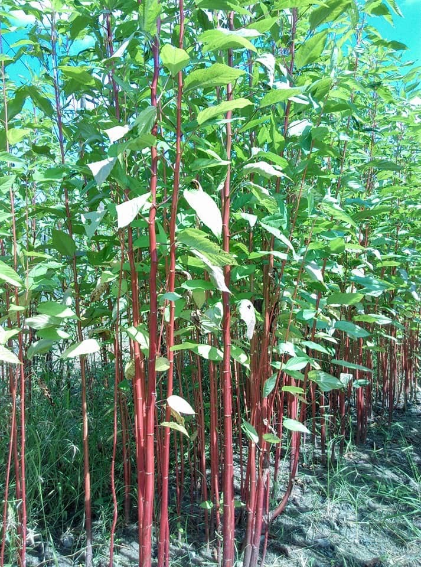

## 2-1. 麻íⁿ
> **Môa-íⁿ**

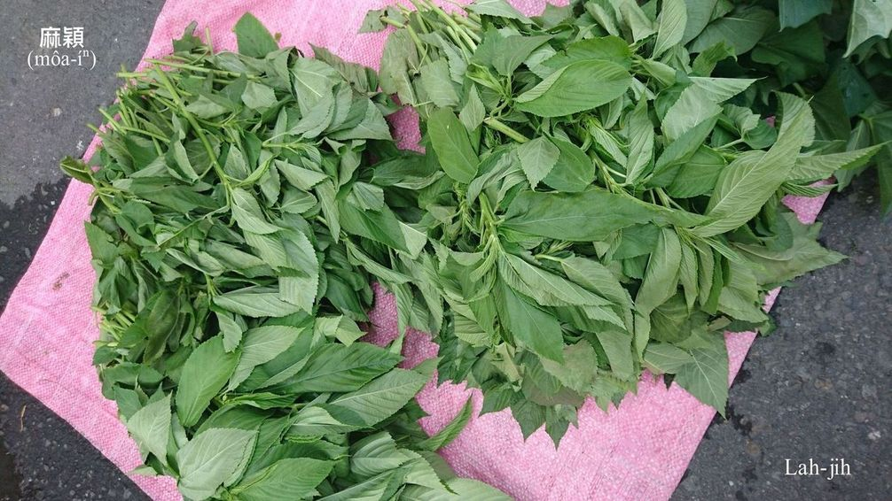

# 【Lah-jih寓言】黃麻園ê鳥á岫   
> **【Lah-jih Gū-giân】N̂g-môa-hn̂g ê Chiáu-á Siū**

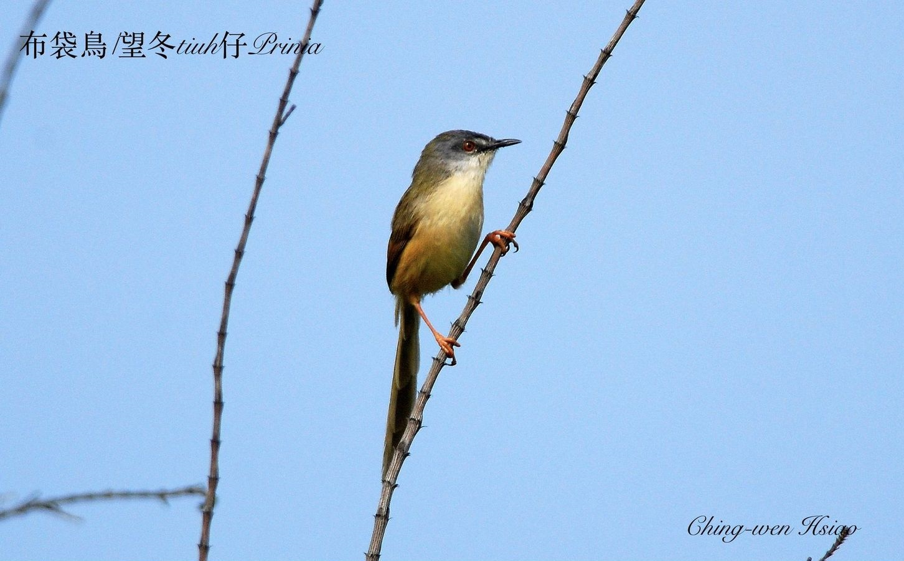

黃麻園ê黃麻已經人外koân，bāng-tang-tiuh-á ang-bó͘趕緊咬草做岫，生卵育kiáⁿ。日子1工1工過，黃麻1日1日大欉，鳥á-kiáⁿ已經開始boeh學飛。

黃麻園主人來巡：這khu黃麻ē-sái-tit khau，tio̍h chhiàⁿ幾ê人工來khau黃麻。

鳥á-kiáⁿ聽了，驚kah boeh死：「阿爸阿母咱趕緊搬厝。」

鳥á母講：「M̄免驚，恁趕緊學飛khah要緊。」

幾工後，黃麻園主人koh來巡：「已經有夠koân有夠長，kui khu黃麻lóng chiâⁿ súi。」

鳥á-kiáⁿ聽了，chiok緊張：「阿爸阿母咱趕緊搬厝。」

鳥公講：「下昏暗安心睏，睏ho͘飽眠，明á透早ē記得khah早精神。」

天未光，鳥公鳥母chhōa kiáⁿ起飛，離開鳥á岫。

㊣愚意：Siáⁿ-mih是智慧，經驗to̍h是智慧。

> **註：Bāng-tang-tiuh-á（望冬tiuh-á），mā叫做布袋鳥。**

# 3. Khau黃麻
> **Khau N̂g-môa**

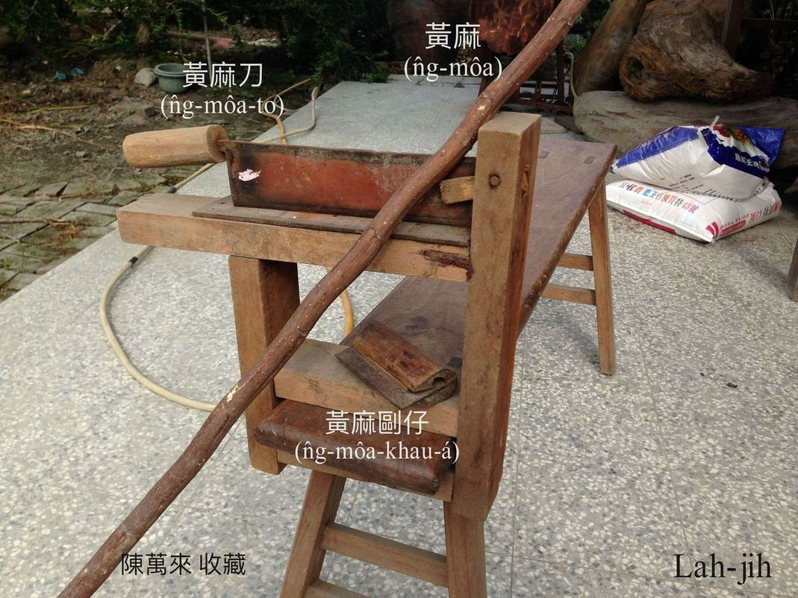

黃麻大到人外koân to̍h ē-sái-chit khau，需要連根khau，khau--起-來ê黃麻hâ做1-khún 1-khún giâ轉去門口埕、巷á路，趁chhiⁿ peh黃麻皮，kā黃麻骨khǹg一邊，peh好ê黃麻皮需要kā外皮khau掉chhun內皮。下面ē紹介khau黃麻ê家私。

## 3-1. 黃麻刀
> **N̂g-môa-to**

黃麻刀需要kah tiàm椅條頂，1人hōaⁿ刀，1人giú黃麻皮，速度khah緊khah省力，不過黃麻頭tio̍h用黃麻khau-á khau ho͘薄，khau好ê黃麻皮隨時phi tiàm土腳a̍h是nê tiàm竹篙曝ta，chiah收起來khǹg。

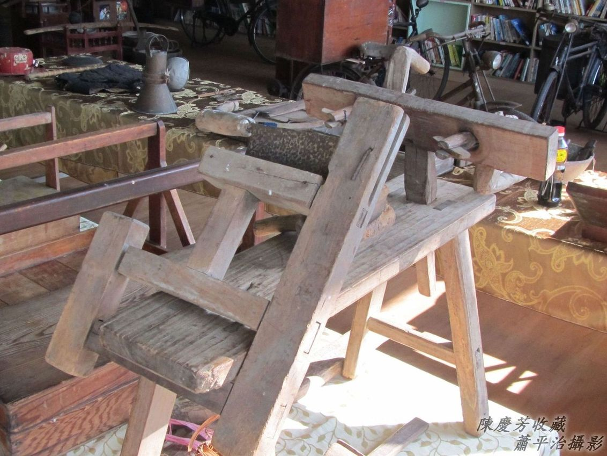
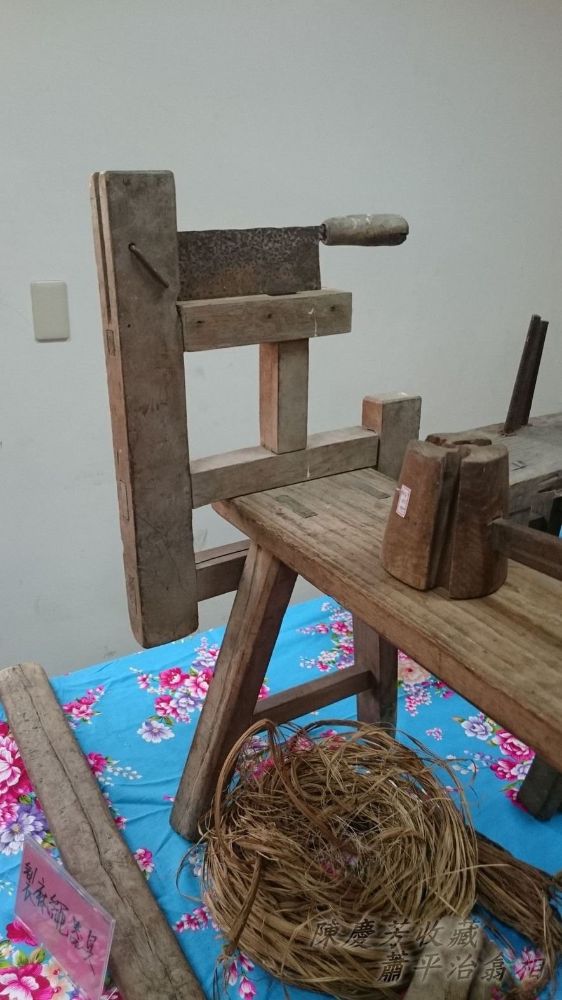
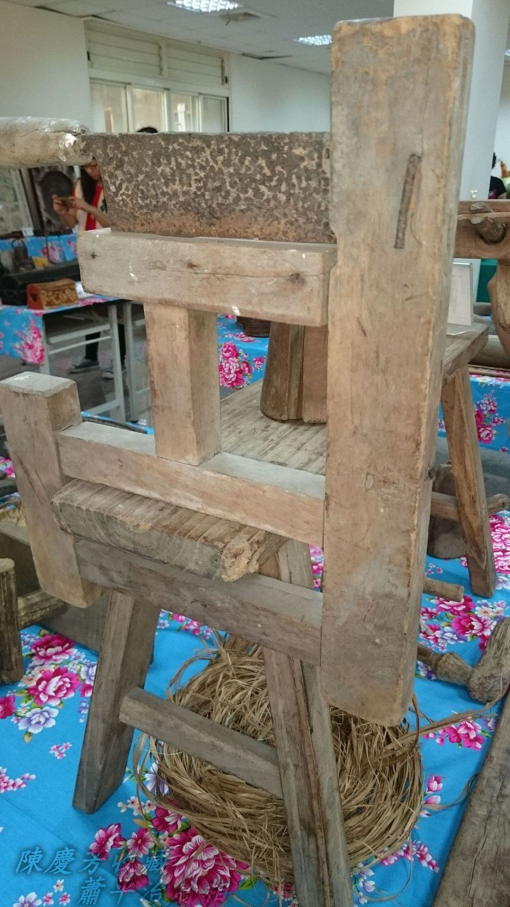

## 3-2. 黃麻khau-á
> **N̂g-môa-khau-á**

黃麻khau-á像長liau形菜刀肉掛柴kheng，khǹg tiàm椅條頂ê柴枋khau。
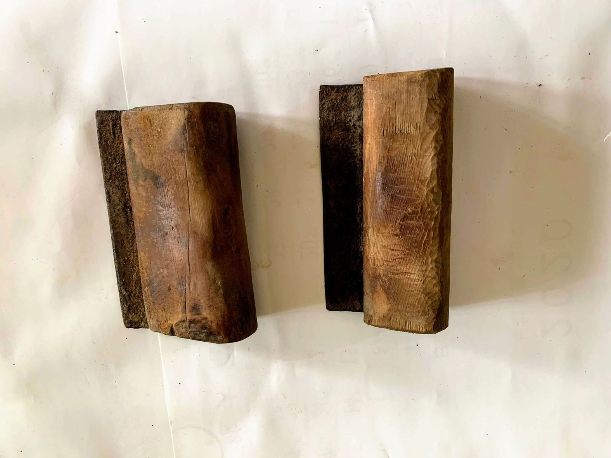

## 3-3. 黃麻骨
> **N̂g-môa-kut**

黃麻骨á ē-sái-tit hiâⁿ火做火種，mā ē-sái-tit phòa-pêng做屎pe koeh尻川。

黃麻骨á頭節部份khah tēng腹，ē-sái-tit做chhôe-á phah gín-á尻川，安全bē tio̍h傷。

黃麻骨有khang，siàⁿ-khiat gín-á kā黃麻骨一頭點火當做hun來pok，hiam-hiam pháiⁿ氣味。

謎猜：「1支柴á lia̍h-gōa長，ioh ē-tio̍h giâ去chn̄g。」To̍h是屎pe ê謎猜。

# 4. 曝ta黃麻、撚黃麻
> **Pha̍k ta N̂g-môa, lián N̂g-môa**

曝ta黃麻需要絲做1絲1絲，講做phòa黃麻，揀軟絲--ê做keⁿ-á（經線），ngē-chiāⁿ--ê做húi-á（緯線），phòa好ê黃麻絲需要1絲1絲頭尾撚接，chiâⁿ做1條長長ê黃麻紗，kap棉花撚紗無kāng。
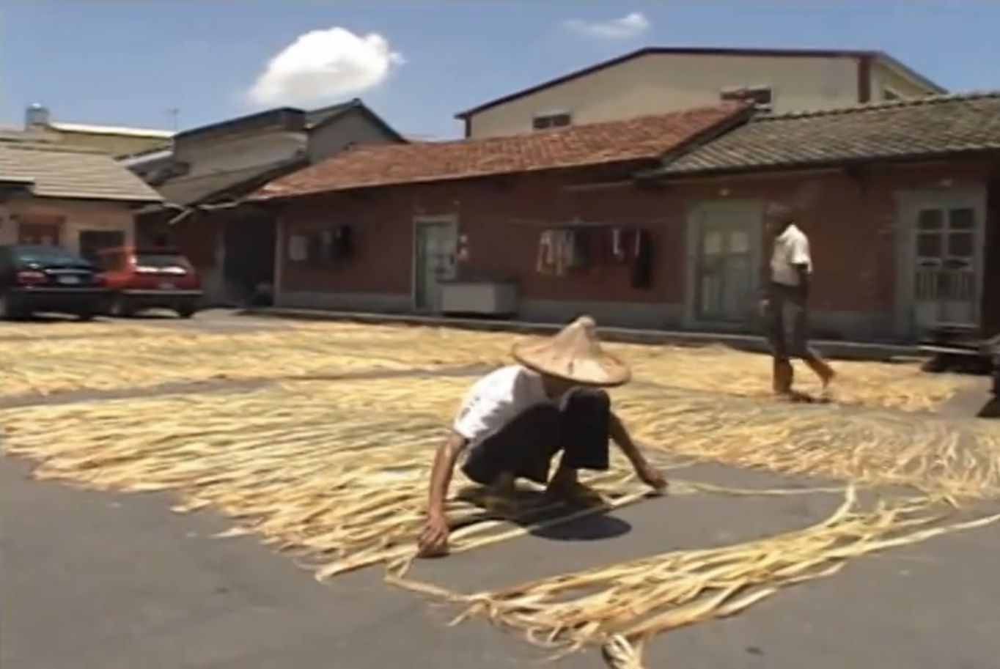

## 4-1. 撚黃麻ài先chhoân ê物á——黃麻籠、竹椅、火Hu
> **Lián N̂g-môa Ài Seng Chhoân ê Mi̍h-á——N̂g-môa-láng, Tek-í, Hóe-hu**

撚黃麻需要1隻低椅、1-khok ē澀ê火hu，人坐椅，褲腳le̍k到大腿頭，大腿肉so一寡火hu，黃麻絲頭kah尾áu 1小節用手蹄so大腿ka lián做夥，所以撚黃麻mā講做so黃麻。Keⁿ-á是布ê直紗，tio̍h phah-kat khah勇，húi-á是橫紗，khah免hiah頂真。因為húi-á nā斷紗，隨接隨ē-sái-tit keⁿ，ah nā keⁿ-á斷紗，to̍h chiâⁿ費氣chiâⁿ oh接紗。

撚黃麻，1人1-kha黃麻籠á，大人撚keⁿ-á，gín-á人lián húi-á，撚nā有夠額，to̍h ē-sái-tit纏黃麻紗。

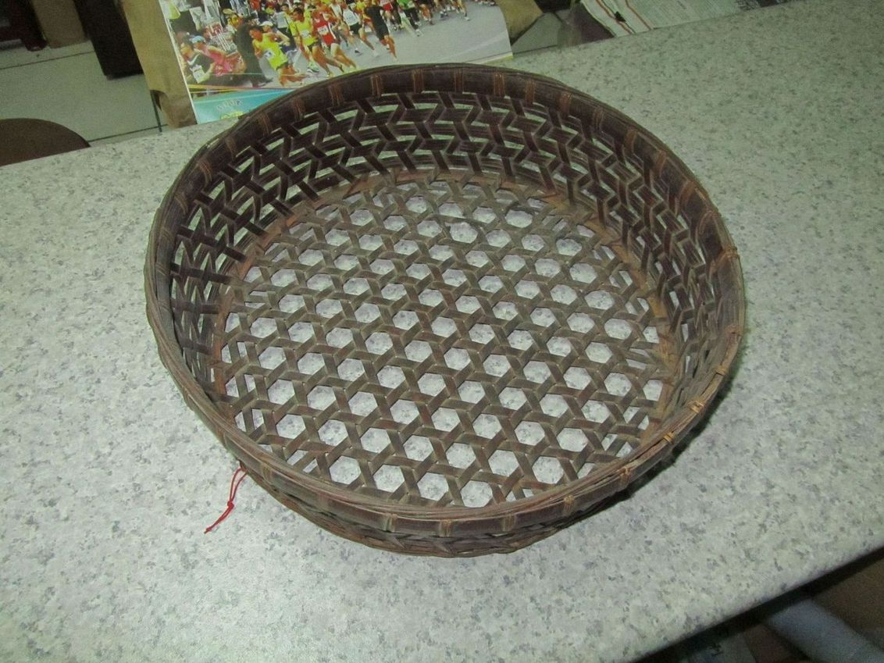
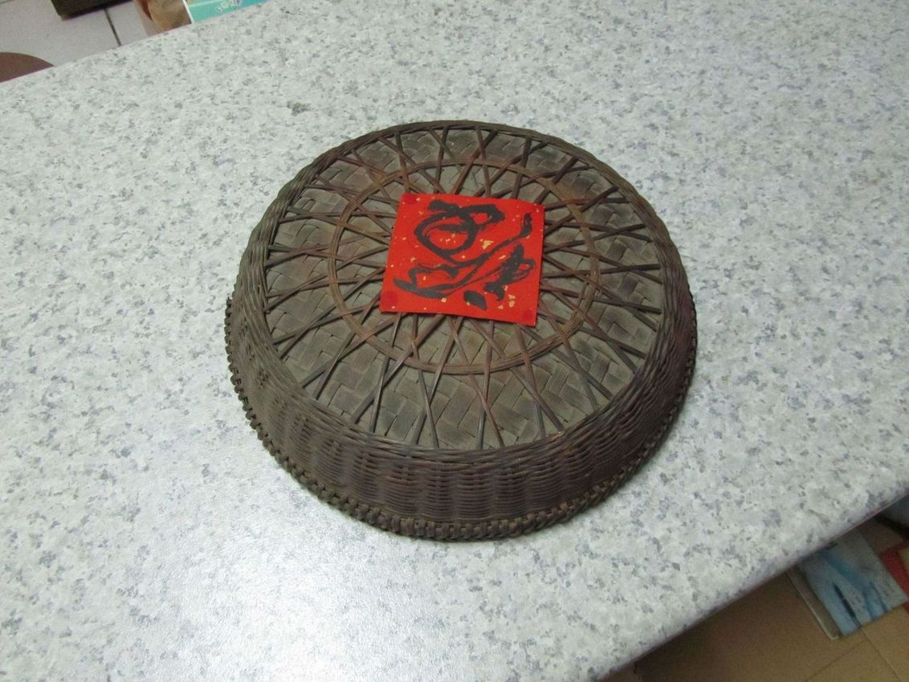
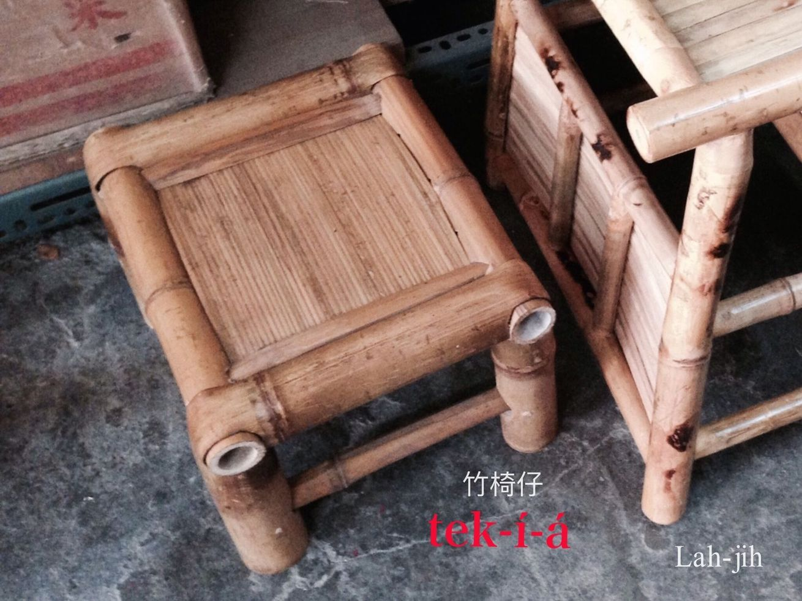
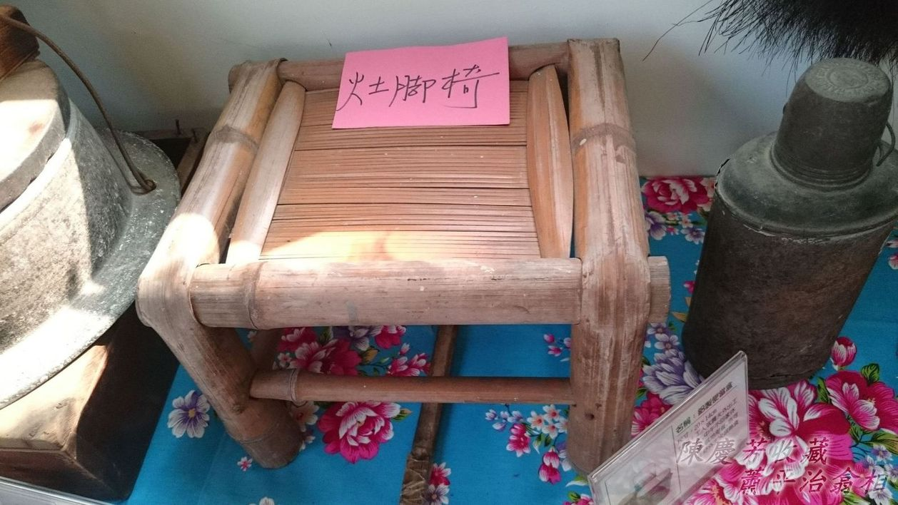
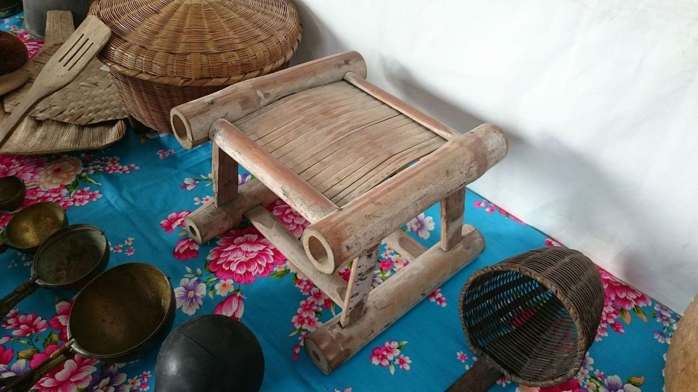

# 5. 纏黃麻紗
> **Tîⁿ N̂g-môa-se**

復興里普興庄3位cha-bó͘人，Chhai--e、Chit--è、Jî-á姊lóng是崁頂庄cha-bó͘ kiáⁿ，keⁿ黃麻布專門，纏keⁿ-á（經線）用來牽黃麻布，mā號做牽á，用1支竹管á做sim，纏做1粒1粒像細粒西瓜hiah大ê球形備用，纏húi-á（緯線）是boeh入tī梭á內，用箸做芯，纏做1粒1粒像煙腸ê形體備用，纏keⁿ-á、纏húi-á有撇步，tio̍h用「8」字形去纏，chiah bē làu紗。
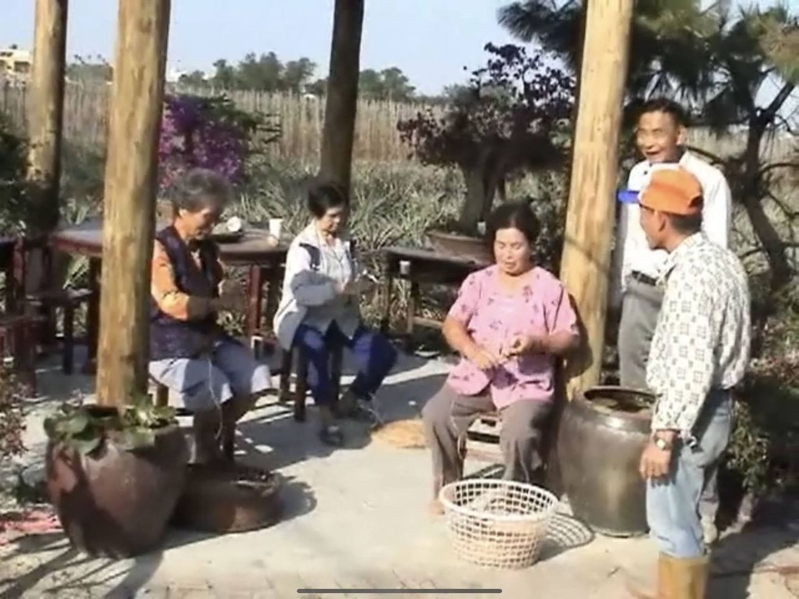
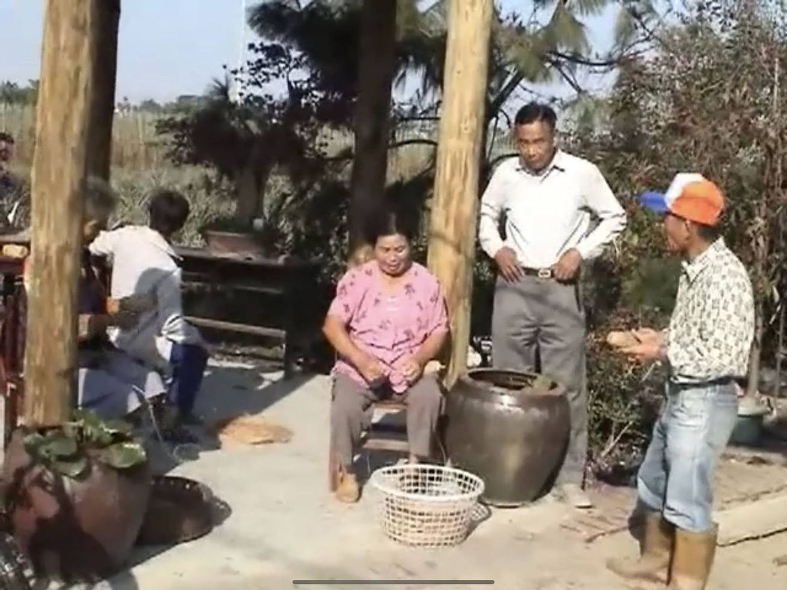
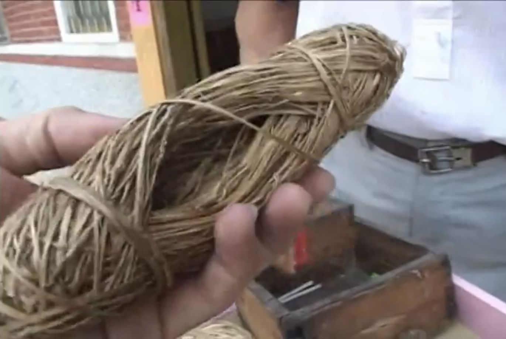

# 6. 牽黃麻布
> **Khan N̂g-môa-pò͘**

先tī門口埕土腳量3、5丈長，tī二頭尾á釘8支竹khi̍t-á，tī坦邊所在用椅á khòe 1張梯a̍h是竹管pêng鑿khang，khǹg 10幾粒keⁿ-á紗tī下腳，giú出紗á芯內ê紗á頭結做夥，10幾粒keⁿ-á紗線，chhiû紗牽去khi̍t-á se̍h來se̍h去，然後chiah捲紗、收紗，準備keⁿ黃麻布。

牽黃麻布siāng少tio̍h 3-ê人saⁿ-kap做，1人顧紗，1人牽紗、捲紗，1人梳紗。顧紗是看紗á是m̄是ē phah結，是m̄是斷--去，隨時khioh好勢接線，m̄-thang têng-tâⁿ；牽紗tio̍h ná牽ná看，nā有phah結斷線，隨時暫停。

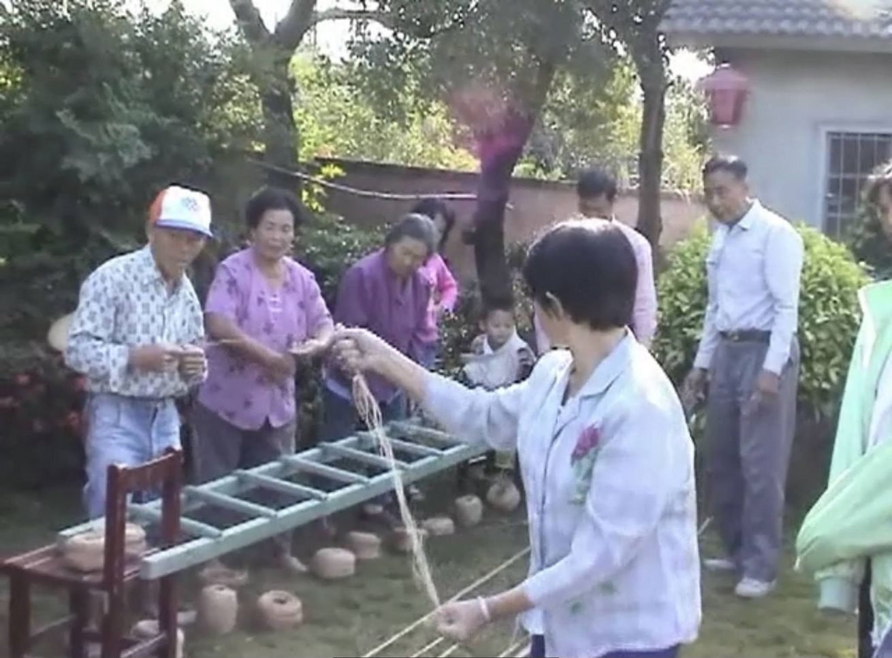
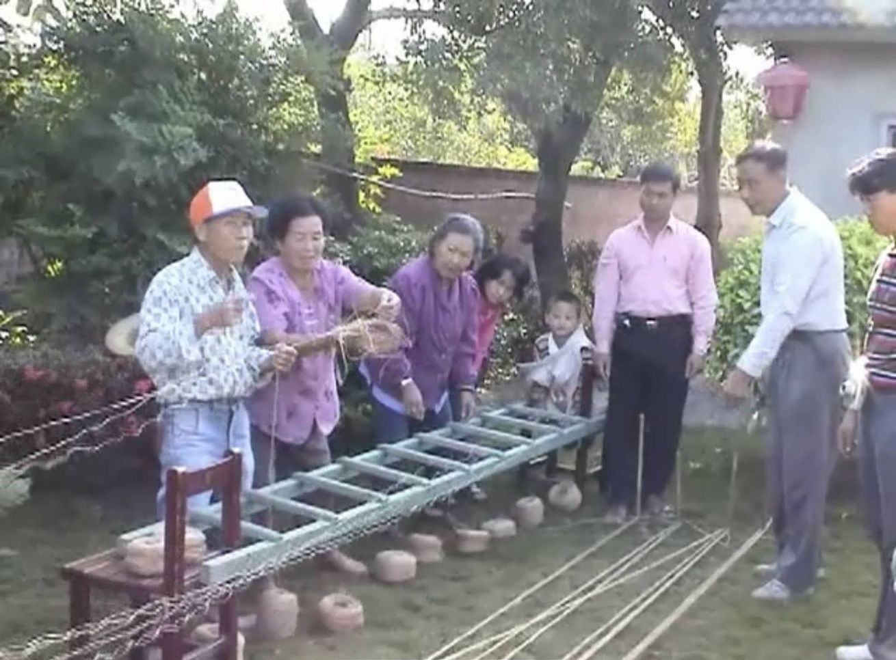

## 6-1. Hiⁿ梳
> **Hiⁿ-se**

Keⁿ-á（牽á）1條紗1條紗chhng過hiⁿ梳縫，準備收紗，chiâⁿ費氣，bē-sái-tit chhng m̄-tio̍h縫。

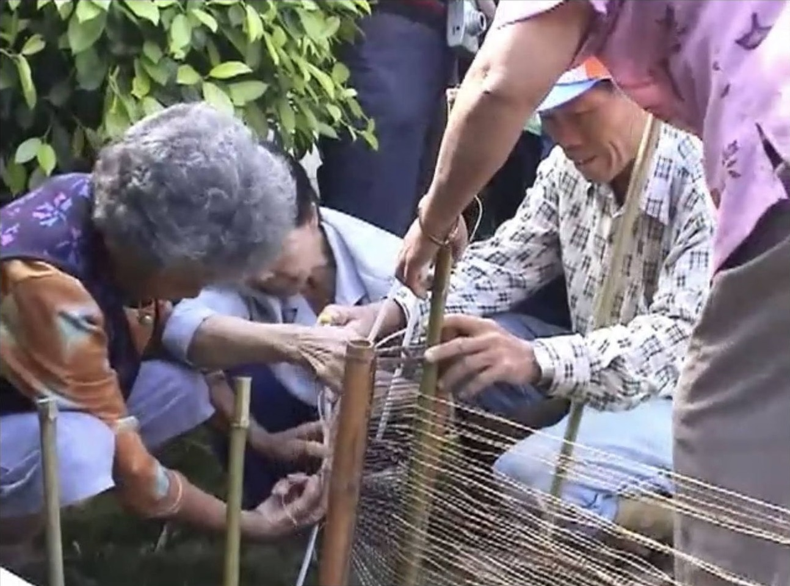
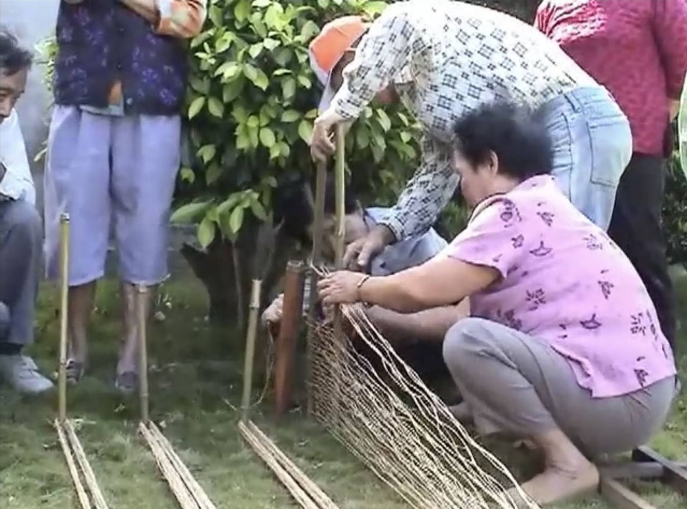

21-5-2. Moâi-lâng Chhâ-á（媒人柴á）
17 bô tô͘
 
17a ok

17b ok

17c ok

18 bô tô͘
 
18a ok

19 bô tô͘

19a ok

19b ok

19c ok

19d ok

捲紗是用1-kâi「#」字型ê架á kā紗á平順捲收好勢，tio̍h ná行ná捲；捲紗進前需要kā紗á 1條1條chhng過hiⁿ梳，hiⁿ梳後壁有2支媒人柴á，chit 2支媒人柴á是chhiû紗á ho͘順ê媒介，án-ne經過hiⁿ梳to̍h ē平順好捲紗、好keⁿ布，梳紗ê人一手提hiⁿ梳，一手giâ 1支篾pêng-á，ná梳ná phah ná行，顧紗ê人mā tio̍h斟酌紗á是m̄是phah結，是m̄是斷線，最後chiah ē kā紗á捲好勢。

21-5-3. 牽黃麻布ê Khiat-chiat
牽布需要3-ê人工合作配合，厚工費氣，需要專注細jī，一下無張持，斷紗phah結，隨時ē-sái-tit補救，nā是chhng m̄-tio̍h紗to̍h真食力，所以現場看人牽布ê厝邊隔壁，to̍h m̄-thang「十嘴九尻川」chho̍p-chho̍p唸，講he「有khang無榫」ê閒á話，chiah bē chhut-chhê，che是一種khiat-chiat，主要目的to̍h是mài影響人作穡ê專心。親像現場nā無人hāⁿ過黃麻紗，nā無人烏白厚話，án-ne ē khah ku̍t-liu，khah好梳，khah bē phah死結，khah bē斷線。Che是先人ê智慧，牽黃麻布過程複雜，1絲1線lóng tio̍h對同，黃麻紗koh gâu斷線，nā有chhap-cha̍p ê人講he五四三ê話，ē hō͘人分心tāⁿ-gō͘，chiah ē有chit種khiat-chiat ê流傳。

21-6. Hiⁿ-kui keⁿ布
捲好ê黃麻布紗，搬入厝內kah tiàm hiⁿ-kui，kāng款麻煩費氣厚工，gâu to̍h是gâu，chiah-nī厚工費氣精密ê過程，崁頂庄ê cha-bó͘人to̍h是ē-hiáu ka-tī來完成，為tio̍h趁所費幫贊家庭，siáⁿ-mih是khiàng-kha，阮崁頂庄ê cha-bó͘人siāng khiàng-kha。

21-6-1. Hiⁿ-kui（哼機）
20 bô tô͘

21 ok

21a ok

Keⁿ黃麻布ê織布機，阮講hiⁿ-kui。

21-6-2. So-á（梭á）
22 ok

頭尖尾尖雙頭尖，中央1-o，邊--a 1-khang，to̍h是hiⁿ-kui ê梭á，雙頭尖ùi keⁿ-á紗縫cho̍k來cho̍k去，中央1-o khǹg húi-á，用一支篾pêng弓tiâu，邊--a 1-khang thang chhng húi-á紗，iⁿ-oaiⁿ iⁿ-oaiⁿ開始keⁿ布。
22a ok

21-6-3. Keⁿ布過程
23 bô tô͘

23a ok

24 bô tô͘

24a ok

Hiⁿ-kui to̍h是keⁿ布機（織布機），織黃麻布用--ê，完全人工操作，雙腳踏2支篙á，牽動頂下線，雙手提hiⁿ梳kap梭á，互相交換手，húi-á紗chhng過keⁿ-á紗，chiah koh用hiⁿ梳kā húi-á梳ho͘ pêⁿ-pāng四正，keⁿ完1節to̍h需要去hiⁿ-kui後壁放紗á，chiah koh轉來頭前座位捲keⁿ好ê黃麻布。為tio̍h keⁿ布滑溜順手，húi-á紗需要先浸酸ám hō͘伊柔軟兼漂白，he húi-á紗tī keⁿ-á線中間來回chhng來chhng去，「iⁿ-oaiⁿ iⁿ-oaiⁿ」1腳踏落1腳起，1手cho̍k梭1手梳，日也keⁿ暝也keⁿ，有時三更共半暝猶原「iⁿ-oaiⁿ iⁿ-oaiⁿ」聲沈沈，一聲iⁿ-oaiⁿ 1-ê向望，1-pha番á油燈微微光影伴寂寞，1-kò͘月、60工，1-kui黃麻布總算完成，thèng-hāu生理人來giâ（買黃麻布阮講giâ黃麻布）。 

21-7. Giâ黃麻布
25 ok

1-kui黃麻布nā keⁿ完成，歡喜tī心內，有錢入袋，gín-á ê冊費、飯包ê配鹹免煩惱，ka-tī mā ē-sái-tit鉸一塊布料做新衫…真chē期待kap向望lóng tī chit-kui黃麻布，chi̍t尺、nn̄g尺、saⁿ尺，ná量ná笑，笑hai-hai，sì尺、gō͘尺、la̍k尺，愈量愈開懷…lóng總20丈koh 6尺長，「Jih--è！烏色蠟筆giâ--來，20丈koh 6尺，寫ho͘好勢。」Lah-jih開始寫，寫he台灣碼「〢十丈⊥尺」等待黃麻布販á來giâ布。

專門niû布ê長尺，1碼3台尺長，giâ黃麻布ê布販á講做1篙，「1篙3尺2篙6尺，3篙9尺4篙12尺…lóng總20丈koh 6尺。」Kā量好ê黃麻布摺好，講20丈koh 6尺長無m̄-tio̍h，現金買賣，一手交錢，雙手kā黃麻布giâ-chiūⁿ肩頭，「Nā有，chiah koh來giâ，ló͘-la̍t！」

21-8. 崁頂黃麻傳奇
(Chia ē-sái sió-khóa-á ka bûn-jī siāu-kài)
93年田中鎮頂潭里黃麻奇蹟
26 ok

27 ok

28 ok

29 ok

30 ok

31 ok

32 ok

# 8. 註解
> **Chù-kái**

|**詞**|**解說**|
|土地公|Thó-tī-kong。|
|Hit kho͘圍á|『那附近一帶』。|
|放伴做|互相幫忙工作。|
|Pôe-tòe|陪tòe，『親戚朋友鄰居之間，婚喪喜慶紅白包的互動交陪』。|
|Hēng餅|Hēng，『分享喜慶糕餅粿食菜尾』。|
|Im he濁水溪水|『以濁水溪水灌溉』。|
|Cha̍p-chhò-chèng|雜錯種，『種雜糧』。|
|大pû-ong|大頭母，『大姆指』。|
|Thàn só͘-hùi|趁所費，『賺取生活費用』。|
|Tàu腳手|Tàu幫忙，互相幫忙做工。|
|Tàu-saⁿ-kāng|鬥相共，tàu幫忙，互相幫忙做工。|
|Kin去田--裡|kin，『在旁邊盯著、注意著』。跟tòe去田園。|
|屎pe|便所chhit尻川ê竹片/油麻骨片。|
|Han-chî-kho͘ thng（番薯kho͘湯）|蕃薯tok一塊一塊煮湯。|
|Khó͘-kam khó͘-kam（苦甘苦甘）|苦中帶甘甜。|
|真退火|非常『降火氣，中醫上指消除病理上口乾舌燥等現象。』|
|Hâ做1-khún 1-khún|『繫上、圍上成一綑』。|
|Giâ轉去|Giâ『扛。以肩舉物』。|
|Hōaⁿ刀|Hōaⁿ『主持、掌管。用手扶著』。操作黃麻刀。|
|Phi tiàm土腳|『把東西展開來披掛在地面』。|
|Nê tiàm竹篙|『把東西吊掛在竹篙』。|
|Koeh尻川|『用屎pe揩拭屁股』。|
|Lia̍h-gōa長|『手掌撐開最寬的長度』為1-lia̍h。|
|Tēng-pak|『硬的、堅實的』。|
|Siàⁿ-khiat gín-á|『調皮搗蛋的孩子』。|
|1-khok ē澀ê火hu|『一小盒子不滑溜的灰燼』。|
|褲腳le̍k到大腿頭|『褲管拉到大腿上』。|
|Làu紗|黃麻紗纏無好勢，『脫落』。|
|Chhiû紗á|『把紗拉攏起來』。|
|Khiat-chiat|『迷信忌諱』。|
|Ū-khang bô-sún|有khang無榫，『器物接合的地方，凸的部分叫「榫」，就是「榫頭」，凹陷的部分叫「khang」，就是「榫眼」。有凹進去的榫眼，卻沒有接合的榫頭，用來比喻不合理、不著邊際或沒有結果的事情』。|
|Chhut-chhê|『出差錯』。|
|Hāⁿ過|『跨過、越過』。|
|O͘-pe̍h kāu-ōe|烏白厚話，『亂講話』。|
|Ku̍t-liu|滑溜，『順滑順暢』。|
|Chhap-cha̍p ê人|『好管閒事、喜歡過問別人事的人』。|
|講he五四三ê話|『講一些有的沒有的廢話』。|
|Tāⁿ-gō͘|Têng-tâⁿ（重耽）錯誤，『事情出了差錯』。|
|Kah tiàm hiⁿ-kui|『安置在織布機上』。|
|Khiàng-kha|khiàng腳，『形容一個人精明能幹，一般用在形容女人，有貶義。厲害、精明、能幹』。|
|Chhng來chhng去|『穿來穿去』。|
|Cho̍k來cho̍k去|『丟擲來丟擲去』。|
|梳ho͘ pêⁿ-pāng四正|『梳成平整使四方端正、不偏不倚』。|
|Sng-ám|酸ám，『臭酸的米湯』。|
